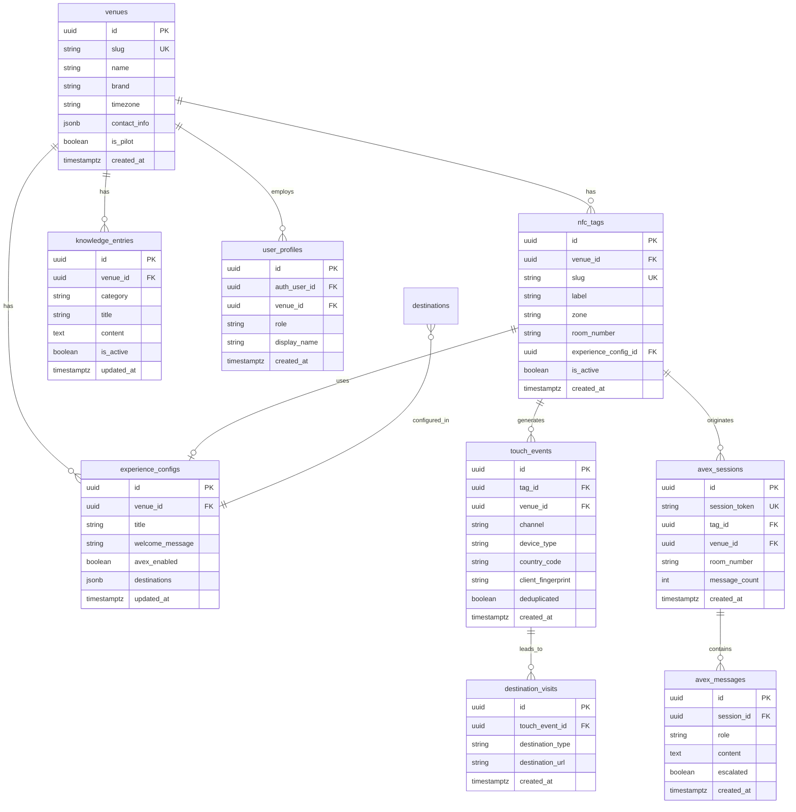

# Modelo de Datos: TagMe MVP

**Fecha**: 2026-06-08 | **Backend**: InsForge PostgreSQL | **Spec**: [spec.md](./spec.md)

---

## Diagrama ER (alto nivel)



---

## Entidades y reglas

### `venues`

Establecimiento (hotel, bar, restaurante).

| Campo | Tipo | Reglas |
|-------|------|--------|
| `slug` | `text` UNIQUE | URL-safe; ej. `hotel-caribe` |
| `name` | `text` NOT NULL | "Hotel Caribe by Faranda Grand" |
| `timezone` | `text` | `America/Bogota` para agregaciones horarias |
| `contact_info` | `jsonb` | `{ phone, whatsapp, reception_hours }` para AVEX derivación |
| `is_pilot` | `boolean` | `true` para Hotel Caribe en MVP |

### `nfc_tags`

Punto físico NFC (FR-013, FR-022).

| Campo | Tipo | Reglas |
|-------|------|--------|
| `slug` | `text` UNIQUE | Programado en tag físico; ej. `caribe-lobby`, `caribe-room-412` |
| `zone` | `text` | `lobby` \| `room` \| `restaurant` \| `bar` \| `other` |
| `room_number` | `text` NULL | Solo si `zone = room`; ej. `"412"` |
| `label` | `text` | Descripción staff: "Lobby principal" |
| `is_active` | `boolean` | Tags inactivos → 404 amigable |

**Transición**: tag reasignado → actualizar `room_number`/`slug`; historial en `touch_events` conserva `tag_id`.

### `experience_configs`

Contenido y destinos del hub (FR-003, FR-004).

| Campo | Tipo | Reglas |
|-------|------|--------|
| `destinations` | `jsonb` | Array ordenado de destinos (ver schema abajo) |
| `avex_enabled` | `boolean` | `true` en Hotel Caribe piloto |
| `welcome_message` | `text` | Opcional; personalizable por zona |

**Schema `destinations`**:

```json
[
  {
    "id": "menu",
    "type": "menu",
    "label": "Menú Digital",
    "url": "https://...",
    "icon": "utensils",
    "is_primary": true
  },
  {
    "id": "google",
    "type": "external",
    "label": "Google",
    "url": "https://g.page/...",
    "icon": "map-pin"
  },
  {
    "id": "tripadvisor",
    "type": "external",
    "label": "TripAdvisor",
    "url": "https://...",
    "icon": "star"
  },
  {
    "id": "reservations",
    "type": "reservation_link",
    "label": "Reservar",
    "url": "https://...",
    "icon": "calendar"
  }
]
```

`type` enum: `menu` | `external` | `reservation_link` | `info` | `social`

### `knowledge_entries`

Base de conocimiento AVEX (FR-017, FR-020).

| Campo | Tipo | Reglas |
|-------|------|--------|
| `category` | `text` | `hours` \| `amenities` | `policies` \| `room_service` \| `faq` |
| `title` | `text` | Título corto para staff |
| `content` | `text` | Contenido en prosa para inyectar en prompt |
| `is_active` | `boolean` | Solo activas en prompt AVEX |

### `touch_events`

Registro TagMétricas (FR-005, FR-006).

| Campo | Tipo | Reglas |
|-------|------|--------|
| `channel` | `text` | `nfc` \| `url_direct` \| `staff_assisted` |
| `device_type` | `text` | `iphone` \| `android` \| `other` — parseado de UA |
| `country_code` | `text` | ISO 3166-1 alpha-2; de Vercel geo header |
| `client_fingerprint` | `text` | Hash para deduplicación |
| `deduplicated` | `boolean` | `true` si skipped por ventana 60s |

### `destination_visits`

| Campo | Tipo | Reglas |
|-------|------|--------|
| `destination_type` | `text` | Alineado a `destinations[].type` + `avex` |
| `destination_url` | `text` NULL | URL visitada si aplica |

### `avex_sessions` / `avex_messages`

| Regla | Detalle |
|-------|---------|
| Anónimo | `session_token` UUID en localStorage cliente |
| Contexto | `room_number` copiado de tag al crear sesión |
| `escalated` | `true` si guardrail derivó a humano |
| Retención | 90 días MVP; sin PII |

### `user_profiles`

| `role` | Permisos |
|--------|----------|
| `staff` | Editar content + KB de su `venue_id` |
| `admin` | CRUD tags, venues, ver TagMétricas todos los venues piloto |
| `ops` | Solo lectura TagMétricas (opcional MVP) |

---

## Row Level Security (InsForge)

| Tabla | Anónimo (guest) | Staff autenticado | Service role (API routes) |
|-------|-----------------|-------------------|---------------------------|
| `venues` | SELECT activos | SELECT su venue | ALL |
| `nfc_tags` | SELECT activos | SELECT/UPDATE su venue | ALL |
| `experience_configs` | SELECT | SELECT/UPDATE su venue | ALL |
| `knowledge_entries` | SELECT activos | SELECT/INSERT/UPDATE su venue | ALL |
| `touch_events` | INSERT | SELECT su venue | ALL |
| `destination_visits` | INSERT | SELECT su venue | ALL |
| `avex_sessions` | INSERT | — | ALL |
| `avex_messages` | INSERT | — | ALL |
| `user_profiles` | — | SELECT propio | ALL |

---

## Vistas SQL (TagMétricas dashboard)

### `v_touches_daily`

```sql
SELECT venue_id, date_trunc('day', created_at) AS day, count(*) AS touches
FROM touch_events
WHERE deduplicated = false
GROUP BY 1, 2;
```

### `v_touches_hourly`

```sql
SELECT venue_id, extract(hour from created_at AT TIME ZONE v.timezone) AS hour, count(*) AS touches
FROM touch_events te
JOIN venues v ON v.id = te.venue_id
WHERE te.deduplicated = false
GROUP BY 1, 2;
```

### `v_destination_breakdown`

```sql
SELECT venue_id, destination_type, count(*) AS visits,
       round(100.0 * count(*) / sum(count(*)) OVER (PARTITION BY venue_id), 1) AS pct
FROM destination_visits dv
JOIN touch_events te ON te.id = dv.touch_event_id
GROUP BY 1, 2;
```

---

## Seed piloto Hotel Caribe (M0)

| tag slug | zone | room_number | label |
|----------|------|-------------|-------|
| `caribe-lobby` | lobby | — | Lobby principal |
| `caribe-restaurant` | restaurant | — | Restaurante |
| `caribe-room-412` | room | 412 | Habitación 412 (ejemplo piloto) |

Venue slug: `hotel-caribe`