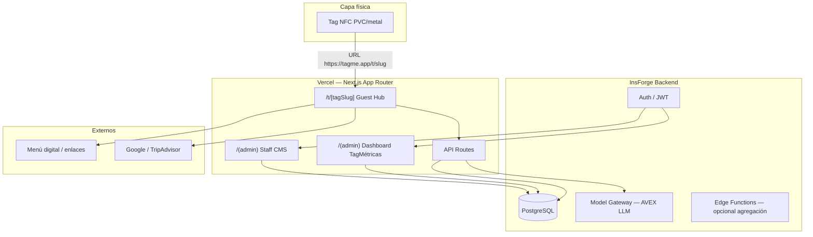
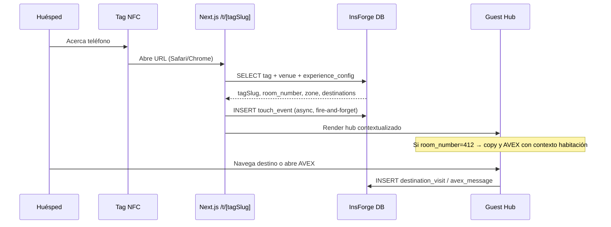
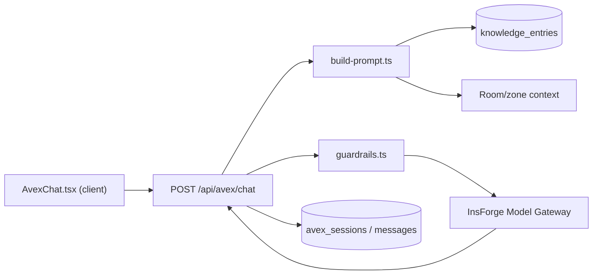

# Plan de Implementación: TagMe — Plataforma NFC/IoT

**Branch**: `001-tagme-platform` | **Fecha**: 2026-06-08 | **Spec**: [spec.md](./spec.md)

**Input**: Especificación en `specs/001-tagme-platform/spec.md` + stack Next.js/Vercel + InsForge

---

## Summary

TagMe MVP es una **aplicación web full-stack** desplegada en **Vercel (Next.js App Router)** con backend en **InsForge** (PostgreSQL, Auth, Model Gateway). Los tags NFC apuntan a URLs públicas que resuelven contexto de venue/habitación, registran eventos en **TagMétricas** y muestran un hub mobile-first. **AVEX** es un chat conversacional vía API Route que consulta una base de conocimiento del venue y el Model Gateway de InsForge, sin acciones transaccionales.

Enfoque pragmático: **un solo repositorio Next.js** como BFF (Backend-for-Frontend), sin microservicios ni colas en MVP. Entrega incremental por milestones alineados a user stories P1→P3.

---

## Arquitectura General



### Capas y responsabilidades

| Capa | Responsabilidad | Tecnología |
|------|-----------------|------------|
| **NFC / URL** | Identificar punto físico (venue, zona, habitación) | Tag programado con URL única |
| **Guest Experience** | Hub contextual, destinos, AVEX chat UI | Next.js RSC + Client Components |
| **BFF / API Routes** | Resolver tags, registrar eventos, proxy AVEX | `app/api/*` en Vercel |
| **Datos & Auth** | Venues, tags, contenido, KB, eventos, usuarios staff | InsForge PostgreSQL + Auth |
| **AVEX** | Chat conversacional acotado a KB | InsForge Model Gateway + prompt RAG-lite |
| **TagMétricas** | Toques, destinos, agregaciones | Tablas de eventos + vistas SQL / queries |

### Flujo NFC + contexto de habitación



**Regla de URL (Q3=B)**:

- Formato canónico: `https://{domain}/t/{tagSlug}`
- Ejemplo habitación: tag `caribe-room-412` → slug resuelve `room_number: "412"`, `zone: "room"`
- Sin PMS: el contexto vive en la fila `nfc_tags`, no en identidad del huésped

---

## Technical Context

| Campo | Valor |
|-------|-------|
| **Language/Version** | TypeScript 5.x, Node 20 LTS |
| **Frontend** | Next.js 15 App Router, React 19, Tailwind CSS 3.4 |
| **Backend** | InsForge (`@insforge/sdk`) — PostgreSQL, Auth, Model Gateway |
| **Primary Dependencies** | `@insforge/sdk`, `zod`, `date-fns`, `recharts` (dashboard), `ai` (Vercel AI SDK opcional para streaming AVEX) |
| **Storage** | InsForge PostgreSQL; Storage solo si menú con imágenes propias (post-MVP) |
| **Testing** | Vitest (unit), Playwright (E2E guest flow + admin), contract tests en `tests/contract/` |
| **Target Platform** | Vercel (Edge/Node runtimes); clientes móvil Safari iOS + Chrome Android |
| **Performance Goals** | TTFB hub ≤ 500ms p95; touch event registrado ≤ 1s; AVEX primera token ≤ 2s |
| **Constraints** | Sin app nativa; sin PMS; AVEX no transaccional; analítica agregada (Ley 1581 Colombia) |
| **Scale/Scope** | 1 venue piloto, ≥10 tags NFC, ~1000 toques/día pico (según PDF ejemplo ~1023/día) |

---

## Constitution Check

*GATE: Pre-Phase 0 ✅ | Post-Phase 1 ✅*

| Principio (Constitución v1.1.0) | Gate | Estado |
|---------------------------------|------|--------|
| I. Spec-Driven Development | Plan deriva de `spec.md` aprobado; sin scope extra | ✅ |
| II. Business First | NFC + TagMétricas + Hotel Caribe priorizados antes que elegancia técnica | ✅ |
| III. High-Level + Visual Clarity | Flujos Mermaid, rutas UX definidas antes de código | ✅ |
| IV. Pragmatic Quality | Tests en puntos de valor; tipado con Zod; sin microservicios | ✅ |
| V. Simplicity & Guest/Staff Empathy | Hub ≤2 taps al destino; admin simple; URL fallback sin NFC | ✅ |
| VI. Iterative & MVP-Oriented | 6 milestones entregables independientemente | ✅ |

**Post-Phase 1**: Arquitectura monolito Next.js + InsForge justificada; sin violaciones que requieran Complexity Tracking.

---

## Decisiones Técnicas Clave y Trade-offs

| Decisión | Elegido | Alternativa rechazada | Razón |
|----------|---------|----------------------|-------|
| **Arquitectura** | Monolito Next.js (BFF) en Vercel | Frontend + API separada (FastAPI) | Menos ops; un deploy; suficiente para MVP (Principio V) |
| **Resolución NFC** | URL por `tagSlug` en path | Query params largos en tag | URLs cortas = menos errores al programar tags |
| **Contexto habitación** | Campo en `nfc_tags` (Q3=B) | Integración PMS | Spec explícita: sin PMS en MVP |
| **TagMétricas ingest** | `POST /api/events` fire-and-forget | Cola Redis/Kafka | YAGNI; volumen piloto bajo; retry client-side opcional |
| **Deduplicación toques** | Ventana 60s por `tagSlug` + `clientFingerprint` (hash UA+IP parcial) | Sin dedup | Evita inflar métricas (edge case spec) |
| **AVEX RAG** | **RAG-lite**: KB estructurada inyectada en system prompt | pgvector + embeddings full RAG | Más simple para MVP; InsForge pgvector como mejora M5+ si precisión <85% |
| **AVEX streaming** | SSE desde `/api/avex/chat` | Respuesta bloqueante | Mejor UX percibida en móvil |
| **Auth staff/admin** | InsForge Auth (email/password o magic link) | Auth0 externo | Una plataforma; menos dependencias |
| **Menú digital** | Enlace externo o página InsForge en MVP | CMS gastronómico propio | Spec: no CMS completo en v1 |
| **i18n huésped** | Español por defecto; inglés post-MVP | Multi-idioma día 1 | NFR-008; piloto Colombia |

---

## Estructura de Carpetas (Next.js)

```text
tagme/                              # raíz del repo (a crear en implementación)
├── app/
│   ├── (guest)/                    # Layout mobile-first, sin auth
│   │   ├── t/[tagSlug]/page.tsx    # Entry NFC — hub principal
│   │   └── layout.tsx              # Tipografía, tema "silent luxury"
│   ├── (admin)/                    # Layout protegido staff/ops
│   │   ├── dashboard/page.tsx      # TagMétricas
│   │   ├── venues/[id]/page.tsx    # Config venue
│   │   ├── tags/page.tsx           # Gestión puntos NFC
│   │   ├── content/page.tsx        # Destinos y mensajes
│   │   ├── knowledge/page.tsx      # Base conocimiento AVEX
│   │   └── layout.tsx              # Sidebar admin
│   ├── api/
│   │   ├── events/touch/route.ts   # Registro toque NFC/URL
│   │   ├── events/destination/route.ts
│   │   ├── avex/chat/route.ts      # Chat streaming AVEX
│   │   └── tags/[tagSlug]/route.ts # Resolución JSON (opcional)
│   ├── login/page.tsx
│   └── layout.tsx
├── components/
│   ├── guest/
│   │   ├── GuestHub.tsx            # Hub destinos
│   │   ├── DestinationCard.tsx
│   │   ├── RoomContextBanner.tsx   # "Habitación 412"
│   │   └── FallbackHelp.tsx        # Sin NFC
│   ├── avex/
│   │   ├── AvexChat.tsx            # UI chat
│   │   ├── AvexMessage.tsx
│   │   └── AvexEscalation.tsx      # Derivación a humano
│   ├── admin/
│   │   ├── MetricsDashboard.tsx
│   │   ├── TouchChart.tsx
│   │   ├── DestinationBreakdown.tsx
│   │   ├── TagForm.tsx
│   │   └── KnowledgeEditor.tsx
│   └── ui/                         # Primitivos (Button, Card, Input)
├── lib/
│   ├── insforge.ts                 # Cliente InsForge
│   ├── insforge-server.ts          # Cliente service-role (API routes)
│   ├── tags/resolve-tag.ts         # Lógica resolución tag → contexto
│   ├── analytics/track.ts          # touch + destination events
│   ├── avex/
│   │   ├── build-prompt.ts         # System prompt + KB + room context
│   │   ├── guardrails.ts           # No transacciones; derivación
│   │   └── stream-chat.ts          # Model Gateway streaming
│   ├── auth/session.ts
│   └── validators/                 # Esquemas Zod
├── types/
│   └── index.ts                    # Tipos compartidos (contratos TS)
├── tests/
│   ├── contract/                   # Contratos API
│   ├── integration/
│   └── e2e/                        # Playwright: NFC flow simulado
├── public/
├── .env.local.example
├── next.config.ts
├── tailwind.config.ts
└── package.json
```

**Structure Decision**: Monorepo single Next.js app. InsForge es backend externo gestionado; no carpeta `backend/` separada. Contratos en `specs/001-tagme-platform/contracts/`; implementación consume tipos espejo en `types/`.

---

## AVEX — Diseño Técnico

### Componentes



### Comportamiento MVP

1. **System prompt** incluye: rol AVEX, tono hotel premium, KB del venue (FAQs, horarios, políticas), contexto `room_number`/`zone` si aplica, instrucción explícita de **no reservar ni pagar**.
2. **Guardrails post-LLM**: si detecta intención transaccional → respuesta fija + enlace reservas; si baja confianza → `AvexEscalation` con teléfono/WhatsApp del venue.
3. **Persistencia**: `avex_sessions` anónimas (sessionId en localStorage); mensajes para métricas y mejora, sin PII.
4. **Modelo**: vía InsForge Model Gateway (ej. `anthropic/claude-3.5-haiku` o equivalente económico para latencia).

### Base de conocimiento (staff-editable)

Tabla `knowledge_entries`: `category`, `title`, `content`, `venue_id`, `active`. El staff edita desde `/(admin)/knowledge`. Sin embeddings en MVP — búsqueda por venue_id + categoría; todo el corpus del venue cabe en context window del piloto.

---

## TagMétricas — Diseño Técnico

| Evento | Tabla | Campos clave |
|--------|-------|--------------|
| Toque NFC/URL | `touch_events` | `tag_id`, `venue_id`, `channel`, `device_type`, `country`, `created_at` |
| Visita destino | `destination_visits` | `touch_event_id`, `destination_type`, `destination_url` |
| Sesión AVEX | `avex_sessions` | `tag_id`, `room_number`, `message_count` |

**Agregaciones** (dashboard):

- Toques por día: `GROUP BY date_trunc('day', created_at)`
- Horas pico: `GROUP BY extract(hour from created_at)`
- % destinos: `destination_type` distribution
- % dispositivos: `device_type` from User-Agent parsing server-side
- Origen geo: header `x-vercel-ip-country` o InsForge geo; solo país

**Deduplicación**: antes de INSERT, comprobar último toque mismo `tag_id` + fingerprint dentro de 60s → skip o marcar `deduplicated: true`.

---

## Despliegue en Vercel

| Aspecto | Configuración |
|---------|---------------|
| **Proyecto** | Vercel vinculado al repo; production domain `tagme.com.co` o subdominio piloto |
| **Env vars** | `INSFORGE_URL`, `INSFORGE_ANON_KEY`, `INSFORGE_SERVICE_KEY` (solo server), `NEXT_PUBLIC_APP_URL` |
| **Runtime guest routes** | Edge preferido para `/t/[tagSlug]` (baja latencia global) |
| **API routes AVEX** | Node runtime (streaming SSE, Model Gateway) |
| **ISR / caching** | `revalidate: 60` en hub guest — balance freshness vs velocidad (spec: cambios <5 min) |
| **Headers** | `Cache-Control` corto en guest; geo headers de Vercel para TagMétricas |
| **Preview** | Branch previews para `001-tagme-platform`; tags de prueba apuntan a preview URL |
| **InsForge** | Proyecto dedicado TagMe; RLS policies: público read tags/config; write events anónimo; admin autenticado |

---

## Orden de Implementación (Milestones)

| Fase | Milestone | User Stories | Entregable verificable |
|------|-----------|--------------|------------------------|
| **M0** | Fundación | — | Repo Next.js + InsForge linked + schema migrado + seed Hotel Caribe |
| **M1** | NFC Core | US-1 | `/t/[tagSlug]` abre hub en <3s; touch_events registrados |
| **M2** | Destinos + métricas base | US-2, US-6 (parcial) | Destinos navegables; dashboard toques/día y horas |
| **M3** | Admin contenido | US-4, US-7 | Staff edita destinos; CRUD tags y venues |
| **M4** | Contexto habitación | US-2 (esc.3), FR-022–023 | Tags `caribe-room-*` muestran banner y AVEX contextual |
| **M5** | AVEX conversacional | US-3 | Chat funcional; guardrails; SC-009 testable |
| **M6** | Piloto hardening | US-5, US-6 completo | URL fallback; reportes completos; 3 tags producción Hotel Caribe |

**Dependencias**: M0 → M1 → M2 → (M3 ∥ M4) → M5 → M6

---

## Riesgos Técnicos y Mitigaciones

| ID | Riesgo | Mitigación técnica |
|----|--------|-------------------|
| **TR-01** | Latencia AVEX en móvil hotel | Modelo rápido; streaming SSE; timeout 15s con mensaje útil |
| **TR-02** | Alucinaciones AVEX | RAG-lite acotado; guardrails; lista blanca temas; derivación obligatoria |
| **TR-03** | Pérdida eventos analíticos | API fire-and-forget + `navigator.sendBeacon` en client unload |
| **TR-04** | RLS InsForge mal configurado | Contract tests; revisión policies antes de piloto |
| **TR-05** | Cache stale en hub guest | `revalidate: 60` + on-demand revalidation al guardar staff |
| **TR-06** | Safari iOS NFC quirks | Probar en dispositivos reales; URL corta impresa como fallback |
| **TR-07** | Costo Model Gateway | Cuota InsForge; modelo económico; límite mensajes/sesión AVEX |

---

## Project Structure

### Documentation (this feature)

```text
specs/001-tagme-platform/
├── plan.md              # Este archivo
├── research.md          # Decisiones Phase 0
├── data-model.md        # Modelo de datos InsForge
├── quickstart.md        # Guía validación E2E
├── contracts/           # Contratos API
│   ├── guest-experience.md
│   ├── analytics-events.md
│   ├── avex-chat.md
│   └── admin-api.md
└── tasks.md             # (/speckit.tasks — pendiente)
```

### Source Code (repository root — a crear)

Ver sección **Estructura de Carpetas (Next.js)** arriba.

---

## Complexity Tracking

*Vacío — sin violaciones de constitución que requieran justificación.*

---

## Referencias

- [spec.md](./spec.md) — requisitos funcionales FR-001–FR-024
- [research.md](./research.md) — decisiones Phase 0
- [data-model.md](./data-model.md) — esquema PostgreSQL
- [contracts/](./contracts/) — contratos frontend ↔ InsForge ↔ API Routes
- [quickstart.md](./quickstart.md) — validación del piloto
- Constitución: `.specify/memory/constitution.md` v1.1.0
- InsForge: [docs.insforge.dev](https://docs.insforge.dev/introduction)