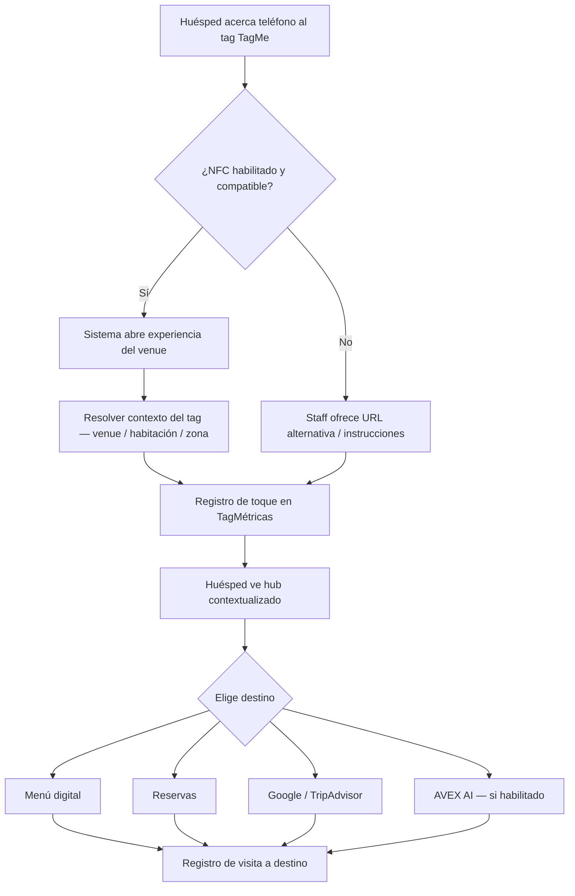
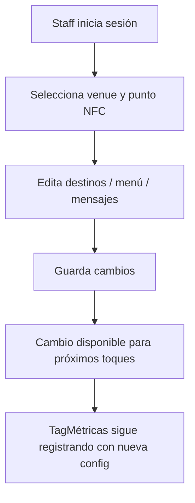
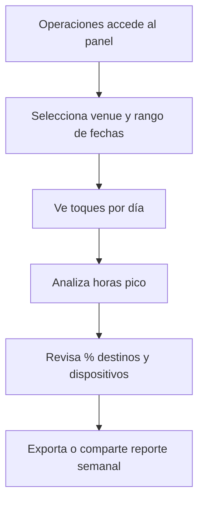

# Especificación de Funcionalidad: TagMe — Plataforma NFC/IoT de Experiencia para Huéspedes

**Rama de funcionalidad**: `001-tagme-platform`

**Creado**: 2026-06-08

**Estado**: Clarificado (listo para planificación)

**Clarificaciones resueltas** (2026-06-08): Q1=B (AVEX conversacional), Q2=A (NFC + cloud + TagMétricas), Q3=B (identificación ligera por tag/URL sin PMS)

**Fuente de negocio**: `TagMe.pdf` (Presentación Comercial v1.0, www.tagme.com.co)

**Input del usuario**: Plataforma completa TagMe para restaurantes, bares y hoteles, con foco inicial en Hotel Caribe by Faranda Grand y prototipo AVEX AI assistant.

**Constitución aplicable**: `.specify/memory/constitution.md` v1.1.0

---

## Resumen Ejecutivo

### Problema

En hospitalidad (restaurantes, bares, hoteles), la conexión entre el establecimiento y el huésped sigue dependiendo de procesos lentos y con fricción: códigos QR que exigen cámara y alineación, menús impresos difíciles de actualizar, y poca visibilidad para el negocio sobre cómo los clientes interactúan con la información ofrecida. El personal pierde tiempo explicando lo mismo repetidamente y operaciones carece de datos accionables sobre patrones de uso.

### Solución

TagMe es una plataforma de experiencia para huéspedes basada en **NFC sin apps**: el huésped acerca su teléfono a una tarjeta o punto físico TagMe y accede de inmediato a contenido relevante (menú digital, reservas, redes, información del venue). Para el establecimiento, **TagMétricas** registra cada interacción y entrega reportes de uso (toques por día/hora, dispositivo, origen geográfico, destinos visitados).

El MVP se despliega primero en **Hotel Caribe by Faranda Grand** como cliente piloto destacado (según propuesta comercial), demostrando valor dual: experiencia premium sin fricción para el huésped y analítica operativa para el venue.

### Propuesta de valor (según PDF)

| Actor | Valor |
|-------|-------|
| **Huésped / consumidor** | Activación instantánea con un toque; sin cámaras, sin descargas, sin pasos intermedios |
| **Establecimiento** | Métricas de uso, patrones de comportamiento, reportes semanales y por franjas horarias |
| **Marca TagMe** | Diferenciación premium (hardware PVC/metal, diseño minimalista) frente a QR convencional |

---

## Objetivos del Proyecto

| ID | Objetivo | Alineación PDF / Constitución |
|----|----------|-------------------------------|
| **OBJ-01** | Reducir la fricción de conexión huésped–venue a un solo toque NFC | Principio V (Simplicidad y empatía); sección "One Experience" |
| **OBJ-02** | Permitir al establecimiento actualizar el contenido expuesto sin reimprimir material físico | FAQ comercial; Principio II (Business First) |
| **OBJ-03** | Entregar analítica accionable (TagMétricas) al equipo de operaciones | Sección "Connective Technology — TagMétricas" |
| **OBJ-04** | Validar el modelo en Hotel Caribe como referencia para expansión LATAM | Cliente destacado en PDF; Principio VI (MVP iterativo) |
| **OBJ-05** | Integrar **AVEX AI como asistente conversacional** post-conexión NFC, capaz de responder preguntas sobre servicios e información del venue usando una base de conocimiento configurada (sin reservas ni upselling automatizado en MVP) | Q1=B; prototipo estratégico del piloto |

---

## Alcance del MVP

### Dentro del MVP

| Área | Incluido |
|------|----------|
| **Experiencia huésped NFC** | Toque NFC → apertura inmediata de experiencia web/mobile optimizada (sin app nativa) |
| **Contenido configurable** | Menú digital, enlaces a reservas, redes sociales, Google, TripAdvisor (según PDF: destinos de visita medidos) |
| **Gestión de contenido** | Personal autorizado puede actualizar qué muestra cada punto/tag NFC |
| **TagMétricas básico** | Registro de toques, fecha/hora, dispositivo (iPhone/Android), origen aproximado, destino visitado |
| **Reportes operativos** | Vista de métricas por día, franjas horarias de mayor uso, distribución de destinos |
| **Multi-punto por venue** | Múltiples tags NFC asociados a un establecimiento (ej. lobby, habitación, restaurante, bar) |
| **Piloto Hotel Caribe** | Configuración y despliegue para al menos un venue piloto con puntos NFC representativos |
| **Identificación ligera por habitación** | Tags/URLs por habitación o zona que contextualizan la experiencia (ej. "Habitación 412") **sin integración PMS** |
| **AVEX AI conversacional** | Chat de asistente accesible post-NFC; respuestas basadas en base de conocimiento del venue; derivación a humano si no hay certeza |
| **Capa IoT (MVP)** | Tags NFC + plataforma cloud + TagMétricas — la conectividad del MVP se limita a puntos NFC y analítica en la nube |
| **Compatibilidad móvil** | iPhone y Android con NFC habilitado (mayoría de dispositivos modernos, según FAQ) |
| **Diseño premium** | Experiencia visual coherente, mobile-first, alineada con sensibilidad "geek formal + silent luxury" (Constitución) |

### Explícitamente fuera del MVP

| Área | Excluido | Razón |
|------|----------|-------|
| **App nativa iOS/Android** | Fuera | PDF y FAQ confirman modelo sin apps |
| **QR como canal principal** | Fuera del MVP core | TagMe se diferencia por NFC; QR podría ser fallback futuro, no MVP |
| **E-commerce / pagos in-app** | Fuera | No mencionado en propuesta comercial |
| **Sensores IoT avanzados** | Fuera | Q2=A: sin ocupación, temperatura, beacons ni hardware IoT adicional; MVP = NFC + cloud + TagMétricas |
| **Marketplace multi-cadena** | Fuera | MVP = un venue piloto + arquitectura preparada para más venues |
| **Personalización física DTF UV** | Fuera del software MVP | Es proceso de manufactura/hardware, no plataforma digital |
| **Facturación / Inversión Estratégica** | Fuera del producto | Sección 7 del índice PDF no está en el documento entregado |
| **Programa de onboarding formal** | Fuera del software MVP | Sección 9 del índice PDF ausente en archivo |
| **Integración PMS hotelero** | Fuera | Q3=B: sin check-in, folio ni sincronización de huésped con PMS; solo contexto de habitación vía tag/URL |
| **Reservas / upselling automatizado por AVEX** | Fuera | Q1=B acota AVEX a conversación informativa; reservas siguen siendo enlaces/configuración manual |
| **Concierge IA con acciones transaccionales** | Fuera | Post-MVP; MVP limita AVEX a Q&A sobre info del venue |

---

## User Scenarios & Testing *(obligatorio)*

Las historias están priorizadas por valor de negocio y capacidad de entrega incremental. Cada historia es **independientemente testeable**.

---

### Perspectiva: Huéspedes

#### User Story 1 — Conexión instantánea por NFC (Prioridad: P1) 🎯 MVP

Como **huésped** en un hotel, bar o restaurante, quiero **acercar mi teléfono a un punto TagMe y acceder de inmediato a la información o servicio ofrecido**, para **obtener lo que necesito sin descargar apps, escanear códigos ni pedir ayuda**.

**Por qué esta prioridad**: Es la promesa central del producto ("un toque a la vez") y el diferenciador frente a QR. Sin esto no hay TagMe.

**Prueba independiente**: Colocar un tag NFC de prueba, tocar con un iPhone y un Android compatibles, y verificar que la experiencia se abre en menos de 3 segundos sin instalaciones previas.

**Escenarios de aceptación**:

1. **Dado** un huésped con teléfono NFC habilitado, **Cuando** acerca el dispositivo al tag TagMe, **Entonces** se abre automáticamente la experiencia del venue en el navegador o vista nativa del sistema.
2. **Dado** un huésped que toca un tag en el restaurante del hotel, **Cuando** la experiencia carga, **Entonces** ve el menú digital como destino principal (alineado al 60.1% de visitas a "Menú Digital" en datos de ejemplo TagMétricas).
3. **Dado** un huésped internacional, **Cuando** accede por NFC, **Entonces** la interfaz es legible en móvil y los contenidos críticos son comprensibles (idioma por defecto del venue, con preferencia de idioma si está configurada).

---

#### User Story 2 — Acceso a destinos útiles post-toque (Prioridad: P2)

Como **huésped**, quiero **elegir entre menú, reservas, reseñas o contacto** desde una experiencia unificada, para **resolver mi necesidad actual sin buscar enlaces por mi cuenta**.

**Por qué esta prioridad**: El PDF muestra distribución de destinos (Menú 60.1%, Google 29.7%, TripAdvisor 10.3%). La plataforma debe enrutar y medir estos destinos.

**Prueba independiente**: Simular un toque NFC y verificar que al menos tres tipos de destino configurados son accesibles y registrados en analítica.

**Escenarios de aceptación**:

1. **Dado** un venue con menú, Google Business y TripAdvisor configurados, **Cuando** el huésped navega a cada destino, **Entonces** cada visita queda registrada como evento separado en TagMétricas.
2. **Dado** un huésped en Hotel Caribe, **Cuando** toca un tag en lobby, **Entonces** accede a un hub de servicios del hotel (información, restaurante, reservas — según configuración del piloto).
3. **Dado** un huésped que toca un tag en su habitación (Q3=B), **Cuando** la experiencia carga, **Entonces** ve contenido contextualizado a esa habitación/zona (ej. servicios a la habitación, AVEX con contexto) sin requerir login ni PMS.
4. **Dado** contenido actualizado por el venue hoy, **Cuando** un huésped toca el tag, **Entonces** ve la versión vigente (no contenido obsoleto).

---

#### User Story 3 — Asistencia conversacional AVEX AI (Prioridad: P3)

Como **huésped**, quiero **conversar con un asistente inteligente después de conectarme por NFC**, para **resolver dudas sobre servicios del hotel en lenguaje natural sin esperar al personal**.

**Por qué esta prioridad**: Prototipo estratégico acordado (Q1=B). Amplía la propuesta de valor post-conexión con IA conversacional acotada a información del venue. Depende de P1.

**Prueba independiente**: Tras conexión NFC exitosa, abrir chat AVEX, hacer tres preguntas distintas (horarios, amenidades, política) y verificar respuestas coherentes con la base de conocimiento configurada.

**Escenarios de aceptación**:

1. **Dado** un huésped conectado vía NFC en Hotel Caribe, **Cuando** abre AVEX y pregunta "¿A qué hora abre el restaurante?", **Entonces** recibe una respuesta conversacional basada en la base de conocimiento del venue.
2. **Dado** un huésped en habitación con tag contextualizado (Q3=B), **Cuando** pregunta a AVEX "¿Cómo solicito toallas extra?", **Entonces** AVEX responde con información del hotel y reconoce el contexto de habitación si está configurado para ese tag.
3. **Dado** una pregunta fuera del conocimiento del venue o con baja confianza, **Cuando** AVEX no puede responder con certeza, **Entonces** lo indica explícitamente y ofrece derivación (contactar recepción, enlace telefónico o WhatsApp del venue).
4. **Dado** un huésped que solicita hacer una reserva vía AVEX, **Cuando** AVEX no tiene capacidad transaccional en MVP, **Entonces** redirige al enlace de reservas configurado o indica contactar al staff.

---

### Perspectiva: Personal del Venue (Staff)

#### User Story 4 — Actualizar contenido expuesto (Prioridad: P2)

Como **miembro del staff** con permisos, quiero **cambiar qué muestra cada punto NFC** (menú, enlaces, mensajes), para **mantener la información al día sin reimprimir tarjetas ni rediseñar material físico**.

**Por qué esta prioridad**: FAQ comercial: "¿Se puede cambiar lo que muestra la tarjeta? — Claro." Es requisito operativo diario.

**Prueba independiente**: Usuario staff cambia el destino principal de un tag y verifica que el próximo toque NFC refleja el cambio.

**Escenarios de aceptación**:

1. **Dado** un staff autorizado, **Cuando** edita el menú digital asociado a un tag, **Entonces** el cambio es visible para nuevos toques en menos de 5 minutos.
2. **Dado** un staff sin permisos de administración, **Cuando** intenta editar contenido, **Entonces** el sistema deniega la acción con mensaje claro.
3. **Dado** un cambio de enlace a reservas, **Cuando** un huésped toca el tag, **Entonces** es dirigido al nuevo destino y el evento se registra correctamente.

---

#### User Story 5 — Soporte al huésped en el punto de contacto (Prioridad: P3)

Como **staff de recepción o restaurante**, quiero **orientar rápidamente a un huésped que no logra conectar por NFC**, para **reducir fricción sin frenar la operación**.

**Por qué esta prioridad**: Empatía staff/huésped (Principio V). No todos los dispositivos tienen NFC o lo tienen deshabilitado.

**Prueba independiente**: Simular dispositivo sin NFC y verificar que el staff tiene un método alternativo documentado (URL corta / código de respaldo) para entregar la misma experiencia.

**Escenarios de aceptación**:

1. **Dado** un huésped con NFC deshabilitado, **Cuando** el staff accede al panel de ayuda, **Entonces** obtiene instrucciones y enlace alternativo para abrir la experiencia manualmente.
2. **Dado** un huésped que logra conectar con ayuda del staff, **Cuando** completa la visita, **Entonces** el evento queda registrado indicando canal de acceso (NFC directo vs. asistido).

---

### Perspectiva: Operaciones / Administración

#### User Story 6 — Dashboard TagMétricas (Prioridad: P2)

Como **responsable de operaciones**, quiero **ver cuántos toques hubo por día, en qué horarios y hacia qué destinos**, para **tomar decisiones de staffing, promociones y contenido**.

**Por qué esta prioridad**: TagMétricas es el segundo pilar de valor del PDF. Datos de ejemplo incluyen toques diarios, horas pico y % por destino.

**Prueba independiente**: Generar toques de prueba durante una semana simulada y verificar que el dashboard refleja totales, picos horarios y distribución de destinos.

**Escenarios de aceptación**:

1. **Dado** un venue con actividad registrada, **Cuando** operaciones abre el reporte semanal, **Entonces** ve total de toques por día comparable al formato del PDF (ej. Mié 255, Sáb 1023).
2. **Dado** datos de una semana, **Cuando** consulta franjas horarias, **Entonces** identifica las horas de mayor uso (ej. 8pm–1am en datos de ejemplo).
3. **Dado** tráfico internacional, **Cuando** revisa origen de clientes, **Entonces** ve distribución geográfica agregada (país/región, no datos personales identificables).

---

#### User Story 7 — Gestión de puntos NFC y venues (Prioridad: P3)

Como **administrador de plataforma**, quiero **registrar venues, puntos NFC y su configuración**, para **escalar de Hotel Caribe piloto a más establecimientos**.

**Por qué esta prioridad**: Necesario para operación multi-punto; puede seguir al piloto una vez validado el flujo base.

**Prueba independiente**: Crear un venue de prueba con dos tags NFC distintos y verificar que cada uno reporta métricas separadas pero consolidadas a nivel venue.

**Escenarios de aceptación**:

1. **Dado** un administrador, **Cuando** registra un nuevo punto NFC, **Entonces** queda asociado a un venue, ubicación física (ej. "Restaurante — Barra") y conjunto de destinos.
2. **Dado** dos tags del mismo venue, **Cuando** operaciones filtra por ubicación, **Entonces** puede comparar rendimiento entre puntos.

---

### Edge Cases

- **Dispositivo sin NFC o NFC deshabilitado**: El huésped debe recibir instrucciones claras y un acceso alternativo (URL); el evento debe indicar canal no-NFC.
- **Conectividad intermitente del huésped**: La experiencia debe mostrar estado de carga y reintento; no pantalla en blanco.
- **Toques repetidos en pocos segundos**: El sistema debe deduplicar o agrupar para no inflar métricas artificialmente (regla de negocio a definir en plan: ventana de 30–60 s).
- **Contenido externo caído** (Google, TripAdvisor): Mostrar mensaje útil; registrar intento fallido en métricas.
- **Actualización de contenido en horario pico**: Cambios deben aplicarse sin downtime perceptible para el huésped.
- **Privacidad y huéspedes extranjeros**: Origen geográfico solo a nivel agregado; sin almacenar datos personales del huésped sin consentimiento explícito.
- **Horario nocturno (picos 10pm–3am según PDF)**: La experiencia y reportes deben funcionar correctamente en franjas de baja dotación de staff.
- **Tag de habitación reasignado**: Si una habitación cambia de número o tag, el contexto debe actualizarse en configuración sin afectar métricas históricas del punto anterior.
- **AVEX con pregunta ambigua**: El asistente debe pedir aclaración o derivar a humano; no inventar políticas del hotel.

---

## Flujos Clave de Usuario

### Flujo 1 — Conexión NFC del huésped (crítico)

**Criterios del flujo**:

- Tiempo percibido desde toque hasta contenido visible: **≤ 3 segundos** en condiciones normales de red.
- **Cero instalaciones** previas (FAQ comercial).
- Cada destino visitado genera evento analítico distinguishable.

### Flujo 2 — Staff actualiza contenido

### Flujo 3 — Operaciones revisa TagMétricas

---

## Requirements *(obligatorio)*

### Functional Requirements

**Experiencia huésped**

- **FR-001**: El sistema DEBE activar la experiencia del venue con un solo toque NFC, sin requerir aplicación nativa instalada.
- **FR-002**: El sistema DEBE soportar iPhone y Android con NFC según compatibilidad declarada en la propuesta comercial.
- **FR-003**: El sistema DEBE presentar un hub de experiencia mobile-first tras la conexión, con acceso a los destinos configurados para ese punto NFC.
- **FR-004**: El sistema DEBE permitir configurar destinos de tipo menú digital, enlace externo (Google, TripAdvisor, redes, reservas) y contenido informativo del venue.
- **FR-005**: El sistema DEBE registrar cada toque NFC con marca de tiempo, identificador del punto/venue y tipo de dispositivo (iPhone/Android u otro).

**TagMétricas y reportes**

- **FR-006**: El sistema DEBE almacenar y mostrar conteo de toques agregados por día.
- **FR-007**: El sistema DEBE mostrar distribución de uso por franjas horarias (horas de mayor actividad).
- **FR-008**: El sistema DEBE mostrar porcentaje de visitas por destino (menú, Google, TripAdvisor, otros).
- **FR-009**: El sistema DEBE mostrar distribución de dispositivos (ej. % iPhone vs Android).
- **FR-010**: El sistema DEBE mostrar origen geográfico agregado de clientes (nivel país/región).
- **FR-011**: El sistema DEBE permitir filtrar métricas por venue, punto NFC y rango de fechas.

**Gestión y administración**

- **FR-012**: El sistema DEBE permitir que usuarios staff autorizados actualicen el contenido asociado a un punto NFC sin intervención técnica.
- **FR-013**: El sistema DEBE soportar múltiples puntos NFC por venue con configuración independiente.
- **FR-014**: El sistema DEBE distinguir roles mínimos: huésped (anónimo), staff de venue, administrador de operaciones.
- **FR-015**: El sistema DEBE proveer acceso alternativo (URL directa) cuando NFC no está disponible.

**AVEX AI conversacional**

- **FR-016**: El sistema DEBE ofrecer interfaz de chat AVEX accesible desde la experiencia post-NFC cuando esté habilitado para el venue.
- **FR-017**: AVEX DEBE responder en lenguaje natural usando únicamente información de la base de conocimiento configurada del venue (horarios, servicios, políticas, amenidades).
- **FR-018**: AVEX DEBE indicar explícitamente cuando no puede responder con certeza y ofrecer derivación a contacto humano del venue.
- **FR-019**: AVEX NO DEBE ejecutar reservas, pagos ni acciones transaccionales en MVP; DEBE redirigir a enlaces o contacto staff cuando aplique.
- **FR-020**: El staff DEBE poder actualizar la base de conocimiento de AVEX sin intervención técnica (misma gobernanza que contenido NFC).

**Hotel Caribe piloto e identificación ligera**

- **FR-021**: El sistema DEBE soportar configuración específica para Hotel Caribe by Faranda Grand como venue piloto con al menos tres puntos NFC representativos (lobby, restauración, habitación).
- **FR-022**: El sistema DEBE permitir asociar contexto de habitación o zona a un tag/URL específico (ej. `habitacion=412`) sin integración PMS.
- **FR-023**: La experiencia contextualizada por habitación DEBE mostrar contenido y respuestas AVEX relevantes a esa zona, sin identificar al huésped personalmente.
- **FR-024**: El sistema NO DEBE sincronizar datos con PMS (check-in, folio, perfil de huésped) en MVP.

### Non-Functional Requirements

- **NFR-001 (Rendimiento percibido)**: El huésped DEBE ver contenido principal en ≤ 3 segundos tras toque NFC en condiciones de red móvil estándar (4G/Wi-Fi hotel).
- **NFR-002 (Disponibilidad)**: La experiencia huésped y el panel de métricas DEBEN estar disponibles ≥ 99% en horario operativo del venue piloto.
- **NFR-003 (Usabilidad)**: La interacción DEBE requerir como máximo 2 acciones desde el toque hasta el destino principal configurado.
- **NFR-004 (Accesibilidad)**: Contenidos críticos DEBEN ser legibles en pantallas móviles (mínimo equivalente a body 16px) y cumplir contraste adecuado para uso en restaurante/bar con baja luz.
- **NFR-005 (Privacidad)**: El sistema NO DEBE almacenar identificadores personales del huésped sin base legal y consentimiento; analítica agregada por defecto.
- **NFR-006 (Seguridad)**: Accesos de staff y operaciones DEBEN requerir autenticación; cambios de contenido DEBEN quedar auditados (quién, cuándo, qué).
- **NFR-007 (Mantenibilidad)**: Separación clara entre experiencia huésped, panel operativo y configuración (Principio IV — calidad pragmática).
- **NFR-008 (Idioma)**: Documentación de producto y UI del piloto DEBEN estar en español; soporte multi-idioma para huéspedes es deseable post-MVP.
- **NFR-009 (Escalabilidad MVP)**: La plataforma DEBE soportar al menos 1 venue piloto y 10 puntos NFC concurrentes sin degradación perceptible.
- **NFR-010 (Resiliencia)**: Ante fallo de destino externo, el sistema DEBE mostrar mensaje útil al huésped sin romper la experiencia completa.

### Key Entities

- **Venue**: Establecimiento (hotel, restaurante, bar). Atributos: nombre, marca, ubicación, configuración global, estado piloto/producción.
- **NFC Point (Tag)**: Punto físico de interacción. Atributos: identificador, venue, ubicación descriptiva, contexto (lobby/habitación/zona), identificador de habitación opcional, destinos configurados, estado activo/inactivo.
- **Experience Config**: Conjunto de contenidos y destinos visibles tras un toque. Atributos: menú, enlaces, mensajes, AVEX habilitado, contexto de habitación, idioma por defecto.
- **Knowledge Base (AVEX)**: Información estructurada del venue para el asistente. Atributos: FAQs, horarios, políticas, amenidades, mensajes de derivación.
- **AVEX Session**: Interacción conversacional del huésped. Atributos: timestamp, punto de origen, contexto habitación, mensajes, derivaciones.
- **Touch Event**: Registro de toque NFC o acceso alternativo. Atributos: timestamp, punto, venue, dispositivo, canal (NFC/URL), origen geo aproximado.
- **Destination Visit**: Evento de navegación a un destino. Atributos: tipo (menú, Google, TripAdvisor, reserva, AVEX), timestamp, punto de origen.
- **User (Staff/Admin)**: Operador interno. Atributos: rol, venue(s) asignados, permisos.
- **Report Snapshot**: Vista agregada para operaciones. Atributos: periodo, métricas calculadas, venue.

---

## Restricciones Técnicas y de Negocio

### Restricciones de negocio

- La propuesta comercial (`TagMe.pdf`) es fuente de verdad para el "qué" y el "por qué" (Constitución II).
- El piloto prioritario es **Hotel Caribe by Faranda Grand** (cliente destacado en PDF).
- El modelo de negocio hardware (tarjetas PVC/metal, impresión DTF UV) existe en paralelo al software; el MVP digital no reemplaza la cadena de suministro física.
- Secciones **Inversión Estratégica** y **Onboarding** del índice PDF no están disponibles en el archivo entregado — decisiones comerciales y de despliegue físico requieren documentación adicional.
- Expansión LATAM y multi-ciudad (Cartagena, Medellín en PDF) es visión, no alcance MVP.

### Restricciones técnicas (alto nivel — detalle de implementación en `/speckit.plan`)

- Frontend web moderno desplegable en cloud (Constitución: Next.js / Vercel).
- Backend con contratos explícitos frontend–backend (Constitución: InsForge o equivalente).
- Sin dependencia de app nativa para la experiencia huésped.
- NFC tags deben programarse con URLs o identificadores resolubles por la plataforma.
- Analítica debe funcionar sin cookies invasivas; preferir eventos first-party.
- Compatibilidad prioritaria con Safari iOS y Chrome Android (95.3% / 4.4% en datos de ejemplo del PDF).

### Restricciones de flujo de trabajo (Spec Kit)

- Ninguna implementación sin especificación aprobada (Constitución I).
- Ambigüedad de UX/flujo resuelta antes de código (Constitución III).
- Cambios de alcance requieren enmienda de esta especificación.

---

## Success Criteria *(obligatorio)*

### Measurable Outcomes

- **SC-001**: ≥ 90% de usuarios con dispositivo NFC compatible completan la conexión y ven el hub del venue en menos de 3 segundos, medido en pruebas con al menos 20 dispositivos de prueba.
- **SC-002**: ≥ 95% de toques NFC exitosos registran evento en TagMétricas en menos de 1 segundo después de la conexión.
- **SC-003**: El staff puede actualizar el destino principal de un punto NFC y reflejar el cambio en un toque posterior en menos de 5 minutos, en 100% de pruebas de aceptación.
- **SC-004**: Operaciones puede generar un reporte semanal con toques por día, top 5 horas de uso y % por destino, equivalente a las dimensiones mostradas en TagMétricas del PDF.
- **SC-005**: En el piloto Hotel Caribe, al menos **3 puntos NFC** activos en producción durante **30 días**, con datos de uso reales registrados.
- **SC-006**: ≥ 80% de huéspedes encuestados en piloto (muestra ≥ 15) califican la experiencia de conexión como "fácil" o "muy fácil".
- **SC-007**: Reducción de al menos **30%** en interacciones staff de "¿cómo accedo al menú / información?" reportada por el venue piloto tras 30 días (línea base medida en semana 1).
- **SC-008**: Cero incidentes de seguridad por acceso no autorizado a panel de administración durante el piloto.
- **SC-009**: ≥ 85% de preguntas de prueba sobre información del venue (muestra ≥ 20) reciben respuesta correcta o derivación apropiada por AVEX en el piloto Hotel Caribe.
- **SC-010**: 100% de tags de habitación piloto resuelven contexto correcto (habitación/zona) sin autenticación ni PMS en pruebas de aceptación.

---

## Riesgos

| ID | Riesgo | Impacto | Mitigación propuesta |
|----|--------|---------|----------------------|
| **R-01** | PDF incompleto (faltan secciones 7 y 9 del índice) | Medio | Solicitar versión completa; marcar decisiones comerciales/onboarding como pendientes |
| **R-02** | Alucinaciones o respuestas incorrectas de AVEX | Alto | Base de conocimiento acotada; umbrales de confianza; derivación a humano; revisión staff del contenido |
| **R-03** | Expectativa de sensores IoT adicionales | Medio | **Resuelto (Q2=A)** — documentar que IoT MVP = NFC + cloud; comunicar a stakeholders |
| **R-04** | Dispositivos sin NFC (~5% o más en público real) | Medio | URL alternativa + capacitación staff (US-005) |
| **R-05** | Picos nocturnos de uso con staff reducido | Medio | Experiencia self-service robusta; AVEX como soporte si aplica |
| **R-06** | Privacidad / datos de geolocalización | Medio | Solo agregados; política de privacidad visible; cumplimiento Ley 1581 Colombia |
| **R-07** | Dependencia de destinos externos (Google, TripAdvisor) | Bajo | Manejo de errores; métricas de fallo; contenido first-party prioritario |
| **R-08** | Confusión entre contexto de habitación y identidad del huésped | Medio | **Resuelto (Q3=B)** — tag identifica habitación/zona, no persona; comunicar en UX y privacidad |

---

## Assumptions

- El archivo `TagMe.pdf` en la raíz del proyecto es la versión vigente de la propuesta comercial (v1.0), aunque incompleta respecto a su índice.
- Hotel Caribe by Faranda Grand participará como venue piloto con puntos NFC físicos ya disponibles o en proceso de producción TagMe.
- Los tags NFC serán programados para apuntar a la plataforma web de TagMe (URLs firmadas o identificadores resolubles).
- El huésped dispone de conectividad móvil o Wi-Fi del hotel al usar la experiencia.
- La mayoría de huéspedes del piloto usan smartphones modernos con NFC (alineado a 95.3% iPhone en datos de ejemplo).
- AVEX AI (Q1=B) opera como asistente conversacional acotado a la base de conocimiento del venue; no ejecuta reservas ni transacciones en MVP.
- La identificación de habitación (Q3=B) se resuelve por tag/URL programado (ej. parámetro o ruta por habitación), sin consultar PMS ni almacenar datos personales del huésped.
- "IoT" en el MVP (Q2=A) significa tags NFC conectados a plataforma cloud y TagMétricas; no incluye sensores ambientales ni beacons.
- El equipo operativo del venue tiene al menos un responsable con acceso al panel de métricas y un miembro de staff con permisos de edición de contenido.
- Menú digital puede hospedarse o enlazarse externamente en MVP; no se requiere CMS gastronómico completo en v1.
- La plataforma software MVP precede a la expansión multi-ciudad (Cartagena, Medellín) mencionada en el PDF.
- Comentarios técnicos en código pueden estar en inglés; documentación de producto en español (Constitución).