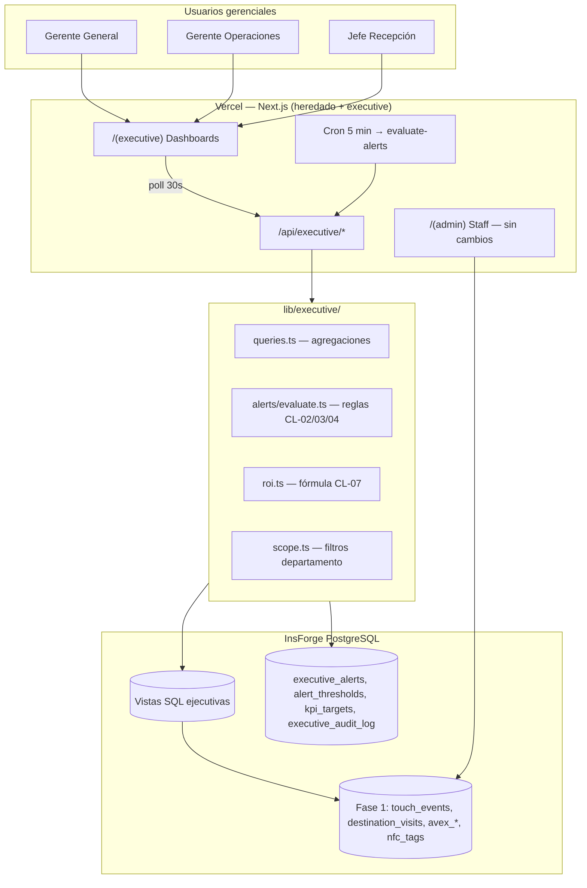
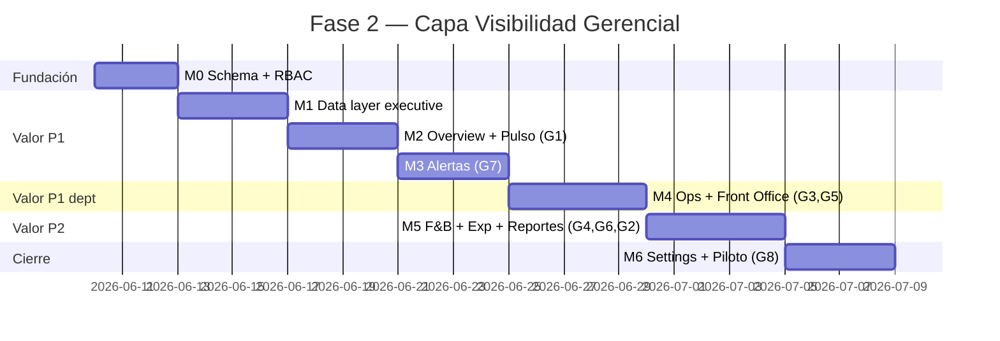

# Plan de Implementación: TagMe — Capa de Visibilidad Gerencial

**Branch**: `002-tagme-clevel` | **Fecha**: 2026-06-09 | **Spec**: [spec.md](./spec.md)

**Constitución**: [constitution.md](./constitution.md) v1.0.0

**Input**: Spec clarificada (lote crítico CL-02/03/04/07/08/10/11/13) + stack heredado Fase 1

---

## Summary

La **Capa de Visibilidad Gerencial** extiende el monolito Next.js existente con un nuevo route group `app/(executive)/`, APIs bajo `/api/executive/*`, y una migración SQL que agrega tablas de alertas/configuración + vistas analíticas sobre datos de Fase 1. **No se duplican eventos raw** ni se introduce cola de mensajes ni BI externo.

Enfoque pragmático para piloto Hotel Caribe (~3 tags, ~150–700 interacciones/semana):

1. **Agregaciones** en vistas SQL + módulo `lib/executive/` (queries tipadas, testeables).
2. **Pulso en tiempo real** vía polling cliente cada 30 s (cumple NFR-G003 ≤60 s; evita complejidad InsForge Realtime en MVP).
3. **Alertas** evaluadas por **Vercel Cron cada 5 min** → API route protegida → persiste en `executive_alerts` (deduplicación en DB).
4. **RBAC** extendido en `user_profiles` con roles gerenciales y `executive_scope`.
5. Entrega incremental en **6 milestones** alineados a user stories P1→P3 de la spec.

---

## Constitution Check

*GATE: Pre-implementación ✅*

| Principio (Constitution Fase 2) | Gate | Estado |
|---------------------------------|------|--------|
| I. Spec-Driven Development | Plan deriva de `spec.md`; sin scope §5.2 | ✅ |
| II. Decision-First, Not Data-First | Cada endpoint/dashboard mapea a pregunta gerencial + acción | ✅ |
| III. Visibilidad sin Supervisión Física | Pulso + alertas proactivas en M2–M3 | ✅ |
| IV. Capa de Inteligencia, No Reemplazo | Sin PMS/POS; solo consume Fase 1 | ✅ |
| V. Métricas Accionables y ROI | Fórmula CL-07; KPIs CL-08 con meta vs. real | ✅ |
| VI. Claridad Ejecutiva y Visual | Componentes KPI card + alert feed + narrativa | ✅ |
| VII. Pragmatismo e Entrega Incremental | 6 milestones; sin ML ni jobs complejos | ✅ |

**Post-diseño**: Sin violaciones que requieran Complexity Tracking. Polling + Cron justificados vs. Realtime (costo/complejidad > beneficio en piloto 3 tags).

---

## Arquitectura General



### Las 4 capas → implementación

| Capa | Fuente primaria | Transformación | Superficie UI |
|------|-----------------|----------------|---------------|
| **1. Pulso RT** | `touch_events`, `avex_sessions` (últimos 30 min) | Query rolling + comparativo hora actual | `ExecutivePulse`, `AvexPulseCard` |
| **2. Rendimiento** | Vistas `v_*` + `lib/analytics/metrics.ts` extendido | Δ% vs. semana anterior; heatmap zona | Dashboards dept.; charts reutilizados |
| **3. Experiencia** | Join toque→destino; AVEX `escalated` | Abandono %, latencia mediana server-side | `ExperienceQualityPanel` |
| **4. ROI** | AVEX resueltas + self-service NFC | `roi.ts` fórmula CL-07; meta vs. real CL-08 | `RoiSummaryCard`, reporte export |

### Separación de concerns (no romper Fase 1)

| Superficie | Audiencia | Rutas | APIs |
|------------|-----------|-------|------|
| Guest | Huésped | `/(guest)/t/[tagSlug]` | `/api/events/*`, `/api/avex/chat` |
| Staff/Admin | Staff operativo | `/(admin)/*` | `/api/admin/*`, `/api/metrics/summary` |
| **Executive** | Gerencia | `/(executive)/*` | `/api/executive/*` |

Staff (`staff`, `ops`) y admin operativo **no** acceden a `/(executive)` salvo `admin` con permiso técnico de lectura sistema (CL-13).

---

## Alimentación de Dashboards y Alertas

### Pipeline de datos

```mermaid
sequenceDiagram
    participant G as Guest / AVEX
    participant F1 as Tablas Fase 1
    participant V as Vistas SQL
    participant C as Cron 5 min
    participant E as executive_alerts
    participant D as Dashboard executive

    G->>F1: INSERT touch_events, destination_visits, avex_*
    Note over F1,V: Sin ETL; vistas leen directo

    C->>V: Lee agregados + baseline
    C->>E: UPSERT alertas (dedup 4h)

    D->>V: GET pulse, KPIs, tendencias
    D->>E: GET alertas activas
    Note over D: Poll cada 30s en vista pulso
```

### Fuentes por señal gerencial

| Señal | Tablas Fase 1 | Vista / query nueva | Caché |
|-------|---------------|---------------------|-------|
| Toques por zona/tag | `touch_events` + `nfc_tags` | `v_touches_by_zone_hourly` | No (volumen bajo) |
| Pulso 30 min | `touch_events` | Query parametrizada en `queries.pulse()` | No |
| Baseline mediana hora | `touch_events` | `v_hourly_baseline_median` (4 semanas) | Sí — resultado estable 5 min |
| AVEX derivaciones | `avex_sessions` + `avex_messages` | `v_avex_effectiveness` | No |
| Abandono | `touch_events` LEFT JOIN `destination_visits` | `v_touch_abandonment` | No |
| Canal acceso | `touch_events.channel` | `v_channel_breakdown` | No |
| Latencia hub→destino | `touch_events` + `destination_visits` | `MIN(dv.created_at - te.created_at)` agregado | No |
| ROI AVEX | `avex_sessions` | `lib/executive/roi.ts` | No |
| Tags inactivos | `nfc_tags` + `touch_events` | Lógica en `evaluate.ts` | N/A |

### Dónde se calculan las alertas

**Decisión: API route + Cron, no triggers SQL ni InsForge Schedules en MVP.**

| Opción | Elegida | Rechazada | Razón |
|--------|---------|-----------|-------|
| Evaluación alertas | `lib/executive/alerts/evaluate.ts` invocada por Cron | Triggers PostgreSQL | Reglas legibles, unit-testeables, umbrales en JSON/DB |
| Persistencia | Tabla `executive_alerts` | Solo in-memory | Trazabilidad, bandeja, auditoría |
| Frecuencia | Cron Vercel **5 min** | Realtime stream | Constitution §4.4: ≤60 s suficiente; 5 min eval + 30 s poll UI cumple |
| Baseline gate | Check en `evaluate.ts` antes de CL-02 | Siempre activo | CL-11: 14 días + 100 toques |

**Flujo `evaluateAlerts(venueId)`**:

1. Cargar `alert_thresholds` del venue (defaults seed CL-02/03/04).
2. Si `days_since_first_touch < 14` OR `total_touches < 100` → skip alertas estadísticas; permitir `tag_disabled`, `avex_critical`, `system_health`.
3. Evaluar reglas en orden: tag inactivo → caída actividad → derivación AVEX → pico inusual (opcional M4).
4. `UPSERT` en `executive_alerts` con clave dedup `(venue_id, alert_type, entity_ref, window_start)`; ventana dedup **4 h**.
5. `INSERT` en `executive_audit_log` solo para acciones humanas (no para evaluación automática).

---

## Modelo de Datos Nuevo (sin romper Fase 1)

Migración: `migrations/20260609120000_executive-layer.sql`

### Extensiones a entidades existentes

```sql
-- user_profiles: extender roles gerenciales
ALTER TABLE user_profiles
  DROP CONSTRAINT user_profiles_role_check,
  ADD CONSTRAINT user_profiles_role_check CHECK (
    role IN ('staff', 'admin', 'ops', 'executive', 'manager', 'department_head')
  );

ALTER TABLE user_profiles
  ADD COLUMN executive_scope TEXT
    CHECK (executive_scope IS NULL OR executive_scope IN (
      'operations', 'fnb', 'experience', 'front_office'
    ));
```

`admin` existente conserva acceso staff; `executive`/`manager`/`department_head` acceden a `/(executive)`.

### Tablas nuevas

| Tabla | Propósito | Campos clave |
|-------|-----------|--------------|
| `executive_alerts` | Bandeja de alertas | `type`, `severity`, `status`, `department`, `entity_ref`, `message`, `suggested_action`, `dedup_key`, `acknowledged_by`, timestamps |
| `alert_thresholds` | Umbrales configurables | `venue_id`, `alert_type`, `department`, `config` (jsonb), `is_active` |
| `kpi_targets` | Metas CL-08 | `venue_id`, `department`, `kpi_key`, `period` (weekly/monthly), `target_value`, `comparison` (gte/lte) |
| `executive_audit_log` | Auditoría gerencial | `user_id`, `action`, `resource_type`, `resource_id`, `metadata` jsonb |
| `venue_baseline` | Cache baseline (opcional) | `venue_id`, `first_touch_at`, `total_touches`, `baseline_ready` boolean — evita recalcular |

### Vistas SQL nuevas

| Vista | Descripción |
|-------|-------------|
| `v_touches_by_zone_hourly` | `venue_id`, `zone`, `hour`, `touches` |
| `v_touches_by_tag_daily` | `venue_id`, `tag_id`, `day`, `touches` |
| `v_hourly_baseline_median` | Mediana toques por `venue_id`, `zone`, `dow`, `hour` (28 días) |
| `v_avex_effectiveness` | `venue_id`, `day`, `sessions`, `resolved`, `escalated`, `derivation_pct` |
| `v_touch_abandonment` | `venue_id`, `zone`, `day`, `touches`, `with_destination`, `abandonment_pct` |
| `v_channel_breakdown` | `venue_id`, `channel`, `count`, `pct` |
| `v_latency_to_destination` | `venue_id`, `tag_id`, `median_seconds`, `p95_seconds` |

Todas con `security_invoker = true`; RLS hereda de tablas subyacentes + políticas nuevas para roles executive.

### Seed Hotel Caribe

Extender `scripts/seed-hotel-caribe.ts`:

- `alert_thresholds` con valores CL-02/03/04.
- `kpi_targets` con tabla CL-08.
- Usuarios demo: `executive`, `manager` (operations), `department_head` (front_office).

---

## Decisiones Técnicas Clave

| Decisión | Elegido | Alternativa rechazada | Razón |
|----------|---------|----------------------|-------|
| **Tiempo real UI** | Polling cliente 30 s en pulso | InsForge Realtime | Piloto 3 tags; Constitution permite ≤60 s; menos infra |
| **Tiempo real alertas** | Cron 5 min + tabla persistida | Evaluar solo al abrir dashboard | Alertas deben existir sin que gerente abra panel (§4.1) |
| **Agregaciones pesadas** | Vistas SQL + índices existentes | Materialized views | Volumen piloto bajo; refresh manual innecesario |
| **Agregaciones ligeras** | TypeScript en `lib/executive/` | Todo en SQL | ROI, narrativa, filtros scope — más legible en TS |
| **Latencia experiencia** | Server-side `touch_events` → `destination_visits` | Beacon cliente | CL-15 pendiente; server-side suficiente MVP |
| **Auth executive** | Extender `lib/auth/session.ts` | Auth separado | Un InsForge Auth; `requireExecutive()` |
| **Charts** | Extraer primitivos de `components/admin/` → `components/charts/` | Reescribir | Reutilización Fase 1 |
| **Reportes** | CSV en M5; PDF vía print CSS / `@react-pdf/renderer` en M5 | Servicio PDF externo | Pragmatismo; CSV cumple SC-G007 parcial |
| **PDF library** | Evaluar en M5; default print-friendly HTML | — | Evitar dependencia pesada hasta validar necesidad |
| **Cron auth** | Header `Authorization: Bearer ${CRON_SECRET}` | Sin protección | Seguridad mínima Vercel Cron |
| **Baseline UI** | Banner `CalibrationBanner` si `!baseline_ready` | Ocultar dashboards | Gerencia ve datos desde día 1; alertas esperan CL-11 |

---

## Estructura de Carpetas y Componentes (Next.js)

```text
app/
├── (guest)/                    # Sin cambios
├── (admin)/                    # Sin cambios — staff operativo
│   └── dashboard/              # TagMétricas Fase 1 permanece
├── (executive)/                # NUEVO — gerencia
│   ├── layout.tsx              # Sidebar executive, densidad desktop/tablet
│   ├── page.tsx                # Redirect → /executive/overview
│   ├── overview/page.tsx       # G1 — Dashboard Gerente General
│   ├── operations/page.tsx     # G3 — Operaciones / Rooms
│   ├── fnb/page.tsx            # G4 — F&B
│   ├── front-office/page.tsx   # G5 — Recepción / AVEX
│   ├── experience/page.tsx     # G6 — Marketing / contenido
│   ├── alerts/page.tsx         # G7 — Bandeja alertas
│   ├── reports/page.tsx        # G2 — Exportar reportes
│   └── settings/page.tsx       # G8 — Umbrales y metas (M6)
├── api/
│   ├── executive/
│   │   ├── pulse/route.ts              # Capa 1 — pulso 30 min
│   │   ├── overview/route.ts           # Capa 1+2+4 — consolidado GG
│   │   ├── department/[scope]/route.ts # Dashboards dept.
│   │   ├── alerts/route.ts             # GET bandeja; PATCH acknowledge
│   │   ├── alerts/evaluate/route.ts    # POST cron (interno)
│   │   ├── roi/route.ts                # Capa 4 — ROI CL-07
│   │   ├── kpis/route.ts               # Meta vs. real CL-08
│   │   ├── thresholds/route.ts         # CRUD umbrales (executive)
│   │   ├── reports/export/route.ts     # CSV/PDF
│   │   └── me/route.ts                 # Perfil executive + scope
│   ├── admin/                  # Sin cambios
│   ├── events/                 # Sin cambios
│   └── metrics/summary/        # Sin cambios — staff sigue usándolo

components/
├── charts/                     # NUEVO — extraído de admin/
│   ├── TouchChart.tsx
│   ├── PeakHoursChart.tsx
│   ├── DestinationBreakdown.tsx
│   └── ZoneHeatmap.tsx         # NUEVO
├── admin/                      # Importa desde charts/
├── executive/                  # NUEVO
│   ├── ExecutiveSidebar.tsx
│   ├── ExecutiveLayout.tsx
│   ├── KpiCard.tsx             # Valor + Δ% + narrativa + acción
│   ├── AlertFeed.tsx           # Severidad, departamento, CTA
│   ├── AlertActions.tsx        # Reconocer / asignar / descartar
│   ├── PulsePanel.tsx          # Pulso RT + "Actualizado hace N s"
│   ├── CalibrationBanner.tsx   # CL-11 período calibración
│   ├── DepartmentDashboard.tsx # Shell reutilizable por scope
│   ├── AvexEffectiveness.tsx
│   ├── RoiSummaryCard.tsx
│   ├── TagRankingTable.tsx
│   ├── ExecutiveFilters.tsx    # venue, rango, zona, tag
│   └── ReportExportForm.tsx
└── guest/                      # Sin cambios

lib/
├── analytics/
│   └── metrics.ts              # Sin breaking changes; opcional wrappers
├── executive/                  # NUEVO
│   ├── queries.ts              # Pulse, trends, zone, tag, AVEX
│   ├── roi.ts                  # Fórmula CL-07
│   ├── kpis.ts                 # Meta vs. real
│   ├── scope.ts                # Filtros RBAC por executive_scope
│   ├── baseline.ts             # Gate CL-11
│   ├── alerts/
│   │   ├── evaluate.ts         # Motor de reglas
│   │   ├── rules/
│   │   │   ├── activity-drop.ts
│   │   │   ├── tag-inactive.ts
│   │   │   └── avex-derivation.ts
│   │   └── dedup.ts
│   └── reports/
│       └── weekly-summary.ts
├── auth/
│   └── session.ts              # + ExecutiveRole, requireExecutive()
└── validators/
    └── executive.ts            # Zod schemas APIs executive

migrations/
└── 20260609120000_executive-layer.sql

tests/
├── unit/
│   ├── executive-alerts.test.ts
│   ├── executive-roi.test.ts
│   └── executive-scope.test.ts
└── integration/
    └── executive-api.test.ts

vercel.json                     # cron: */5 * * * *
```

### Componentes principales y responsabilidad

| Componente | Capa | User Story |
|------------|------|------------|
| `PulsePanel` | 1 | G1, G3, G5 |
| `AlertFeed` + `AlertActions` | 1 + control | G7 |
| `KpiCard` + `DepartmentDashboard` | 2 | G3, G4, G5, G6 |
| `AvexEffectiveness` | 2 + 3 | G5 |
| `RoiSummaryCard` | 4 | G1, G2 |
| `CalibrationBanner` | Transversal | CL-11 |
| `ReportExportForm` | 4 | G2 |

**Diseño visual**: heredar tokens Tailwind `tagme-*`; layout más denso (más KPIs por viewport); sidebar fija desktop, colapsable tablet. Sin mobile-first.

---

## Reutilización Fase 1 vs. Trabajo Nuevo

### Reutilizar directamente (sin cambios o mínimos)

| Artefacto | Uso en Fase 2 |
|-----------|---------------|
| `touch_events`, `destination_visits`, `avex_*`, `nfc_tags`, `venues`, `knowledge_entries` | Fuente primaria de todas las capas |
| `v_touches_daily`, `v_touches_hourly`, `v_destination_breakdown` | Base rendimiento; extendidas por zona |
| `lib/analytics/metrics.ts` → `getMetricsSummary()` | Staff dashboard + input para comparativos executive |
| `lib/analytics/track.ts` | Sin cambios |
| `components/admin/*Chart*.tsx` | Mover a `components/charts/`; import en admin y executive |
| `lib/auth/session.ts` → InsForge Auth, `assertVenueAccess` | Patrón base para `requireExecutive` |
| `lib/insforge-server.ts`, `lib/insforge-ssr.ts` | Clientes DB |
| `scripts/seed-hotel-caribe.ts` | Extender con thresholds/KPIs/usuarios executive |
| `middleware.ts` | Patrón auth; agregar rutas `/executive` |
| RLS existente en tablas Fase 1 | Políticas SELECT staff; agregar políticas executive |

### Trabajo nuevo (requerido)

| Área | Esfuerzo | Notas |
|------|----------|-------|
| Migración SQL executive | Medio | Tablas + vistas + RLS + seed |
| `lib/executive/*` | Alto | Core del valor gerencial |
| `app/(executive)/*` | Alto | 7 páginas + layout |
| `/api/executive/*` | Medio | ~8 routes |
| Motor alertas + Cron | Medio | Reglas CL-02/03/04 testeadas |
| RBAC executive | Medio | Roles, scope, middleware |
| Componentes `executive/` | Alto | KPI cards, alert feed, narrativa |
| Reportes CSV/PDF | Bajo–Medio | M5 |
| Tests unitarios alertas/ROI | Medio | Vitest |
| Contratos `specs/002-clevel/contracts/` | Bajo | Paralelo a implementación APIs |

### No tocar (explícito)

- Flujos `/(guest)/*` y `/api/avex/chat` salvo instrumentación futura CL-15.
- `/(admin)/*` staff CMS — gerencia **solicita** corrección vía alerta → staff ejecuta en admin existente.
- `GET /api/metrics/summary` — contrato Fase 1 intacto para ops/staff.

---

## Orden de Implementación — Milestones



### M0 — Fundación (schema, roles, seed)

**Entregable**: Migración aplicada; usuarios executive demo; thresholds/KPIs seed.

- [ ] `20260609120000_executive-layer.sql` — tablas + vistas + RLS
- [ ] Extender `user_profiles` roles + `executive_scope`
- [ ] Seed CL-02/03/04/08 en `alert_thresholds` + `kpi_targets`
- [ ] `lib/auth/session.ts` — `ExecutiveRole`, `requireExecutive()`, `assertExecutiveScope()`
- [ ] `middleware.ts` — proteger `/executive/*`
- [ ] `lib/validators/executive.ts` — schemas base
- [ ] Contrato borrador `contracts/executive-api.md`

**Criterio done**: login como `executive` redirige a `/(executive)`; staff no accede.

---

### M1 — Capa de datos executive

**Entregable**: `lib/executive/queries.ts` con funciones testeadas; baseline gate.

- [ ] Vistas SQL validadas contra datos seed
- [ ] `queries.pulse(venueId, windowMin=30)`
- [ ] `queries.trends(venueId, period)` — Δ% vs. semana anterior
- [ ] `queries.byZone()`, `queries.byTag()`, `queries.avexEffectiveness()`
- [ ] `queries.abandonment()`, `queries.channelBreakdown()`, `queries.latency()`
- [ ] `baseline.isReady(venueId)` — CL-11 (14 días + 100 toques)
- [ ] `roi.calculate(venueId, period)` — CL-07
- [ ] `kpis.compareTargets(venueId, period)` — CL-08
- [ ] Tests unitarios: `executive-roi.test.ts`, `executive-scope.test.ts`

**Criterio done**: funciones retornan datos correctos con seed; `getMetricsSummary` sin regresión.

---

### M2 — Dashboard ejecutivo + pulso (G1) — P1 🎯

**Entregable**: Gerente General ve panorama en ≤2 min.

- [ ] Refactor charts → `components/charts/`
- [ ] `app/(executive)/overview/page.tsx`
- [ ] `GET /api/executive/overview` — KPIs clave, tendencia semanal, resúmenes dept.
- [ ] `GET /api/executive/pulse` — actividad 30 min, AVEX reciente
- [ ] `PulsePanel` con timestamp "Actualizado hace N s" + poll 30 s
- [ ] `CalibrationBanner` cuando `!baseline_ready`
- [ ] `KpiCard` con Δ%, tooltip definición, acción sugerida
- [ ] `RoiSummaryCard` (estimado operativo)
- [ ] Degradación elegante si API falla (últimos datos + banner)

**Criterio done**: SC-G001, SC-G002, SC-G003 en entorno dev con seed.

---

### M3 — Sistema de alertas (G7) — P1 🎯

**Entregable**: Alertas proactivas clasificadas con bandeja y acciones.

- [ ] `lib/executive/alerts/evaluate.ts` + rules (CL-02/03/04/10)
- [ ] `POST /api/executive/alerts/evaluate` — cron protegido
- [ ] `vercel.json` cron `*/5 * * * *`
- [ ] `GET /api/executive/alerts` — filtros severidad, dept., status
- [ ] `PATCH /api/executive/alerts/[id]` — acknowledge / assign / dismiss
- [ ] `app/(executive)/alerts/page.tsx` + `AlertFeed` + `AlertActions`
- [ ] Integrar top alertas en `overview` (sección superior)
- [ ] `executive_audit_log` en acciones humanas
- [ ] Tests: `executive-alerts.test.ts` — dedup, baseline gate, umbrales

**Criterio done**: simular tag inactivo + pico derivaciones → alertas visibles; dedup 4 h funciona.

---

### M4 — Dashboards Operaciones + Front Office (G3, G5) — P1

**Entregable**: Gerente Operaciones y Jefe Recepción con vistas dept.

- [ ] `GET /api/executive/department/[scope]`
- [ ] `app/(executive)/operations/page.tsx` — zona, tag, habitación atípica, heatmap
- [ ] `app/(executive)/front-office/page.tsx` — AVEX, derivaciones, temas
- [ ] `scope.ts` — filtrar tags por `zone` según CL-13
- [ ] `AvexEffectiveness`, `TagRankingTable`, `ZoneHeatmap`
- [ ] Acción "Solicitar corrección contenido" → audit log + nota para staff (sin workflow automático)

**Criterio done**: SC-G009 — top 3 temas derivación en ≤1 min; habitación atípica sin PII.

---

### M5 — F&B, Experiencia, Reportes (G4, G6, G2) — P2

**Entregable**: Dashboards restantes + export semanal.

- [ ] `app/(executive)/fnb/page.tsx` — menú %, horas pico restaurant/bar
- [ ] `app/(executive)/experience/page.tsx` — destinos, perfil demanda, post-update Δ
- [ ] `app/(executive)/reports/page.tsx`
- [ ] `GET /api/executive/reports/export?format=csv|pdf`
- [ ] `weekly-summary.ts` — dimensiones: interacciones, zonas top, AVEX, alertas, comparativo
- [ ] Impacto contenido: ventana 7 días post `experience_configs.updated_at` (default pragmático)

**Criterio done**: CSV exportable; PDF o print view con mismas dimensiones.

---

### M6 — Configuración + validación piloto (G8) — P3

**Entregable**: Umbrales/metas editables; checklist piloto.

- [ ] `app/(executive)/settings/page.tsx` — solo `executive`
- [ ] `GET/PATCH /api/executive/thresholds`, `GET/PATCH /api/executive/kpis`
- [ ] Documentar `quickstart.md` ejecutivo
- [ ] `checklists/pilot-validation-executive.md`
- [ ] Usuarios reales Hotel Caribe provisionados
- [ ] Capacitación 30 min gerencia (R-G09)

**Criterio done**: Constitution §8 — gerente supervisa 1 semana (SC-G005) con señales cubiertas.

---

## Contratos API (resumen — detalle en `contracts/`)

| Endpoint | Método | Rol | Descripción |
|----------|--------|-----|-------------|
| `/api/executive/me` | GET | executive+* | Perfil, scope, venue |
| `/api/executive/pulse` | GET | executive+* | Pulso 30 min, AVEX reciente |
| `/api/executive/overview` | GET | executive | Consolidado GG |
| `/api/executive/department/:scope` | GET | executive / manager / dept_head | Dashboard dept. |
| `/api/executive/alerts` | GET | executive+* | Bandeja alertas |
| `/api/executive/alerts/:id` | PATCH | executive+* | Acciones alerta |
| `/api/executive/alerts/evaluate` | POST | cron secret | Evaluación reglas |
| `/api/executive/roi` | GET | executive | ROI CL-07 |
| `/api/executive/kpis` | GET/PATCH | executive | Meta vs. real |
| `/api/executive/thresholds` | GET/PATCH | executive | Umbrales |
| `/api/executive/reports/export` | GET | executive | CSV/PDF |

`*` según `executive_scope` y CL-13.

---

## Riesgos Técnicos y Mitigaciones

| ID | Riesgo | Prob. | Impacto | Mitigación |
|----|--------|-------|---------|------------|
| **T-R01** | Queries baseline mediana lentas | Media | Medio | Índice `(venue_id, created_at)` ya existe; vista limita 28 días; pilot volume bajo |
| **T-R02** | Alert fatigue por umbrales | Media | Alto | Defaults CL-02 B; dedup 4 h; gracia 72 h tags; umbral mínimo sesiones AVEX |
| **T-R03** | Regresión staff dashboard | Baja | Alto | No modificar contrato `/api/metrics/summary`; tests integración existentes |
| **T-R04** | Cron no corre en dev local | Alta | Bajo | `npm run alerts:evaluate` script manual; botón dev-only en settings |
| **T-R05** | RLS bloquea vistas executive | Media | Alto | `security_invoker`; políticas explícitas `is_executive()`; test integración |
| **T-R06** | Polling excesivo carga DB | Baja | Medio | 1 request/30s/usuario; piloto <10 usuarios gerenciales |
| **T-R07** | Latencia server-side imprecisa | Media | Bajo | Etiquetar "proxy"; CL-15 pospuesto; no bloquea MVP |
| **T-R08** | PDF complejo retrasa M5 | Media | Bajo | CSV primero; PDF print CSS como fallback |
| **T-R09** | Roles mal asignados en prod | Media | Medio | Seed demo + checklist provisión; `admin` no implica `executive` |

---

## Technical Context

| Campo | Valor |
|-------|-------|
| **Language** | TypeScript 5.x, Node 20 LTS |
| **Frontend** | Next.js 15 App Router, React 19, Tailwind, Recharts |
| **Backend** | InsForge PostgreSQL + Auth (`@insforge/sdk`) |
| **Nuevas deps** | Ninguna obligatoria MVP; opcional `@react-pdf/renderer` en M5 |
| **Testing** | Vitest (unit alertas/ROI/scope), Playwright (smoke executive login) |
| **Cron** | Vercel Cron → `/api/executive/alerts/evaluate` |
| **Performance** | Overview ≤3 s; filtros ≤1 s (NFR-G001/G002); pulse stale ≤60 s |
| **Scale** | 1 venue, 3–10 tags, ~1000 toques/día pico, <10 usuarios gerenciales |

---

## Complexity Tracking

| Decisión | ¿Violación? | Justificación |
|----------|-------------|---------------|
| 5 tablas + 7 vistas nuevas | No | Spec exige alertas, umbrales, auditoría; no hay alternativa más simple |
| Cron 5 min | No | Constitution §4.4; más simple que Realtime o job queue |
| Route group separado `(executive)` | No | Constitution §6; separación staff vs. gerencia |

---

## Artefactos de esta fase

| Artefacto | Ubicación | Estado |
|-----------|-----------|--------|
| Constitution | `constitution.md` | ✅ v1.0.0 |
| Spec | `spec.md` | ✅ Parcialmente clarificada |
| Plan | `plan.md` | ✅ Este documento |
| Data model (detalle) | Incorporado en § Modelo de Datos | ✅ |
| Contratos API | `contracts/executive-api.md` | Pendiente — crear en M0 |
| Tasks | `tasks.md` | ✅ Generado 2026-06-09 |
| Quickstart gerencial | `quickstart.md` | Pendiente — M6 |
| Checklist piloto | `checklists/pilot-validation-executive.md` | Pendiente — M6 |

---

## Siguiente paso

```bash
/speckit.tasks
```

Descomponer milestones M0–M6 en tareas accionables con dependencias, alineadas a FR-G* y user stories G1–G8.

---

*Plan alineado a `specs/002-clevel/constitution.md` y `spec.md`. Implementación solo en rama `002-tagme-clevel` tras aprobación de este plan.*