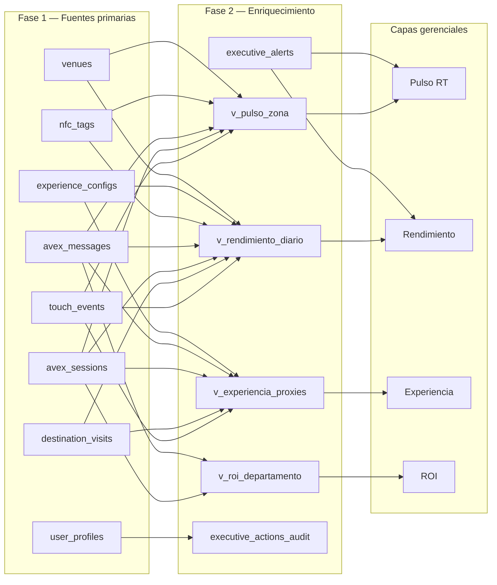

# Especificación de Funcionalidad: TagMe — Capa de Visibilidad Gerencial (Executive Visibility Layer)

**Rama de funcionalidad**: `002-tagme-clevel`

**Iniciativa**: Capa de Visibilidad Gerencial (Executive Visibility Layer)

**Creado**: 2026-06-09

**Estado**: Parcialmente clarificado — 5/15 ítems resueltos (2026-06-09); pendiente validación humana y CL-01, CL-05, CL-06, CL-09, CL-12, CL-14, CL-15

**Clarificaciones resueltas** (2026-06-09, lote crítico):
- **CL-02, CL-03, CL-04** → Umbrales de alertas (ver § Clarificaciones)
- **CL-07** → Fórmula ROI AVEX
- **CL-08** → KPIs meta piloto Hotel Caribe
- **CL-11** → Baseline mínimo (14 días)
- **CL-13** → Matriz roles–departamentos

**Constitución aplicable**: `specs/002-clevel/constitution.md` v1.0.0

**Herencia de Fase 1**: `specs/001-tagme-platform/` (TagMétricas, `touch_events`, `destination_visits`, AVEX, entidades venue/tag)

**Fuente de negocio**: `TagMe.pdf` (Presentación Comercial v1.0) — sección TagMétricas y promesa de valor para establecimientos

**Input del usuario**: Capa de inteligencia gerencial que entrega visibilidad, control y capacidad de decisión a Gerentes y Jefes de Departamento sin supervisión física constante.

---

## Resumen Ejecutivo

### Problema que enfrentan los gerentes hoy

En la Fase 1, TagMe resolvió la conexión huésped–venue y comenzó a capturar señales digitales (toques NFC, visitas a destinos, sesiones AVEX). Sin embargo, **los tomadores de decisión del hotel siguen operando con visibilidad fragmentada**:

| Dolor actual | Manifestación en el día a día |
|--------------|-------------------------------|
| **Ceguera operativa fuera del piso** | El Gerente General no sabe qué ocurre en restaurante, lobby o habitaciones sin caminar el hotel o pedir reportes verbales al cierre del turno. |
| **Datos sin contexto ni acción** | TagMétricas de Fase 1 entrega conteos (toques, destinos, horas pico), pero no responde preguntas gerenciales: *¿hay un problema ahora?*, *¿dónde actuar?*, *¿qué decisión tomar?* |
| **Dependencia de reportes manuales** | Jefes de departamento consolidan información de recepción, F&B y mantenimiento en hojas de cálculo o WhatsApp; hay retraso, inconsistencia y pérdida de señales digitales. |
| **AVEX invisible para gerencia** | Las derivaciones a humano, temas recurrentes y gaps de conocimiento quedan en el chat del huésped; recepción los absorbe sin visibilidad agregada para corregir procesos o contenido. |
| **Sin alertas proactivas** | Un tag inactivo, un pico anómalo de consultas o una caída de actividad se detectan tarde — cuando el huésped ya reclamó o el turno terminó. |
| **ROI de TagMe difícil de demostrar** | Sin métricas de impacto operativo (consultas resueltas sin staff, reducción de fricción, eficiencia por área), la inversión en NFC y AVEX es difícil de justificar ante dirección o cadena. |

**Resultado**: Gerentes y jefes de departamento toman decisiones de staffing, contenido, capacitación y priorización **sin una capa unificada de inteligencia** sobre la experiencia digital del huésped y el desempeño operativo asociado.

### Solución propuesta

La **Capa de Visibilidad Gerencial** transforma las señales ya capturadas en Fase 1 en **inteligencia accionable para gerencia**: dashboards por rol, alertas proactivas, narrativa contextual y reportes ejecutivos. Cada vista responde una pregunta de negocio concreta y habilita una decisión sin exigir presencia física en el piso ni supervisión manual de métricas crudas.

**Usuario primario de esta fase**: Gerente General, Gerentes de Área (Operaciones/Rooms, F&B, Experiencia/Marketing) y Jefes de Departamento (Recepción/Front Office).

**Principio rector** (Constitución Fase 2, Principio II): *Decision-First, Not Data-First* — ningún KPI se expone sin contexto, comparativo y vínculo a una acción posible.

---

## Objetivos de la Capa de Visibilidad Gerencial

| ID | Objetivo | Alineación Constitution / Fase 1 |
|----|----------|----------------------------------|
| **OBJ-G01** | Permitir que la gerencia entienda **qué ocurre ahora** en el hotel (pulso en tiempo real) sin estar en el piso | Principio III — Visibilidad sin supervisión física |
| **OBJ-G02** | Entregar **rendimiento operativo** por departamento y zona con tendencias y comparativos accionables | §3.2 Rendimiento operativo |
| **OBJ-G03** | Inferir y surfacear la **calidad de la experiencia digital del huésped** mediante proxies medibles (abandono, latencia, derivaciones AVEX) | §3.3 Experiencia del huésped |
| **OBJ-G04** | Demostrar **valor ejecutivo y ROI operativo** de TagMe para justificar inversión y priorización | §3.4 Valor y control ejecutivo; Principio V |
| **OBJ-G05** | **Alertar proactivamente** sobre anomalías e incidencias con severidad, dueño y trazabilidad | §4.1 Alertas y excepciones |
| **OBJ-G06** | Ofrecer **vistas diferenciadas por rol gerencial** (ejecutivo consolidado vs. departamental) | §4.2 Dashboards por rol |
| **OBJ-G07** | **Reutilizar y enriquecer** datos de Fase 1 sin duplicar pipelines ni exponer PII | Principio IV; §6 herencia técnica |
| **OBJ-G08** | Validar la capa en **Hotel Caribe by Faranda Grand** con escenarios gerenciales reales durante al menos una semana de supervisión autónoma | §8 Criterio de done de la fase |

---

## Alcance del MVP — Capa de Visibilidad Gerencial

### Dentro del MVP

| Área | Incluido | Capa(s) |
|------|----------|---------|
| **Dashboard ejecutivo consolidado** | Vista Gerente General: pulso, KPIs clave, alertas activas, tendencias semanales | Pulso + ROI |
| **Dashboard Operaciones / Rooms** | Interacciones por zona/tag, habitaciones atípicas, fricción de acceso, estado de tags | Pulso + Operativo + Experiencia |
| **Dashboard F&B** | Uso menú digital, horas pico restaurante/bar, demanda vs. capacidad inferida | Operativo |
| **Dashboard Front Office / Recepción** | Volumen AVEX, derivaciones, temas top, tags de bajo rendimiento | Pulso + Operativo + Experiencia |
| **Dashboard Experiencia / Marketing** | Destinos consultados, efectividad contenido post-actualización, perfil de demanda agregado | Operativo + Experiencia |
| **Sistema de alertas gerenciales** | Detección, clasificación (informativa/atención/crítica), bandeja, reconocer/asignar/descartar | Pulso |
| **Enriquecimiento TagMétricas** | Vistas SQL, agregaciones derivadas, proxies de experiencia y eficiencia AVEX | Todas |
| **Reportes ejecutivos exportables** | Resumen semanal/mensual PDF y CSV para reuniones de gerencia | ROI |
| **Roles y permisos gerenciales** | RBAC extendido: `executive`, `manager`, `department_head` (lectura/acción según área) | Transversal |
| **Configuración de umbrales de alerta** | Por venue y departamento, sin intervención de desarrollo | Pulso + ROI |
| **Auditoría de acciones gerenciales** | Registro de quién vio reportes críticos y qué acciones tomó | Transversal |
| **Piloto Hotel Caribe** | Validación con datos reales del venue piloto | Transversal |

### Explícitamente fuera del MVP

| Área | Excluido | Razón (Constitution §5.2) |
|------|----------|---------------------------|
| **Nuevo flujo huésped NFC** | Fuera | Entregado Fase 1; solo consumo de eventos |
| **Rediseño mayor del hub huésped** | Fuera | Salvo instrumentación mínima para nuevas métricas |
| **AVEX transaccional** | Fuera | Sin reservas, pagos ni acciones PMS |
| **Integración PMS / housekeeping / POS / CRM** | Fuera | Sin sync bidireccional; sin ETL en tiempo real |
| **App móvil nativa gerencial** | Fuera | Web responsive desktop/tablet suficiente |
| **BI externo completo** (Power BI, Looker) | Fuera | Exportación sí; cubos externos no |
| **Predicción ML avanzada** | Fuera | Reglas, umbrales y tendencias simples sí |
| **Multi-cadena / marketplace** | Fuera | Piloto + arquitectura preparada |
| **Hardware NFC nuevo** | Fuera | Fase 1 |
| **Notificaciones externas** (email, WhatsApp, Slack) | Fuera del MVP | Zona gris §5.3 — requiere spec adicional |
| **Benchmarks entre múltiples venues** | Fuera del MVP | Zona gris §5.3 |
| **Score compuesto único de "experiencia huésped"** | Fuera del MVP | Zona gris §5.3 — fórmula requiere acuerdo con cliente |

### Zona gris — requiere clarificación antes de implementar

- Integraciones de **solo lectura** con PMS (ocupación, llegadas) para enriquecer contexto habitación.
- Notificaciones push/email para alertas críticas fuera del panel.
- Comparativos entre venues de la misma cadena.
- Fórmula acordada del **índice de experiencia digital** compuesto.

---

## Las Cuatro Capas de Información Gerencial

Cada capa es filtrable por **venue**, **departamento/zona**, **tag** y **ventana temporal**. Toda métrica incluye: valor actual, variación vs. período anterior, explicación breve y acción sugerida cuando aplique.

### Capa 1 — Pulso en tiempo real (Now)

**Pregunta de negocio**: *¿Qué está pasando ahora mismo?*

| Señal | Fuente Fase 1 | Enriquecimiento Fase 2 | Decisión habilitada |
|-------|---------------|------------------------|---------------------|
| Actividad activa por zona | `touch_events` (ventana 15–60 min) | Agregación por `nfc_tags.zone`, tag, habitación; comparativo vs. media del día | Reforzar staff en área con pico inesperado |
| Consultas AVEX recientes | `avex_sessions`, `avex_messages` | Temas frecuentes (clasificación por keywords/categoría KB), tasa derivación última hora | Desplegar agente en recepción si derivaciones > umbral |
| Incidencias y excepciones | Eventos + estado `nfc_tags.is_active` | Tags sin actividad en X h, caída abrupta vs. baseline, destinos con error | Escalar a mantenimiento o TI |
| Estado de salud del sistema | Latencia APIs, errores destino | Indicador de frescura de datos ("Actualizado hace N s") | Validar impacto antes de evento/temporada |

**Latencia objetivo**: ≤ 60 segundos (Constitution §4.4).

**Umbrales de alerta resueltos** (CL-02, CL-03, CL-04 — ver § Clarificaciones Resueltas):
- Caída de actividad: ≥40% bajo mediana histórica → atención; ≥60% → crítica (con piso mínimo de volumen).
- Tag inactivo: `is_active=false` → crítica inmediata; 0 toques en 24 h en horario operativo → atención.
- Derivaciones AVEX: ≥25% en 1 h → atención; ≥40% en 1 h → crítica (con mínimo de sesiones).

**Pendiente** (CL-01): ventana de pulso por defecto — 30 min propuesto, no bloqueante para plan.

---

### Capa 2 — Rendimiento operativo (Today / This Week)

**Pregunta de negocio**: *¿El equipo y la experiencia están cumpliendo lo esperado?*

| Señal | Fuente Fase 1 | Enriquecimiento Fase 2 | Decisión habilitada |
|-------|---------------|------------------------|---------------------|
| Volumen y tendencia de interacciones | `touch_events`, vistas `v_touches_daily` | Δ% vs. día/semana anterior; benchmark rolling del venue | Ajustar promociones o staffing |
| Distribución horaria | `v_touches_hourly` | Heatmap por departamento (lobby, room, restaurant, bar) | Alinear turnos con demanda real |
| Rendimiento por punto NFC / zona | `touch_events` + `nfc_tags` | Ranking tags; comparativo lobby vs. habitación 412 vs. restaurante | Reubicar tags o actualizar contenido en zonas débiles |
| Efectividad AVEX | `avex_messages.escalated`, sesiones | Tasa resolución, derivaciones %, temas top, sesiones con baja confianza | Actualizar KB o capacitar staff |
| Fricción de acceso | `touch_events.channel` | % NFC directo vs. `staff_assisted` vs. `url_direct` | Invertir en capacitación o señalización |
| Destinos y contenido | `destination_visits` | % menú, reservas, reseñas, AVEX; Δ post-actualización `experience_configs` | Priorizar información faltante o desactualizada |

**Resuelto parcialmente**:
- Efectividad AVEX objetivo piloto: derivaciones ≤25% semanal (meta); ≤20% mensual — ver CL-08.
- Benchmark operativo (CL-05): pendiente; comparativo por defecto vs. semana anterior en dashboards.

**Pendiente**: ventana de observación post-actualización de contenido (CL-05 relacionado).

---

### Capa 3 — Experiencia del huésped (Quality)

**Pregunta de negocio**: *¿Los huéspedes están teniendo una buena experiencia digital?*

| Señal | Fuente Fase 1 | Enriquecimiento Fase 2 | Decisión habilitada |
|-------|---------------|------------------------|---------------------|
| Tiempo hasta contenido útil | `touch_events` → primera `destination_visit` | Latencia mediana/p95 por tag y zona | Investigar tags o zonas con degradación |
| Abandono y rebote | Toques sin `destination_visit` asociada | % sesiones sin destino; salida temprana del hub | Revisar UX o relevancia del contenido |
| Satisfacción inferida | AVEX: repetición temas, derivaciones, re-consultas | Proxy de fricción por categoría KB | Corregir gaps de información o proceso |
| Perfil de demanda | `device_type`, `country_code` | Distribución agregada por zona/período | Adaptar contenido para segmentos dominantes |
| Contexto habitación | `nfc_tags.room_number`, interacciones por habitación | Habitaciones con demanda atípica de servicio/AVEX | Investigar necesidad operativa sin PII |

**Restricción de privacidad** (heredada NFR-005 Fase 1): solo agregados y señales anonimizadas; habitación como identificador operativo, nunca huésped identificable.

**NEEDS CLARIFICATION**:
- Umbral de "abandono preocupante" (% toques sin destino).
- Si "repetición de consultas AVEX" se mide por sesión, por fingerprint o por habitación en ventana temporal.
- Si latencia se mide server-side (evento a evento) o requiere instrumentación adicional en cliente.

---

### Capa 4 — Valor ejecutivo / ROI

**Pregunta de negocio**: *¿TagMe está generando retorno y dónde invertir?*

| Señal | Fuente Fase 1 | Enriquecimiento Fase 2 | Decisión habilitada |
|-------|---------------|------------------------|---------------------|
| Impacto operativo estimado | AVEX resueltas sin `escalated` | Consultas resueltas sin staff; carga inferida en recepción evitada | Justificar expansión NFC o KB |
| Eficiencia por departamento | Agregaciones normalizadas por zona/área | Señales por interacción útil, no solo conteos brutos | Reasignar presupuesto o prioridad de mejoras |
| Cumplimiento SLAs internos | Alertas + acciones gerenciales | Tiempo reconocimiento alerta, tiempo corrección contenido | Evaluar desempeño jefes de área |
| Comparativos y objetivos | Metas configurables por venue | Meta vs. real por KPI acordado | Reuniones de desempeño con datos objetivos |

**Resuelto** (CL-07, CL-08):
- ROI primario: sesiones AVEX sin derivación × 3,5 min — ver § Clarificaciones Resueltas.
- KPIs meta por departamento definidos para Hotel Caribe — ver tabla CL-08.

**Pendiente** (CL-09): SLAs internos de respuesta a alertas.

---

## User Scenarios & Testing

Historias priorizadas por valor gerencial y entrega incremental. Perspectiva exclusiva de **gerentes y jefes de departamento** — no huésped ni staff operativo de línea.

---

### Perspectiva: Gerente General

#### User Story G1 — Panorama consolidado del hotel (Prioridad: P1) 🎯 MVP

Como **Gerente General**, quiero **ver en una sola vista el pulso actual del hotel, las alertas críticas activas y los KPIs clave de la semana**, para **entender el estado del negocio en menos de 2 minutos sin recorrer el establecimiento ni pedir reportes a cada jefe**.

**Por qué esta prioridad**: Es la promesa central de Fase 2 — visibilidad sin supervisión física. Sin vista ejecutiva consolidada no hay capa gerencial.

**Prueba independiente**: Gerente accede al dashboard ejecutivo con datos de prueba de 7 días; identifica pulso, 3 KPIs y al menos 1 alerta activa en < 2 minutos.

**Escenarios de aceptación**:

1. **Dado** un Gerente General autenticado con rol `executive`, **Cuando** abre el dashboard consolidado de Hotel Caribe, **Entonces** ve pulso de actividad (últimos 30 min por defecto), conteo de alertas por severidad y tendencia de interacciones de la semana.
2. **Dado** una alerta crítica activa (ej. tag lobby sin actividad en 24 h en día de alta ocupación esperada), **Cuando** el gerente abre el dashboard, **Entonces** la alerta aparece en la sección superior con contexto, área responsable y acción sugerida.
3. **Dado** datos actualizados hace 45 segundos, **Cuando** el gerente consulta el pulso, **Entonces** ve indicador de frescura ("Actualizado hace 45 s").
4. **Dado** interrupción temporal del servicio de actualización, **Cuando** el gerente accede al dashboard, **Entonces** ve últimos datos conocidos con banner de estado degradado.

---

#### User Story G2 — Reporte ejecutivo para reuniones de gerencia (Prioridad: P2)

Como **Gerente General**, quiero **exportar un resumen semanal o mensual en PDF y CSV**, para **presentar en el comité de gerencia con datos objetivos de TagMe sin preparar hojas de cálculo manualmente**.

**Por qué esta prioridad**: Cierra el ciclo de valor ejecutivo (ROI) y valida inversión ante dirección.

**Prueba independiente**: Generar reporte semanal con datos simulados; PDF incluye KPIs, tendencias y alertas resueltas; CSV contiene datos tabulares exportables.

**Escenarios de aceptación**:

1. **Dado** un gerente con rol `executive`, **Cuando** solicita reporte semanal del venue, **Entonces** recibe PDF con pulso promedio, interacciones totales, top zonas, efectividad AVEX y alertas del período.
2. **Dado** el mismo período, **Cuando** exporta CSV, **Entonces** obtiene datos tabulares por día/zona/destino sin PII.
3. **Dado** un período sin actividad (hotel cerrado o sin tags activos), **Cuando** genera reporte, **Entonces** el documento indica explícitamente ausencia de datos con contexto.

---

### Perspectiva: Gerente de Operaciones / Rooms

#### User Story G3 — Supervisión de demanda digital por zona y habitación (Prioridad: P1)

Como **Gerente de Operaciones**, quiero **ver interacciones por zona, tag y habitación con comparativos horarios y vs. semana anterior**, para **alinear staffing y detectar habitaciones o áreas con demanda atípica sin visitar cada piso**.

**Por qué esta prioridad**: Operaciones es el mayor consumidor de señales de pulso y rendimiento; habilita decisiones diarias de recursos.

**Prueba independiente**: Filtrar dashboard Operaciones por zona `room` y habitación 412; verificar heatmap horario y Δ% vs. semana anterior.

**Escenarios de aceptación**:

1. **Dado** actividad registrada en lobby, restaurante y habitaciones, **Cuando** el gerente filtra por departamento Operaciones, **Entonces** ve distribución por `nfc_tags.zone` y ranking de tags.
2. **Dado** habitación 412 con 3× interacciones AVEX vs. media de habitaciones, **Cuando** revisa el panel, **Entonces** la habitación aparece marcada como atípica con enlace al detalle (sin PII del huésped).
3. **Dado** pico inesperado en restaurante entre 20:00–22:00, **Cuando** consulta distribución horaria, **Entonces** identifica la franja y ve sugerencia de refuerzo de staff.

---

### Perspectiva: Gerente de F&B

#### User Story G4 — Visibilidad de demanda digital en restaurante y bar (Prioridad: P2)

Como **Gerente de F&B**, quiero **ver uso del menú digital, horas pico y proporción de consultas AVEX sobre horarios y menú**, para **ajustar turnos y priorizar actualización de contenido gastronómico**.

**Por qué esta prioridad**: F&B tiene KPIs distintos; vista departamental evita ruido de otras áreas.

**Prueba independiente**: Dashboard F&B muestra solo tags `zone IN (restaurant, bar)` con % visitas a destino `menu` y temas AVEX de categoría horarios/menú.

**Escenarios de aceptación**:

1. **Dado** tags en restaurante y bar activos, **Cuando** el gerente F&B abre su dashboard, **Entonces** ve métricas filtradas a su departamento por defecto.
2. **Dado** aumento del 40% en consultas AVEX sobre horarios de restaurante, **Cuando** revisa efectividad AVEX, **Entonces** ve sugerencia de actualizar KB en categoría `hours`.
3. **Dado** menú digital como destino principal, **Cuando** compara esta semana vs. anterior, **Entonces** ve Δ% de visitas a destino `menu`.

---

### Perspectiva: Jefe de Recepción / Front Office

#### User Story G5 — Control de carga AVEX y derivaciones (Prioridad: P1)

Como **Jefe de Recepción**, quiero **ver volumen de sesiones AVEX, tasa de derivación a humano y temas que más generan escalamiento**, para **anticipar carga en recepción y coordinar capacitación o actualización de la base de conocimiento**.

**Por qué esta prioridad**: AVEX invisible para gerencia era un dolor explícito; recepción absorbe derivaciones sin visibilidad agregada.

**Prueba independiente**: Simular 50 sesiones AVEX con 15 derivaciones; dashboard Front Office muestra 30% derivación, top 3 temas y tendencia del día.

**Escenarios de aceptación**:

1. **Dado** sesiones AVEX del día, **Cuando** el jefe de recepción abre su vista, **Entonces** ve total sesiones, % derivaciones (`avex_messages.escalated`) y temas más frecuentes.
2. **Dado** pico de derivaciones en la última hora, **Cuando** consulta pulso AVEX, **Entonces** recibe alerta de atención con sugerencia de desplegar agente adicional.
3. **Dado** un tag de lobby con baja tasa de resolución AVEX, **Cuando** revisa rendimiento por tag, **Entonces** identifica el punto y puede solicitar corrección de contenido (acción gerencial).

---

### Perspectiva: Gerente de Experiencia / Marketing

#### User Story G6 — Efectividad de contenido y destinos (Prioridad: P2)

Como **Gerente de Experiencia**, quiero **ver qué destinos consultan los huéspedes, cómo cambia el uso tras actualizaciones de contenido y el perfil agregado de demanda (dispositivo, origen)**, para **priorizar inversiones en contenido y adaptar la experiencia al perfil del huésped**.

**Por qué esta prioridad**: Conecta decisiones de marketing/contenido con datos reales de Fase 1.

**Prueba independiente**: Tras actualización simulada de destino TripAdvisor, dashboard muestra Δ en visitas a `external` en ventana de 7 días post-cambio.

**Escenarios de aceptación**:

1. **Dado** datos de `destination_visits`, **Cuando** el gerente revisa distribución de destinos, **Entonces** ve % menú, Google, TripAdvisor, AVEX y reservas (equivalente a TagMétricas PDF).
2. **Dado** cambio de contenido registrado en `experience_configs.updated_at`, **Cuando** filtra período post-actualización, **Entonces** ve comparativo de engagement vs. período equivalente anterior.
3. **Dado** huéspedes internacionales predominantes (agregado `country_code`), **Cuando** revisa perfil de demanda, **Entonces** ve distribución geográfica sin datos personales identificables.

---

### Perspectiva: Transversal — Alertas y control

#### User Story G7 — Bandeja de alertas proactivas (Prioridad: P1)

Como **gerente o jefe de departamento**, quiero **recibir alertas clasificadas por severidad y área cuando ocurran anomalías**, para **actuar antes de que el problema impacte al huésped o al cierre del turno**.

**Por qué esta prioridad**: Constitution §4.1 — surfacear anomalías sin que el gerente tenga que buscarlas.

**Prueba independiente**: Disparar alertas de prueba (tag inactivo, pico derivaciones, caída actividad); verificar clasificación, deduplicación y flujo reconocer/asignar/descartar.

**Escenarios de aceptación**:

1. **Dado** un tag activo sin toques en 24 h en día laboral, **Cuando** se evalúan reglas de alerta, **Entonces** se genera alerta de atención asignada al área Operaciones/TI según configuración.
2. **Dado** tasa de derivación AVEX > umbral configurado, **Cuando** se detecta en ventana de 1 h, **Entonces** se genera alerta con severidad atención o crítica según umbral.
3. **Dado** una alerta activa, **Cuando** el gerente la reconoce, **Entonces** queda registrado quién y cuándo; la alerta no se duplica por la misma condición en ventana de deduplicación.
4. **Dado** umbrales configurados por venue, **Cuando** un `manager` ajusta umbral de derivaciones AVEX, **Entonces** el cambio aplica sin despliegue de código y queda auditado.

---

#### User Story G8 — Configuración de umbrales y metas por venue (Prioridad: P3)

Como **Gerente General o administrador gerencial**, quiero **configurar umbrales de alerta y metas de KPI por departamento**, para **adaptar TagMe a los estándares operativos del hotel sin depender del equipo técnico**.

**Por qué esta prioridad**: Habilita adopción sostenida; puede seguir a dashboards y alertas básicas.

**Prueba independiente**: Cambiar umbral de derivaciones de 25% a 20%; nueva sesión que supere 20% dispara alerta; cambio queda en audit log.

**Escenarios de aceptación**:

1. **Dado** un usuario con permiso de configuración, **Cuando** edita umbral de alerta para venue Hotel Caribe, **Entonces** las reglas de detección usan el nuevo valor en la siguiente evaluación.
2. **Dado** meta de interacciones semanales configurada, **Cuando** el dashboard ROI compara meta vs. real, **Entonces** muestra desviación con indicador visual claro.

---

### Edge Cases

- **Venue sin actividad** (cierre temporal, temporada baja): Dashboards muestran estado vacío con mensaje contextual; no alertas falsas de "caída abrupta" si el venue está marcado en modo bajo actividad — **[NEEDS CLARIFICATION: flag de temporada baja]**.
- **Tag recién desplegado**: Periodo de gracia **72 h** sin alertas de inactividad por falta de toques (resuelto junto a CL-03).
- **Cambio de horario de verano / timezone**: Agregaciones respetan `venues.timezone` (`America/Bogota`).
- **Deduplicación de toques** (`touch_events.deduplicated = true`): Métricas gerenciales excluyen eventos deduplicados por defecto; opción de vista "bruta" solo para admin técnico.
- **Habitación reasignada**: Métricas históricas permanecen en `tag_id`; vistas actuales usan `room_number` vigente.
- **AVEX sin mensajes** (sesión abandonada): Cuenta en abandono de experiencia, no en efectividad AVEX.
- **Gerente sin permiso de departamento**: No ve dashboards ni alertas de áreas fuera de su `venue_id` y scope de rol.
- **Carga concurrente en temporada alta**: Dashboard principal permanece usable (≤ 3 s carga inicial según Constitution §6).
- **Exportación con datos insuficientes** (< 7 días de piloto): Reporte indica muestra insuficiente para tendencias confiables.

---

## Reutilización y Enriquecimiento de Datos de Fase 1

TagMe Fase 2 **no crea fuentes paralelas** de eventos. Consume, agrega y deriva inteligencia sobre el modelo existente.

### Mapa de fuentes → capas gerenciales



### Por entidad / artefacto de Fase 1

| Artefacto Fase 1 | Uso en Capa Gerencial | Enriquecimiento |
|------------------|----------------------|-----------------|
| **`touch_events`** | Pulso, volumen, fricción (`channel`), perfil dispositivo/geo | Ventanas rolling, Δ% temporal, detección anomalías, exclusión `deduplicated` |
| **`destination_visits`** | Mix de destinos, abandono (toque sin visita), latencia toque→destino | % por tipo, correlación con `experience_configs` post-update |
| **`avex_sessions` / `avex_messages`** | Pulso AVEX, efectividad, temas, derivaciones | Tasa resolución, clasificación temática, proxy satisfacción, ROI consultas evitadas |
| **`nfc_tags`** | Segmentación zona/habitación, alertas tag inactivo, ranking rendimiento | Join con agregaciones; estado `is_active` + actividad reciente |
| **`experience_configs`** | Impacto de cambios de contenido | Ventanas before/after por `updated_at` |
| **`knowledge_entries`** | Gaps AVEX por categoría KB | Correlación derivaciones ↔ categorías con contenido inactivo o ausente |
| **Vistas SQL existentes** (`v_touches_daily`, `v_touches_hourly`, `v_destination_breakdown`) | Base de dashboards operativos | Extender con filtros departamento, tag, comparativos |
| **`GET /api/metrics/summary`** | API staff Fase 1 | Evolucionar a APIs executive separadas (`specs/002-clevel/contracts/`) sin romper consumo staff |
| **`user_profiles.role`** | RBAC staff/admin/ops | Extender roles gerenciales con RLS por departamento |

### Nuevas entidades propuestas (nivel spec — detalle en plan)

| Entidad | Propósito |
|---------|-----------|
| **`executive_alerts`** | Alertas generadas: tipo, severidad, área, estado (activa/reconocida/asignada/descartada), entidad relacionada (tag, destino, tema AVEX) |
| **`alert_thresholds`** | Umbrales configurables por venue/departamento/tipo de alerta |
| **`kpi_targets`** | Metas acordadas por KPI y departamento |
| **`executive_audit_log`** | Acciones gerenciales: vista de reporte, reconocimiento alerta, cambio umbral, exportación |
| **`derived_metrics_snapshots`** | Opcional: snapshots periódicos para reportes históricos y ROI |

### Instrumentación mínima permitida

Solo si un proxy de experiencia no es calculable con datos actuales:

- Timestamp de carga de hub en cliente → mejora medición "tiempo hasta contenido útil" — **evaluar en `/speckit.plan`**.
- Registro de error en destino externo → alimentar alertas de destino caído — **evaluar en `/speckit.plan`**.

---

## Requirements

### Functional Requirements

**Acceso y roles gerenciales**

- **FR-G001**: El sistema DEBE ofrecer rutas/vistas gerenciales separadas de la experiencia huésped y del panel staff operativo (Constitution §6).
- **FR-G002**: El sistema DEBE soportar roles gerenciales como mínimo: `executive` (Gerente General), `manager` (Gerente de Área), `department_head` (Jefe de Departamento), con principio de mínimo privilegio.
- **FR-G003**: El sistema DEBE restringir datos por `venue_id` del perfil y, cuando aplique, por departamento/zona asignado al rol.
- **FR-G004**: El acceso a vistas gerenciales DEBE requerir autenticación; sesiones anónimas NO DEBEN acceder a dashboards executive.

**Dashboard ejecutivo y departamentales**

- **FR-G005**: El sistema DEBE proveer un dashboard consolidado para rol `executive` con pulso, alertas activas, KPIs clave y tendencia semanal.
- **FR-G006**: El sistema DEBE proveer dashboards departamentales para Operaciones, F&B, Front Office y Experiencia con métricas filtradas por defecto al área correspondiente.
- **FR-G007**: Todos los dashboards DEBEN soportar filtros estándar: venue, rango temporal, departamento/zona, tag.
- **FR-G008**: Cada KPI expuesto DEBE incluir: valor actual, variación vs. período anterior, etiqueta explicativa breve y acción sugerida cuando sea determinística.
- **FR-G009**: Los dashboards DEBEN funcionar en desktop y tablet; NO están optimizados para mobile-first de huésped.

**Capa 1 — Pulso en tiempo real**

- **FR-G010**: El sistema DEBE mostrar actividad agregada en ventana configurable (15–60 min) por zona y tag usando `touch_events`.
- **FR-G011**: El sistema DEBE mostrar pulso AVEX reciente: sesiones activas/recientes, derivaciones en ventana, temas frecuentes.
- **FR-G012**: El sistema DEBE indicar antigüedad del dato en vistas de pulso (ej. "Actualizado hace N s").
- **FR-G013**: Ante interrupción de actualización, el sistema DEBE mostrar últimos datos conocidos con indicador de degradación.

**Capa 2 — Rendimiento operativo**

- **FR-G014**: El sistema DEBE mostrar volumen y tendencia de interacciones por día/semana con comparativo vs. período anterior.
- **FR-G015**: El sistema DEBE mostrar distribución horaria por departamento/zona.
- **FR-G016**: El sistema DEBE permitir comparar rendimiento entre tags del mismo venue.
- **FR-G017**: El sistema DEBE calcular y mostrar efectividad AVEX: tasa de resolución (no escalada), % derivaciones, temas principales.
- **FR-G018**: El sistema DEBE mostrar proporción de acceso por canal (`nfc`, `staff_assisted`, `url_direct`).
- **FR-G019**: El sistema DEBE mostrar distribución de destinos visitados y su evolución temporal.

**Capa 3 — Experiencia del huésped**

- **FR-G020**: El sistema DEBE calcular proxy de latencia post-toque hasta primer destino visitado, agregado por tag/zona.
- **FR-G021**: El sistema DEBE calcular tasa de abandono (toques sin `destination_visit` asociada en ventana de sesión).
- **FR-G022**: El sistema DEBE inferir fricción de experiencia vía repetición temática AVEX y derivaciones por categoría KB.
- **FR-G023**: El sistema DEBE mostrar perfil de demanda agregado (dispositivo, país) sin PII.
- **FR-G024**: El sistema DEBE identificar habitaciones con demanda atípica usando `room_number` y agregados, sin identificar huéspedes.

**Capa 4 — Valor ejecutivo / ROI**

- **FR-G025**: El sistema DEBE estimar minutos de carga en recepción evitados como `sesiones_avex_resueltas × 3,5 min`, donde sesión resuelta = ningún `avex_messages.escalated = true` en la sesión. Métrica secundaria informativa (no headline ROI): toques NFC con destino visitado × 0,5 min, excluyendo sesiones que también usaron AVEX.
- **FR-G026**: El sistema DEBE mostrar eficiencia normalizada por departamento (señales por zona, no solo totales brutos).
- **FR-G027**: El sistema DEBE registrar y mostrar cumplimiento de SLAs internos sobre alertas (tiempo reconocimiento/resolución) — **[PENDIENTE CL-09]**.
- **FR-G028**: El sistema DEBE permitir configurar metas por KPI y mostrar meta vs. real usando los valores semanales/mensuales de la tabla CL-08 (seed defaults para Hotel Caribe).

**Alertas y control gerencial**

- **FR-G029**: El sistema DEBE detectar y surfacear anomalías según umbrales CL-02/03/04: tag inactivo, caída abrupta de actividad, pico inusual, pico derivaciones AVEX, destino con fallos recurrentes. Alertas de anomalía estadística solo tras baseline CL-11 (14 días), salvo `is_active=false` y salud del sistema.
- **FR-G030**: El sistema DEBE clasificar alertas en severidad: informativa, atención, crítica.
- **FR-G031**: El sistema DEBE asignar área responsable por tipo de alerta y venue.
- **FR-G032**: El sistema DEBE permitir reconocer, asignar y descartar alertas con trazabilidad (quién, cuándo).
- **FR-G033**: El sistema DEBE deduplicar alertas por condición en ventana configurable para evitar fatiga.
- **FR-G034**: Usuarios autorizados DEBEN poder configurar umbrales de alerta por venue/departamento sin despliegue de código.
- **FR-G035**: El sistema DEBE permitir acciones de control gerencial: priorizar alertas, solicitar corrección de contenido (workflow hacia staff), marcar incidencias revisadas, exportar reportes.
- **FR-G036**: El sistema NO DEBE ejecutar operaciones de PMS, housekeeping ni POS.

**Reportes y auditoría**

- **FR-G037**: El sistema DEBE generar reportes ejecutivos semanales y mensuales exportables en PDF y CSV.
- **FR-G038**: El sistema DEBE registrar en audit log: acceso a reportes críticos, acciones sobre alertas, cambios de umbrales y exportaciones.

**Datos y herencia**

- **FR-G039**: Las métricas gerenciales DEBEN usar `touch_events`, `destination_visits`, sesiones AVEX y entidades venue/tag como fuente primaria.
- **FR-G040**: El sistema DEBE excluir `touch_events.deduplicated = true` de métricas por defecto.
- **FR-G041**: Las APIs gerenciales DEBEN estar documentadas en `specs/002-clevel/contracts/`, separadas de APIs staff.

### Non-Functional Requirements

- **NFR-G001 (Rendimiento)**: El dashboard principal DEBE cargar en ≤ 3 segundos con datos del piloto Hotel Caribe (Constitution §6).
- **NFR-G002 (Interactividad)**: Los filtros de dashboard DEBEN responder en ≤ 1 segundo con datos del piloto.
- **NFR-G003 (Frescura pulso)**: Vistas de pulso DEBEN actualizarse con latencia objetivo ≤ 60 segundos en producción.
- **NFR-G004 (Disponibilidad)**: Vistas gerenciales DEBEN estar disponibles ≥ 99% en horario operativo del venue piloto.
- **NFR-G005 (Privacidad)**: Ninguna vista gerencial DEBE exponer PII de huéspedes; solo agregados y contexto operativo habitación/zona (hereda NFR-005 Fase 1).
- **NFR-G006 (Seguridad)**: RBAC y RLS DEBEN aplicarse por rol, venue y departamento; principio de mínimo privilegio.
- **NFR-G007 (Auditoría)**: Acciones gerenciales críticas DEBEN quedar registradas con usuario y timestamp.
- **NFR-G008 (Claridad visual)**: Interfaces DEBEN priorizar lectura rápida: estado actual, excepciones, tendencias; jerarquía visual sin ambigüedad (Principio VI).
- **NFR-G009 (Idioma)**: UI y documentación de producto gerencial en español.
- **NFR-G010 (Resiliencia)**: Ante fallo parcial de agregaciones, el sistema DEBE degradar con datos cacheados y mensaje explícito.
- **NFR-G011 (Escalabilidad piloto)**: Soportar ≥ 1 venue, ≥ 10 tags, ≥ 90 días de historial sin degradación perceptible en dashboards.
- **NFR-G012 (Mantenibilidad)**: Separación clara entre APIs executive, staff y guest; sin duplicar eventos raw.

### Key Entities (Fase 2)

- **Executive Alert**: Anomalía detectada. Atributos: tipo, severidad, área responsable, entidad relacionada, estado, timestamps, usuario que actuó.
- **Alert Threshold**: Umbral configurable. Atributos: venue, departamento, tipo de alerta, valor, ventana de evaluación, activo.
- **KPI Target**: Meta acordada. Atributos: venue, departamento, KPI, valor meta, período.
- **Executive Audit Entry**: Registro de acción gerencial. Atributos: usuario, acción, recurso, timestamp, metadata.
- **Derived Metric**: Métrica calculada. Atributos: definición, fuentes, fórmula, capa, periodicidad.
- **Executive Report**: Snapshot exportable. Atributos: período, venue, KPIs incluidos, formato, generado por.

---

## Success Criteria

### Measurable Outcomes

- **SC-G001**: El Gerente General puede identificar estado actual del hotel (pulso + alertas + 3 KPIs) en **≤ 2 minutos** en el 100% de sesiones de prueba con datos de 7 días.
- **SC-G002**: Vistas de pulso muestran datos con antigüedad **≤ 60 segundos** en ≥ 95% de observaciones en producción durante horario operativo.
- **SC-G003**: Dashboard principal carga en **≤ 3 segundos** en ≥ 95% de pruebas con dataset piloto completo.
- **SC-G004**: Filtros de dashboard responden en **≤ 1 segundo** en ≥ 95% de interacciones durante piloto.
- **SC-G005**: El gerente piloto puede supervisar Hotel Caribe durante **1 semana** usando TagMe como fuente primaria para las señales cubiertas, **sin reportes manuales paralelos** para: interacciones por zona, derivaciones AVEX, alertas de tags inactivos y tendencia semanal (Constitution §8).
- **SC-G006**: ≥ **80%** de alertas generadas en piloto reciben acción (reconocer/asignar/descartar) en **< 24 h** durante período de validación.
- **SC-G007**: Reporte ejecutivo semanal exportable incluye **100%** de dimensiones acordadas: interacciones, zonas top, AVEX, alertas resueltas, comparativo semanal — **[NEEDS CLARIFICATION: lista final de dimensiones con cliente]**.
- **SC-G008**: **Cero** exposiciones de PII de huésped en vistas gerenciales durante auditoría de privacidad del piloto.
- **SC-G009**: Jefe de Recepción identifica top 3 temas de derivación AVEX y tasa de derivación del día en **≤ 1 minuto** en pruebas de aceptación.
- **SC-G010**: Tras despliegue, el hotel puede articular **al menos 2 decisiones operativas** atribuibles a datos TagMe en la primera semana (documentadas en validación piloto) — ej. actualización KB, refuerzo turno, reubicación tag.
- **SC-G011**: Reducción de **≥ 25%** en tiempo de preparación de reporte semanal de gerencia vs. línea base manual medida en semana 1 — **[NEEDS CLARIFICATION: línea base a medir con cliente]**.
- **SC-G012**: **Cero** incidentes de acceso no autorizado a vistas gerenciales durante piloto.

---

## Riesgos

| ID | Riesgo | Impacto | Mitigación propuesta |
|----|--------|---------|----------------------|
| **R-G01** | KPIs y umbrales no acordados con Hotel Caribe antes del desarrollo | Medio | Lote crítico resuelto en spec (2026-06-09); validación humana pendiente antes de producción |
| **R-G02** | Alert fatigue por reglas demasiado sensibles | Alto | Deduplicación, severidad graduada, período de gracia tags nuevos, revisión semanal de reglas en piloto |
| **R-G03** | Proxies de experiencia (abandono, satisfacción) mal interpretados por gerencia | Medio | Narrativa contextual en cada KPI; tooltips con definición operativa; evitar scores compuestos hasta acuerdo explícito |
| **R-G04** | ROI difícil de cuantificar sin datos de carga real de recepción | Alto | Declarar estimaciones como proxies; no prometer ahorro en COP sin fórmula acordada; opcional integración solo lectura PMS en fase posterior |
| **R-G05** | Expectativa de reemplazar PMS o reportes financieros | Alto | Constitution §5.2 y comunicación explícita: capa complementaria, no sustituto |
| **R-G06** | Rendimiento de dashboards con agregaciones pesadas | Medio | Vistas SQL materializadas, snapshots para reportes, caching; decisión polling vs. realtime en plan |
| **R-G07** | Roles gerenciales mal mapeados a organización real del hotel | Bajo | Matriz CL-13 documentada; validar asignación nominal con Gerente General |
| **R-G08** | Datos insuficientes en primeras semanas de piloto | Medio | Baseline 14 días (CL-11); estados vacíos claros en dashboards |
| **R-G09** | Confusión entre panel staff Fase 1 y vistas gerenciales Fase 2 | Bajo | Rutas y nomenclatura separadas; capacitación de 30 min para gerencia |
| **R-G10** | Privacidad al mostrar habitaciones con demanda atípica | Medio | Solo número de habitación agregado; sin correlación con identidad; auditoría NFR-G005 |

---

## Assumptions

- Hotel Caribe by Faranda Grand continúa como venue piloto con tags NFC activos y datos de Fase 1 fluyendo a producción.
- Fase 1 ha desplegado como mínimo: `touch_events`, `destination_visits`, sesiones AVEX, TagMétricas básico y panel staff operativo.
- Los gerentes y jefes de departamento tienen acceso a desktop o tablet con navegador moderno durante su jornada.
- El equipo gerencial del piloto dedicará tiempo a validar KPIs y umbrales en sesión de clarificación antes del plan técnico.
- No habrá integración PMS en MVP; métricas de ocupación física no están disponibles salvo spec adicional.
- Las consultas AVEX "resueltas" son sesiones donde ningún mensaje tiene `escalated = true` (CL-07).
- Umbrales de alerta y KPIs meta usan valores por defecto de CL-02/03/04/08, configurables por venue sin código.
- Alertas de anomalía estadística se activan tras 14 días de baseline (CL-11); tags nuevos tienen gracia de 72 h.
- `venues.timezone` es `America/Bogota` para Hotel Caribe; agregaciones horarias usan esta zona.
- El personal staff existente sigue siendo responsable de ejecutar correcciones de contenido; gerencia solo solicita/prioriza vía TagMe.
- Benchmarks entre venues de cadena no son necesarios para validar MVP del piloto único.
- Comentarios técnicos en código pueden estar en inglés; spec y UI gerencial en español.
- La propuesta comercial (`TagMe.pdf`) sigue siendo referencia de valor; secciones 7 y 9 permanecen no disponibles.

---

## Clarificaciones Resueltas (2026-06-09)

> **Nota de gobernanza** (Constitution §8): Las resoluciones siguientes son **propuestas del agente para planificación**. El humano valida con Hotel Caribe antes de producción. Valores seed en `alert_thresholds` y `kpi_targets` deben ser configurables sin despliegue.

---

### CRÍTICO 1 — Umbrales de alertas (CL-02, CL-03, CL-04, CL-10)

#### CL-02: Caída abrupta de actividad

| Opción | Definición | Implicaciones |
|--------|------------|---------------|
| **A — Conservadora** | ≥50% bajo mismo día semana anterior, sin piso de volumen | Pocas alertas; riesgo de perder señales reales en tags de bajo tráfico (habitación 412) |
| **B — Moderada** ✅ | ≥40% bajo mediana del mismo día+hora (últimas 4 semanas); atención si Δ≥3 toques esperados; crítica si ≥60% y Δ≥5 | Equilibrio ruido/sensibilidad; requiere 14 días baseline (CL-11) |
| **C — Agresiva** | ≥25% bajo promedio últimas 24 h | Muchas alertas en hotel con 3 tags; alert fatigue probable |

**Recomendación B**: Evaluar por **venue** y por **zona** (`lobby`, `restaurant`, `room`). Ventana de evaluación: **60 min** rodante, cada 5 min. Deduplicación: no repetir misma alerta en **4 h** salvo escalada de severidad. Horario operativo Hotel Caribe: **06:00–23:00** `America/Bogota`; fuera de horario solo alertas críticas de sistema.

#### CL-03: Tag inactivo

| Opción | Definición | Implicaciones |
|--------|------------|---------------|
| **A — Solo flag técnico** | Solo `is_active=false` | No detecta tags físicamente rotos pero marcados activos |
| **B — Solo actividad** | 0 toques en 24 h | Falsos positivos en habitaciones vacías o tags de bajo uso |
| **C — Híbrida** ✅ | (1) `is_active=false` → **crítica** inmediata; (2) activo + 0 toques en **24 h** en horario operativo **y** venue con ≥5 toques totales ese día → **atención** | Detecta fallas técnicas y operativas; evita alertas en días muertos si el hotel está inactivo |

**Recomendación C** + **CL-10: gracia 72 h** tras creación o reactivación de tag (sin alertas por inactividad de actividad).

#### CL-04: Derivaciones AVEX

| Opción | Meta / umbral alerta | Implicaciones |
|--------|---------------------|---------------|
| **A — Estricta** | Meta ≤15%; alerta atención ≥20% | Exigente para KB inicial; puede desmotivar adopción temprana |
| **B — Piloto realista** ✅ | Meta semanal ≤25%; mensual ≤20%. Alerta **atención** si ≥25% en ventana 1 h con ≥4 sesiones; **crítica** si ≥40% con ≥6 sesiones | Alineado a hotel aprendiendo AVEX; volumen mínimo evita alertas por 1–2 sesiones |
| **C — Permisiva** | Meta ≤35%; alerta solo ≥50% | Poca presión para mejorar KB; ROI difícil de demostrar |

**Recomendación B**: Acción sugerida en alerta: *"Revisar categoría KB con más derivaciones (ej. horarios restaurante)"*.

---

### CRÍTICO 2 — Fórmula ROI (CL-07)

| Opción | Fórmula | Implicaciones |
|--------|---------|---------------|
| **A — AVEX estricto** | `resueltas × 3 min` (solo sesiones sin `escalated`) | Conservador; fácil de explicar; subestima valor self-service |
| **B — AVEX + self-service** ✅ | Headline: `resueltas × 3,5 min`; secundario: `toques_nfc_con_destino × 0,5 min` (sin doble conteo con AVEX) | Narrativa ROI más completa; headline sigue siendo proxy AVEX |
| **C — Valor monetario** | Minutos × costo hora recepción en COP | Requiere dato salarial del hotel; fuera de alcance MVP |

**Recomendación B**:

```
staff_minutes_saved = COUNT(avex_sessions WHERE NOT EXISTS escalated message) × 3.5
digital_self_service_minutes = COUNT(touch_events WHERE channel='nfc' AND has destination) × 0.5
  EXCLUDING touches that also opened an avex_session within 30 min
```

- **3,5 min** = proxy industria (desplazamiento + espera + respuesta simple en recepción).
- UI **DEBE** etiquetar como *"Estimado operativo"* — no valor financiero (Principio V; R-G04).
- Reporte semanal: *"≈ X horas de carga en recepción evitadas"* + tendencia vs. semana anterior.

---

### CRÍTICO 3 — KPIs meta piloto Hotel Caribe (CL-08)

Metas aplicables desde **semana 2** del piloto (semana 1 = línea base). Configurables en `kpi_targets`.

| Departamento | KPI | Meta semanal | Meta mensual | Decisión habilitada |
|--------------|-----|--------------|--------------|---------------------|
| **Ejecutivo** | Interacciones totales (venue) | ≥150 | ≥700 | Evaluar adopción NFC |
| **Ejecutivo** | Tasa resolución AVEX | ≥75% | ≥80% | Justificar expansión AVEX/KB |
| **Front Office** | Tasa derivación AVEX | ≤25% | ≤20% | Priorizar actualización KB / capacitación |
| **Front Office** | Sesiones AVEX / día (promedio) | ≥8 | ≥10 | Anticipar carga recepción |
| **Operaciones** | Acceso NFC directo (`channel=nfc`) | ≥70% | ≥75% | Capacitación / señalización |
| **Operaciones** | Tasa abandono (toque sin destino) | ≤15% | ≤12% | Revisar UX por zona |
| **F&B** | % visitas a destino `menu` (tags restaurant/bar) | ≥50% | ≥55% | Priorizar contenido gastronómico |
| **Experiencia** | Destinos por toque (promedio) | ≥1,2 | ≥1,3 | Evaluar relevancia del hub |
| **Transversal** | Alertas con acción en <24 h | ≥80% | ≥85% | Evaluar desempeño gerencial |

**Semana 1 (baseline)**: registrar valores reales sin semáforo rojo; dashboards muestran "período de calibración".

---

### CRÍTICO 4 — Matriz roles y departamentos (CL-13)

Roles técnicos en `user_profiles.role` + campo `executive_scope` (enum departamento).

| Rol técnico | Rol hotelero (Hotel Caribe) | Dashboards | Nivel de detalle | Acciones permitidas |
|-------------|----------------------------|------------|------------------|---------------------|
| `executive` | Gerente General | Consolidado ejecutivo + resúmenes de todos los departamentos | KPIs agregados, alertas todas, tendencias; **sin** detalle mensaje AVEX | Exportar reportes, configurar umbrales/metas, asignar alertas, ver auditoría |
| `manager` + scope `operations` | Gerente de Operaciones / Rooms | Operaciones (completo) | Tag, habitación, heatmap horario, fricción acceso | Reconocer/asignar alertas de su área, solicitar corrección contenido |
| `manager` + scope `fnb` | Gerente de F&B | F&B (completo) | Tags `restaurant`/`bar`, menú, AVEX temas F&B | Idem, scope F&B |
| `manager` + scope `experience` | Gerente de Experiencia / Marketing | Experiencia (completo) | Destinos, perfil demanda, impacto contenido | Idem, scope Experiencia |
| `department_head` + scope `front_office` | Jefe de Recepción | Front Office (completo) | AVEX detallado: derivaciones, temas, tags lobby | Reconocer alertas AVEX, escalar a staff, solicitar KB |
| `admin` | Director TI / plataforma | Salud sistema + lectura all | Tags `is_active`, errores destino, latencia | Lectura global; configuración técnica (no umbrales de negocio) |

**Reglas RBAC**:
- `executive` ve resúmenes departamentales (tarjetas KPI + top 3 alertas); drill-down a detalle requiere **≤2 clics** (Constitution §4.2).
- `manager` / `department_head` **no ven** habitaciones fuera de su scope salvo `executive` comparta reporte.
- Staff Fase 1 (`staff`, `ops`) **no accede** a dashboards gerenciales.

---

### CRÍTICO 5 — Baseline mínimo (CL-11)

| Opción | Días | Implicaciones |
|--------|------|---------------|
| **A — 7 días** | 1 semana | Valor rápido; mediana día+hora inestable con 3 tags |
| **B — 14 días** ✅ | 2 semanas | Cubre 2 ciclos por día de semana; alineado a revisión gerencial quincenal |
| **C — 21 días** | 3 semanas | Muy estable; retrasa alertas útiles en piloto de 30 días |

**Recomendación B — 14 días calendario** con actividad mínima:

| Regla | Valor |
|-------|-------|
| Inicio baseline | Desde primer `touch_event` no deduplicado del venue |
| Mínimo para alertas estadísticas | ≥14 días **y** ≥100 toques acumulados en venue |
| Excepciones día 1 | `is_active=false`, salud de sistema, derivación AVEX >40% con ≥6 sesiones (no requiere baseline) |
| AVEX baseline | Alertas de tasa derivación requieren ≥20 sesiones AVEX acumuladas **o** 7 días, lo que ocurra después |
| UI pre-baseline | Banner *"Período de calibración — día X de 14"*; dashboards operativos sí disponibles |

---

## NEEDS CLARIFICATION — Pendientes (10 ítems)

| # | Tema | Estado | Notas |
|---|------|--------|-------|
| **CL-01** | Ventana de pulso | Pendiente | Propuesta: **30 min** default (15 min opcional en filtros) |
| **CL-05** | Benchmark operativo | Pendiente | Propuesta: semana anterior primario; mediana 4 semanas para alertas |
| **CL-06** | Abandono preocupante | Pendiente | Propuesta: alerta atención si >20% en 24 h (venue); meta ≤15% en CL-08 |
| **CL-09** | SLAs internos | Pendiente | Propuesta: crítica <30 min, atención <4 h reconocimiento |
| **CL-12** | Dimensiones reporte ejecutivo | Pendiente | — |
| **CL-14** | Temporada baja | Pendiente | — |
| **CL-15** | Medición latencia | Pendiente | Propuesta: server-side suficiente MVP |

**Resueltos**: CL-02, CL-03, CL-04, CL-07, CL-08, CL-10 (72 h gracia), CL-11, CL-13

**Siguiente paso**: Validar lote crítico con Hotel Caribe → `/speckit.clarify` restante **o** `/speckit.plan`

---

## Restricciones y Dependencias

### Dependencias de Fase 1

| Dependencia | Requerido para |
|-------------|----------------|
| `touch_events` con `channel`, `device_type`, `country_code` | Pulso, rendimiento, fricción, perfil demanda |
| `destination_visits` con `destination_type` | Mix destinos, abandono, latencia |
| `avex_sessions` / `avex_messages` con `escalated` | AVEX gerencial, ROI, experiencia |
| `nfc_tags` con `zone`, `room_number`, `is_active` | Segmentación, alertas tag |
| `experience_configs.updated_at` | Impacto cambios contenido |
| `knowledge_entries.category` | Gaps AVEX por categoría |
| Auth InsForge + `user_profiles` | RBAC gerencial |
| Vistas `v_touches_*`, `v_destination_breakdown` | Base agregaciones |

### Restricciones de negocio

- Esta spec no modifica alcance de Fase 1 salvo instrumentación mínima justificada.
- Decisiones de UX ejecutiva y definición final de KPIs requieren validación humana (Constitution §7.8).
- Criterio de done de fase: gerente piloto supervisa una semana sin reportes manuales paralelos para señales cubiertas.

### Restricciones técnicas (alto nivel — detalle en `/speckit.plan`)

- Stack heredado: Next.js (Vercel) + InsForge PostgreSQL.
- Rutas gerenciales bajo `app/(executive)/` o extensión acotada de `app/(admin)/`.
- Contratos API en `specs/002-clevel/contracts/`.
- Tiempo real: InsForge Realtime o polling ≤ 60 s — decisión en plan.

---

*Esta especificación es la fuente de requisitos funcionales para TagMe Fase 2 — Capa de Visibilidad Gerencial. Debe leerse junto con `specs/002-clevel/constitution.md`. Toda implementación en la rama `002-tagme-clevel` requiere alineación con este documento una vez aprobado.*