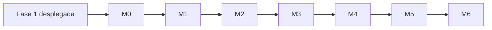

# Tasks: TagMe — Capa de Visibilidad Gerencial (Executive Visibility Layer)

**Input**: [plan.md](./plan.md) | [spec.md](./spec.md) | [constitution.md](./constitution.md)

**Prerequisites**: Fase 1 desplegada (`touch_events`, `destination_visits`, AVEX, TagMétricas staff); rama `002-tagme-clevel`

**Organización**: Milestones M0→M6 del plan; etiquetas `[Gn]` = user story spec; `(REUSE)` / `(NEW)` = origen del trabajo

**Leyenda**:

| Marcador | Significado |
|----------|-------------|
| `[P]` | Paralelizable (archivos distintos, sin dependencia directa) |
| `[G1]`…`[G8]` | User story spec (`spec.md`) |
| `(REUSE)` | Extiende artefacto Fase 1 sin romper contrato |
| `(NEW)` | Trabajo neto Fase 2 |

---

## Resumen Ejecutivo

| Métrica | Valor |
|---------|-------|
| **Total tareas** | 89 |
| **Validación rápida hotel (M0+M1+M2)** | 58 tareas — dashboard GG + pulso RT |
| **Alertas proactivas (+M3)** | 64 tareas |
| **Demo gerencia completa (+M4)** | 72 tareas |
| **Piloto completo (M0–M6)** | 89 tareas |

### Tareas por milestone

| Milestone | Tareas | User Stories | Entregable clave |
|-----------|--------|--------------|------------------|
| **M0** Fundación | T001–T022 (22) | — | Schema executive + RBAC + seed umbrales/KPIs |
| **M1** Data layer | T023–T040 (18) | — | `lib/executive/*` queries, ROI, baseline |
| **M2** Overview + Pulso 🎯 | T041–T058 (18) | G1 | Dashboard Gerente General ≤2 min |
| **M3** Alertas | T059–T064 (6) | G7 | Motor alertas + bandeja |
| **M4** Dept. dashboards | T069–T076 (8) | G3, G5 | Operaciones + Front Office |
| **M5** Resto + reportes | T077–T083 (7) | G2, G4, G6 | F&B, Experiencia, CSV/PDF |
| **M6** Settings + piloto | T084–T093 (10) | G8 | Umbrales editables + validación Hotel Caribe |

### Reutilización vs. trabajo nuevo (estimado)

| Tipo | Tareas aprox. | % |
|------|---------------|---|
| `(REUSE)` — extensión Fase 1 | 18 | 19% |
| `(NEW)` — neto Fase 2 | 71 | 80% |

### Prioridad de inicio recomendada

1. **M0** (bloqueante) — schema, roles, middleware, validators
2. **M1** (bloqueante para M2) — queries y ROI sin UI aún testeables
3. **M2** (valor visible) — **primer demo con Gerente General del hotel**
4. M3 — alertas proactivas (segundo gran diferenciador)
5. M4 → M5 → M6 — dashboards dept., reportes, cierre piloto

---

## M0 — Fundación (schema, roles, seed)

**Objetivo de salida**: Migración executive aplicada; login `executive` accede a `/(executive)`; staff (`staff`/`ops`) bloqueado; seed con umbrales CL-02/03/04 y KPIs CL-08.

**Dependencias**: Fase 1 operativa (migraciones `20260608120000_*` aplicadas)

**Verificación**: `npm run db:migrate` OK · query `alert_thresholds` devuelve filas Hotel Caribe · `GET /api/executive/me` con rol executive → 200; con rol staff → 403

### Migración SQL y modelo de datos

- [x] T001 (NEW) Crear `migrations/20260609120000_executive-layer.sql` con tablas `executive_alerts`, `alert_thresholds`, `kpi_targets`, `executive_audit_log`, `venue_baseline` según `plan.md` § Modelo de Datos
- [x] T002 (NEW) En la misma migración: extender `user_profiles.role` CHECK para incluir `executive`, `manager`, `department_head` y columna `executive_scope` (`operations`|`fnb`|`experience`|`front_office`)
- [x] T003 [P] (NEW) Crear vistas SQL en migración: `v_touches_by_zone_hourly`, `v_touches_by_tag_daily`, `v_hourly_baseline_median`, `v_avex_effectiveness`, `v_touch_abandonment`, `v_channel_breakdown`, `v_latency_to_destination` con `security_invoker = true`
- [x] T004 (NEW) Agregar funciones helper RLS `is_executive()`, `is_executive_for_venue(uuid)` en `migrations/20260609120000_executive-layer.sql` o migración RLS dedicada
- [x] T005 (NEW) Políticas RLS para tablas executive: `executive_alerts`, `alert_thresholds`, `kpi_targets`, `executive_audit_log` — lectura por rol/venue; escritura según CL-13
- [x] T006 (REUSE) Aplicar migración con `npm run db:migrate` (script existente `scripts/apply-migrations.ts`) y verificar tablas/vistas en InsForge

### Seed y configuración piloto

- [x] T007 (REUSE) Extender `scripts/seed-hotel-caribe.ts` con seed `alert_thresholds` — valores CL-02 (caída 40%/60%), CL-03 (24h inactivo), CL-04 (derivación 25%/40%), gracia 72h
- [x] T008 [P] (NEW) En seed: insertar `kpi_targets` tabla CL-08 (9 KPIs semanal/mensual) para venue `hotel-caribe`
- [x] T009 [P] (NEW) En seed: crear usuarios demo InsForge Auth + `user_profiles` — al menos `executive` (GG), `manager`+`operations`, `department_head`+`front_office`; documentar credenciales en comentario del script (no commitear passwords)
- [x] T010 (NEW) Inicializar `venue_baseline` en seed o trigger post-migrate: `first_touch_at` NULL, `baseline_ready` false hasta cumplir CL-11

### Auth, middleware y validators

- [x] T011 (REUSE) Extender `lib/auth/session.ts`: tipos `ExecutiveRole`, `ExecutiveSession` con `executiveScope`; funciones `requireExecutive()`, `assertExecutiveScope(scope)`, `canAccessExecutiveRoutes(session)`
- [x] T012 (NEW) Implementar matriz CL-13 en `lib/executive/scope.ts` — mapa rol+scope → zonas/tags/dashboards permitidos (esqueleto; queries en M1)
- [x] T013 (REUSE) Extender `middleware.ts`: proteger rutas `/executive/*`; redirigir a `/login?next=/executive/overview` sin token; **no** permitir `staff`/`ops` en executive
- [x] T014 [P] (NEW) Crear `lib/validators/executive.ts` con schemas Zod: `PulseResponse`, `OverviewResponse`, `ExecutiveAlert`, `KpiTarget`, `AlertThreshold`, query params comunes (`venueId`, `from`, `to`)
- [x] T015 [P] (NEW) Crear `types/executive.ts` con tipos TS alineados a validators (capas 1–4, severidad alerta, estado alerta)

### Contrato y estructura base

- [x] T016 [P] (NEW) Crear borrador `specs/002-clevel/contracts/executive-api.md` con endpoints M0–M2: `/me`, `/pulse`, `/overview` (request/response JSON)
- [x] T017 [P] (NEW) Crear estructura carpetas vacías: `app/(executive)/`, `app/api/executive/`, `lib/executive/`, `components/executive/`, `components/charts/`
- [x] T018 (NEW) Agregar `CRON_SECRET` y `STAFF_DEV_EXECUTIVE_ROLE` a `.env.local.example` con comentarios de uso

### Tests fundación

- [x] T019 [P] (NEW) Test unitario `tests/unit/executive-scope.test.ts` — matriz CL-13: executive ve todo; manager operations no ve `fnb`; staff → forbidden
- [x] T020 [P] (NEW) Test integración `tests/integration/executive-auth.test.ts` — `requireExecutive()` con mock session; staff rechazado
- [x] T021 (NEW) Crear `app/api/executive/me/route.ts` — GET perfil executive (rol, scope, venue, `baseline_ready`); auth via `requireExecutive()`
- [x] T022 (NEW) Crear `app/(executive)/layout.tsx` + `app/(executive)/page.tsx` redirect a `/executive/overview`; sidebar placeholder `ExecutiveSidebar.tsx`

**Checkpoint M0**: Login executive → `/executive/overview` (página vacía OK) · staff en `/executive` → redirect/login · migración + seed OK

---

## M1 — Capa de datos executive

**Objetivo de salida**: `lib/executive/` entrega pulse, trends, ROI, KPIs y baseline; tests unitarios verdes; **sin regresión** en `getMetricsSummary()`.

**Dependencias**: M0 completo (T001–T022)

**Verificación**: `npm test tests/unit/executive-*.test.ts` OK · script manual o REPL invoca `queries.pulse('venueId')` con datos seed

### Tests primero (Pragmatic Quality)

- [x] T023 [P] (NEW) Test `tests/unit/executive-roi.test.ts` — fórmula CL-07: 10 sesiones, 3 escaladas → 7×3.5=24.5 min; exclusión doble conteo AVEX+destino
- [x] T024 [P] (NEW) Test `tests/unit/executive-baseline.test.ts` — `isReady()`: false con <14 días; false con <100 toques; true cuando ambos cumplen
- [x] T025 [P] (NEW) Test `tests/unit/executive-queries.test.ts` — `pulse()` ventana 30 min; `trends()` Δ% vs. semana anterior con fixtures mock

### Baseline y configuración

- [x] T026 (NEW) Implementar `lib/executive/baseline.ts` — `getBaselineStatus(venueId)`, `isBaselineReady()`, actualizar `venue_baseline` en lectura; gate CL-11 (14 días + 100 toques)
- [x] T027 [P] (NEW) Implementar `lib/executive/kpis.ts` — `loadTargets(venueId)`, `compareTargets(venueId, period)` meta vs. real CL-08; semáforo solo si `baseline_ready`
- [x] T028 (NEW) Implementar `lib/executive/roi.ts` — `calculateRoi(venueId, period)` headline AVEX×3.5 + secundario self-service×0.5 sin doble conteo (ventana 30 min)

### Queries — Capa 1 Pulso

- [x] T029 (NEW) Implementar `lib/executive/queries.ts` → `getPulse(venueId, windowMin=30)` — toques por zona/tag últimos N min; timestamp `fetchedAt` para UI "Actualizado hace N s"
- [x] T030 (NEW) En `queries.ts` → `getAvexPulse(venueId, windowMin=60)` — sesiones recientes, derivaciones %, top 3 temas (keyword simple sobre `avex_messages.content` o categoría KB si disponible)

### Queries — Capa 2 Rendimiento

- [x] T031 [P] (REUSE) Implementar `getTrends(venueId, period)` — reutilizar lógica agregación de `lib/analytics/metrics.ts` + Δ% vs. semana anterior; **no modificar** firma `getMetricsSummary`
- [x] T032 [P] (NEW) Implementar `getByZone(venueId, period)` consultando `v_touches_by_zone_hourly`
- [x] T033 [P] (NEW) Implementar `getByTag(venueId, period)` consultando `v_touches_by_tag_daily` + join `nfc_tags.label`, `room_number`
- [x] T034 [P] (NEW) Implementar `getAvexEffectiveness(venueId, period)` desde `v_avex_effectiveness`
- [x] T035 [P] (NEW) Implementar `getChannelBreakdown(venueId, period)` desde `v_channel_breakdown`

### Queries — Capa 3 Experiencia

- [x] T036 [P] (NEW) Implementar `getAbandonment(venueId, period)` desde `v_touch_abandonment`
- [x] T037 [P] (NEW) Implementar `getLatency(venueId, period)` desde `v_latency_to_destination` — mediana y p95 por tag

### Queries — Overview consolidado (compone capas)

- [x] T038 (NEW) Implementar `lib/executive/overview.ts` — `getExecutiveOverview(venueId, period)` compone: 3 KPIs clave, tendencia semanal, resúmenes dept. (tarjetas), ROI, `baselineStatus`; narrativa + acción sugerida por KPI (Principio II)
- [x] T039 (NEW) Completar `lib/executive/scope.ts` — `filterTagsByScope(tags, session)`, `filterZonesByScope(zones, session)` usando `nfc_tags.zone`

### Regresión Fase 1

- [x] T040 (REUSE) Ejecutar `npm test` suite existente + smoke manual `app/(admin)/dashboard` — verificar `GET /api/metrics/summary` sin cambios de contrato

**Checkpoint M1**: Tests unitarios executive verdes · funciones retornan datos con seed · admin dashboard intacto

---

## M2 — Dashboard Gerente General + Pulso RT (G1) 🎯

**Objetivo de salida**: Gerente General identifica pulso, 3 KPIs y tendencia en **≤2 min** (SC-G001); pulso actualizado cada ≤60 s (SC-G002); carga ≤3 s (SC-G003).

**Dependencias**: M1 completo (T023–T040)

**Independent Test**: Login como `executive` → `/executive/overview` → ver `PulsePanel` con actividad 30 min, 3 `KpiCard` con Δ%, `RoiSummaryCard`, banner calibración si aplica; esperar 30 s → pulso se refresca

### Refactor charts (reutilización Fase 1)

- [x] T041 [P] (REUSE) Mover `components/admin/TouchChart.tsx` → `components/charts/TouchChart.tsx`; actualizar imports en `components/admin/MetricsDashboard.tsx`
- [x] T042 [P] (REUSE) Mover `PeakHoursChart.tsx`, `DestinationBreakdown.tsx`, `DeviceBreakdownChart.tsx`, `CountryBreakdownChart.tsx` → `components/charts/`; fix imports admin
- [x] T043 [P] (NEW) Crear `components/charts/ZoneActivityBar.tsx` — barras actividad por zona (lobby/restaurant/room) para pulso

### APIs executive M2

- [x] T044 (NEW) Crear `app/api/executive/pulse/route.ts` — GET `getPulse` + `getAvexPulse`; auth `requireExecutive`; validar response con Zod; header/cache `Cache-Control: no-store`
- [x] T045 (NEW) Crear `app/api/executive/overview/route.ts` — GET `getExecutiveOverview`; solo rol `executive` (GG); incluir `baselineStatus`, `roi`, `departmentSummaries`
- [x] T046 [P] (NEW) Crear `app/api/executive/roi/route.ts` — GET ROI CL-07 (también embebido en overview; endpoint para refresh aislado)

### Componentes executive — núcleo visual

- [x] T047 [P] (NEW) Crear `components/executive/KpiCard.tsx` — valor, Δ% vs. semana anterior, tooltip definición, `suggestedAction`, semáforo meta si `baseline_ready`
- [x] T048 [P] (NEW) Crear `components/executive/CalibrationBanner.tsx` — "Período de calibración — día X de 14" cuando `!baseline_ready`; enlace a doc interna
- [x] T049 (NEW) Crear `components/executive/PulsePanel.tsx` — client component: fetch `/api/executive/pulse` cada **30 s**; muestra "Actualizado hace N s"; `ZoneActivityBar`; estado degradado con últimos datos si fetch falla (FR-G013)
- [x] T050 [P] (NEW) Crear `components/executive/RoiSummaryCard.tsx` — minutos ahorrados estimados; etiqueta *"Estimado operativo"*; tendencia vs. semana anterior
- [x] T051 [P] (NEW) Crear `components/executive/ExecutiveSidebar.tsx` — nav: Overview (activo M2), placeholders Alertas/Operaciones (disabled o coming soon)
- [x] T052 [P] (NEW) Crear `components/executive/DepartmentSummaryRow.tsx` — tarjetas compactas por dept. (solo KPI principal + estado) para drill-down ≤2 clics en M4

### Página overview (G1)

- [x] T053 (NEW) Implementar `app/(executive)/overview/page.tsx` — RSC carga overview inicial server-side; compone `CalibrationBanner`, `PulsePanel`, grid `KpiCard`×3, `RoiSummaryCard`, `TouchChart` tendencia 7 días, `DepartmentSummaryRow`
- [x] T054 (NEW) Estilos layout executive en `app/(executive)/layout.tsx` — densidad desktop/tablet; tokens `tagme-*`; sidebar fija; sin mobile-first
- [x] T055 [P] (NEW) Crear `components/executive/ExecutiveFilters.tsx` — rango fechas (7d default), disabled tag filter hasta M4; sincroniza query params

### Narrativa y acciones (Decision-First)

- [x] T056 (NEW) Crear `lib/executive/narrative.ts` — mapa KPI → texto explicativo + acción sugerida (ej. derivación AVEX alta → "Actualizar KB horarios restaurante"); consumido por `KpiCard` y overview
- [x] T057 (NEW) Wire narrativa en `getExecutiveOverview` — cada KPI incluye `label`, `definition`, `suggestedAction` en español

### Validación M2

- [x] T058 [G1] (NEW) Test integración `tests/integration/executive-overview.test.ts` + checklist manual SC-G001/G002/G003 (carga ≤3s, poll 30s, lectura ≤2 min) documentado en `specs/002-clevel/quickstart.md` borrador o comentario en `overview/page.tsx`

**Checkpoint M2 🎯**: **Demo listo para Gerente General** — overview funcional con pulso RT, KPIs narrados, ROI estimado, calibración visible

---

## M3 — Sistema de alertas (G7)

**Objetivo de salida**: Alertas CL-02/03/04 evaluadas cada 5 min; bandeja con reconocer/asignar/descartar; top alertas en overview.

**Dependencias**: M2 completo (T041–T058)

**Nivel**: Alto — detalle moderado

- [x] T059 [G7] (NEW) Implementar reglas en `lib/executive/alerts/rules/` — `tag-inactive.ts`, `activity-drop.ts`, `avex-derivation.ts` según CL-02/03/04/10
- [x] T060 [G7] (NEW) Implementar `lib/executive/alerts/evaluate.ts` + `dedup.ts` — baseline gate; UPSERT `executive_alerts`; dedup 4h
- [x] T061 [G7] (NEW) `POST app/api/executive/alerts/evaluate/route.ts` — auth `CRON_SECRET`; `vercel.json` cron `*/5 * * * *`; script `npm run alerts:evaluate` para dev
- [x] T062 [G7] (NEW) `GET/PATCH app/api/executive/alerts/` — bandeja + acciones; audit `executive_audit_log`
- [x] T063 [G7] (NEW) UI: `AlertFeed.tsx`, `AlertActions.tsx`, `app/(executive)/alerts/page.tsx`; sección alertas en overview
- [x] T064 [G7] (NEW) Tests `tests/unit/executive-alerts.test.ts` — dedup, baseline skip, umbrales

**Checkpoint M3**: Simular tag `is_active=false` → alerta crítica en bandeja en ≤5 min

---

## M4 — Dashboards Operaciones + Front Office (G3, G5)

**Objetivo de salida**: Vistas departamentales con scope RBAC; habitación atípica sin PII; AVEX detallado recepción.

**Dependencias**: M3 completo (T059–T064)

**Nivel**: Alto

- [x] T069 [G3] (NEW) `GET app/api/executive/department/[scope]/route.ts` — payload por `operations`|`front_office`
- [x] T070 [G3] (NEW) `app/(executive)/operations/page.tsx` — heatmap zona, ranking tags, habitaciones atípicas, fricción NFC
- [x] T071 [G5] (NEW) `app/(executive)/front-office/page.tsx` — `AvexEffectiveness`, derivaciones, temas top
- [x] T072 [P] (NEW) Componentes: `ZoneHeatmap.tsx`, `TagRankingTable.tsx`, `AvexEffectiveness.tsx`
- [x] T073 [G3] (NEW) Detectar habitación atípica en `queries.ts` — >3× media interacciones AVEX; sin PII
- [x] T074 [G3] (NEW) Acción "Solicitar corrección contenido" → `executive_audit_log` (workflow manual hacia staff)
- [x] T075 [P] (REUSE) Habilitar `ExecutiveFilters` tag/zona en dashboards dept.
- [x] T076 [G5] Validar SC-G009 manual — top 3 temas derivación visible en ≤1 min

**Checkpoint M4**: Gerente Operaciones y Jefe Recepción usan dashboards scoped

---

## M5 — F&B, Experiencia, Reportes (G2, G4, G6)

**Objetivo de salida**: Dashboards restantes + export semanal CSV (PDF print opcional).

**Dependencias**: M4 completo (T069–T076)

**Nivel**: Alto

- [x] T077 [G4] (NEW) `app/(executive)/fnb/page.tsx` — menú %, horas pico restaurant/bar
- [x] T078 [G6] (NEW) `app/(executive)/experience/page.tsx` — destinos, perfil demanda, Δ post-update 7d
- [x] T079 [G2] (NEW) `lib/executive/reports/weekly-summary.ts` + `GET app/api/executive/reports/export/route.ts` — CSV
- [x] T080 [G2] (NEW) `app/(executive)/reports/page.tsx` + `ReportExportForm.tsx`
- [x] T081 [P] (NEW) PDF: vista print-friendly `/executive/reports/print` o `@react-pdf/renderer` si CSV insuficiente
- [x] T082 [G6] (NEW) Query impacto contenido — comparar 7d post `experience_configs.updated_at`
- [x] T083 [P] (REUSE) Reutilizar `DestinationBreakdown`, `CountryBreakdownChart` en experience dashboard

**Checkpoint M5**: Export CSV semanal con interacciones, zonas, AVEX, alertas

---

## M6 — Configuración + validación piloto (G8)

**Objetivo de salida**: Umbrales/metas editables; quickstart gerencial; checklist piloto 1 semana.

**Dependencias**: M5 completo (T077–T083)

**Nivel**: Alto

- [x] T084 [G8] (NEW) `app/(executive)/executive/settings/page.tsx` — solo `executive`; edición umbrales y metas
- [x] T085 [G8] (NEW) `GET/PATCH app/api/executive/thresholds/route.ts` y `kpis/route.ts`
- [x] T086 [G8] (NEW) Crear `specs/002-clevel/quickstart.md` — login gerencial, tour overview, calibración 14d
- [x] T087 [G8] (NEW) Crear `specs/002-clevel/checklists/pilot-validation-executive.md` — SC-G005 semana sin reportes manuales
- [x] T088 (NEW) Provisionar usuarios reales Hotel Caribe en InsForge Auth (fuera de seed demo) — guía en quickstart §1
- [x] T089 [P] (NEW) Playwright smoke: login executive → overview carga → pulse visible
- [x] T090 (REUSE) Actualizar `middleware.ts` matcher con todas rutas `/executive/*`
- [x] T091 (NEW) LoginForm contexto gerencial cuando `next=/executive/*` (AdminSidebar no aplica — redirect executive)
- [x] T092 [G8] Sesión capacitación 30 min — guion en quickstart
- [x] T093 (NEW) Actualizar `specs/002-clevel/contracts/executive-api.md` con contrato final post-M6

**Checkpoint M6**: Constitution §8 — gerente piloto supervisa 1 semana con TagMe

---

## Dependencias y Orden de Ejecución

### Grafo entre milestones



### Dependencias críticas dentro de M0–M2

| Tarea | Depende de |
|-------|------------|
| T006 | T001–T005 |
| T007–T010 | T006 |
| T011–T013 | T002 |
| T021–T022 | T011, T013 |
| T026–T039 | T003, T006, T011 |
| T038 | T029–T037, T028 |
| T044–T045 | T029, T030, T038 |
| T049 | T044 |
| T053 | T045, T047–T050, T041–T043 |

### Paralelización recomendada

**M0** (tras T001):

```text
Paralelo: T003, T007, T008, T014, T015, T016, T017, T019, T020
```

**M1** (tras T026):

```text
Paralelo: T031, T032, T033, T034, T035, T036, T037
```

**M2** (tras T044):

```text
Paralelo: T047, T048, T050, T051, T052, T055
```

---

## Estrategia de Implementación

### Sprint 1 — Validación rápida con el hotel (recomendado)

| Día | Milestone | Entregable demo |
|-----|-----------|-----------------|
| 1–2 | **M0** | Login executive, rutas protegidas, seed umbrales |
| 3–4 | **M1** | APIs datos listas; tests ROI/baseline verdes |
| 5–7 | **M2** | **Dashboard GG con pulso RT** — mostrar al Gerente General |

**Parar y validar** tras M2: ¿El GG entiende el estado del hotel en 2 min? ¿El pulso aporta valor vs. TagMétricas staff? Feedback antes de M3.

### Sprint 2 — Control proactivo

- **M3** alertas → demo bandeja + reconocimiento
- **M4** dashboards dept. → Operaciones + Recepción

### Sprint 3 — Cierre piloto

- **M5** reportes + F&B/Experiencia
- **M6** settings + semana de validación SC-G005

### MVP mínimo absoluto

**M0 + M1 + M2** (T001–T058) = **58 tareas** — Capa de Visibilidad usable por Gerente General sin alertas automáticas aún.

### MVP demo completo gerencia

**M0–M4** (T001–T076) = **72 tareas** — GG + alertas + Operaciones + Recepción.

---

## Mapa tarea → Requisitos spec

| Tareas | FR-G / SC-G principales |
|--------|-------------------------|
| M0 | FR-G001–004, FR-G039–041, NFR-G006 |
| M1 | FR-G010–028 (datos), CL-07, CL-08, CL-11 |
| M2 | FR-G005–009, FR-G012–013, G1, SC-G001–003 |
| M3 | FR-G029–035, G7, SC-G006 |
| M4 | FR-G014–024, G3, G5, SC-G009 |
| M5 | FR-G019, FR-G037, G2, G4, G6, SC-G007 |
| M6 | FR-G034, FR-G038, G8, SC-G005 |

---

## Notas

- Commit sugerido: tras cada checkpoint de milestone
- No modificar `GET /api/metrics/summary` ni flujos `/(guest)/*` (plan § No tocar)
- Tareas `[P]` pueden asignarse a subagentes en archivos distintos
- Si Hotel Caribe valida M2 antes de M3, **priorizar feedback** sobre umbrales antes de implementar T059–T064

---

**Siguiente paso**: `/speckit.implement` comenzando por **T001** (migración executive-layer)

*Generado desde `plan.md` · Fase 2 Constitution v1.0.0*