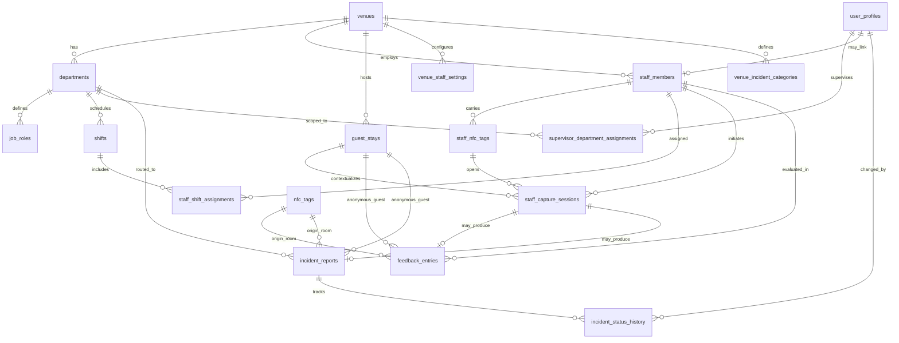

# Modelo de Datos: TagMe Fase 3 — Staff & Feedback Operativo

**Fecha**: 2026-06-10 | **Backend**: InsForge PostgreSQL | **Spec**: [spec.md](./spec.md)

Migraciones propuestas: `004_staff_schema.sql`, `005_staff_rls.sql`, `006_staff_scorecard_views.sql`

---

## Diagrama ER



---

## Extensiones a entidades Fase 1

### `user_profiles` — nuevos roles

```sql
ALTER TABLE public.user_profiles
  DROP CONSTRAINT IF EXISTS user_profiles_role_check;

ALTER TABLE public.user_profiles
  ADD CONSTRAINT user_profiles_role_check CHECK (
    role IN ('staff', 'supervisor', 'manager', 'admin', 'ops')
  );
```

| Rol | Uso Fase 3 |
|-----|------------|
| `staff` | Recepción, operativo con login; scorecard propio |
| `supervisor` | Jefe de departamento; scope por `supervisor_department_assignments` |
| `manager` | Gerente general; hotel completo + comentarios textuales |
| `admin` | Admin venue (heredado) |
| `ops` | Ops read-only (heredado) |

### `touch_events` — extensión analítica

```sql
ALTER TABLE public.touch_events
  ADD COLUMN IF NOT EXISTS event_type TEXT NOT NULL DEFAULT 'hub_visit',
  ADD COLUMN IF NOT EXISTS metadata JSONB NOT NULL DEFAULT '{}'::jsonb;

ALTER TABLE public.touch_events
  ADD CONSTRAINT touch_events_event_type_check CHECK (
    event_type IN ('hub_visit', 'staff_capture_open', 'room_capture_open')
  );
```

### `venues` — sin cambios estructurales

Reutilizar `timezone`, `slug`, `is_pilot`. Config staff en `venue_staff_settings`.

---

## Nuevas tablas

### `venue_staff_settings`

Configuración operativa staff por venue (Principio VIII).

| Campo | Tipo | Reglas |
|-------|------|--------|
| `venue_id` | UUID PK FK | 1:1 con venue |
| `staff_feedback_enabled` | boolean | default `true` |
| `default_stay_ttl_days` | int | default `7` — estadía formal |
| `ephemeral_stay_ttl_hours` | int | default `48` |
| `session_ttl_minutes` | int | default `5` — no editable en MVP UI |
| `session_dedup_seconds` | int | default `45` |
| `min_feedbacks_for_nps` | int | default `6` |
| `updated_at` | timestamptz | trigger `set_updated_at` |

### `departments`

| Campo | Tipo | Reglas |
|-------|------|--------|
| `id` | UUID PK | |
| `venue_id` | UUID FK | NOT NULL |
| `name` | text | NOT NULL |
| `code` | text | UNIQUE per venue; ej. `HK`, `FB` |
| `is_active` | boolean | default true |
| `created_at` | timestamptz | |

Índice: `(venue_id, is_active)`.

### `job_roles`

| Campo | Tipo | Reglas |
|-------|------|--------|
| `id` | UUID PK | |
| `department_id` | UUID FK | NOT NULL |
| `title` | text | NOT NULL — "Camarista", "Mesero" |
| `is_active` | boolean | default true |

### `shifts`

| Campo | Tipo | Reglas |
|-------|------|--------|
| `id` | UUID PK | |
| `department_id` | UUID FK | NOT NULL |
| `name` | text | "Mañana 6–14" |
| `start_time` | time | |
| `end_time` | time | |
| `days_of_week` | jsonb | `[1,2,3,4,5]` ISO weekday |
| `is_active` | boolean | default true |

> Horarios son referencia operativa; **no** se usan para inferir turno al capturar (Q1=B).

### `supervisor_department_assignments`

| Campo | Tipo | Reglas |
|-------|------|--------|
| `id` | UUID PK | |
| `user_profile_id` | UUID FK → user_profiles | supervisor role |
| `department_id` | UUID FK | |
| `assigned_at` | timestamptz | |
| UNIQUE | `(user_profile_id, department_id)` | |

### `staff_members`

Empleado operativo del venue.

| Campo | Tipo | Reglas |
|-------|------|--------|
| `id` | UUID PK | |
| `venue_id` | UUID FK | NOT NULL |
| `department_id` | UUID FK | NOT NULL |
| `job_role_id` | UUID FK | NOT NULL |
| `user_profile_id` | UUID FK NULL | Opcional — si tiene login |
| `display_name` | text | NOT NULL — visible al huésped |
| `employee_code` | text NULL | Código interno RRHH opcional |
| `is_active` | boolean | default true |
| `created_at` | timestamptz | |

Índices: `(venue_id, is_active)`, `(department_id)`.

### `staff_nfc_tags`

Tarjeta NFC personal del empleado.

| Campo | Tipo | Reglas |
|-------|------|--------|
| `id` | UUID PK | |
| `staff_member_id` | UUID FK | NOT NULL |
| `tag_slug` | text UNIQUE | URL `/s/{tag_slug}` |
| `is_active` | boolean | default true |
| `assigned_at` | timestamptz | |
| `revoked_at` | timestamptz NULL | |

**Regla MVP**: máximo una tarjeta `is_active=true` por `staff_member_id` (partial unique index).

### `staff_shift_assignments`

| Campo | Tipo | Reglas |
|-------|------|--------|
| `id` | UUID PK | |
| `staff_member_id` | UUID FK | |
| `shift_id` | UUID FK | |
| `effective_from` | date | NOT NULL |
| `effective_to` | date NULL | NULL = vigente indefinido |

**Resolución al capturar**:
```sql
SELECT shift_id FROM staff_shift_assignments
WHERE staff_member_id = $1
  AND effective_from <= CURRENT_DATE
  AND (effective_to IS NULL OR effective_to >= CURRENT_DATE)
ORDER BY effective_from DESC
LIMIT 1;
```
Si múltiples solapadas → la de `effective_from` más reciente.

### `guest_stays`

Identidad anónima de estadía.

| Campo | Tipo | Reglas |
|-------|------|--------|
| `id` | UUID PK | |
| `venue_id` | UUID FK | NOT NULL |
| `stay_token` | text UNIQUE | Opaco; valor de cookie |
| `stay_type` | text | `formal` \| `ephemeral` |
| `status` | text | `active` \| `expired` \| `consolidated` \| `closed` |
| `consolidated_into` | UUID FK NULL | → guest_stays.id formal |
| `started_at` | timestamptz | default NOW() |
| `expires_at` | timestamptz | NOT NULL |
| `closed_at` | timestamptz NULL | |
| `created_by` | UUID FK NULL | user_profile recepción si formal |

Constraints:
- `stay_type IN ('formal', 'ephemeral')`
- `status IN ('active', 'expired', 'consolidated', 'closed')`

### `staff_capture_sessions`

Sesión efímera staff↔huésped (TTL 5 min).

| Campo | Tipo | Reglas |
|-------|------|--------|
| `id` | UUID PK | |
| `session_token` | text UNIQUE | Opaco UUID v4 |
| `staff_member_id` | UUID FK | NOT NULL |
| `staff_nfc_tag_id` | UUID FK | NOT NULL |
| `guest_stay_id` | UUID FK NULL | Vinculado al abrir o al enviar |
| `venue_id` | UUID FK | NOT NULL |
| `status` | text | `active` \| `completed` \| `expired` |
| `expires_at` | timestamptz | NOT NULL — NOW()+5min |
| `context_snapshot` | jsonb | Snapshot al crear |
| `client_fingerprint` | text NULL | Dedup sesiones |
| `created_at` | timestamptz | |
| `completed_at` | timestamptz NULL | |

**`context_snapshot` schema**:
```json
{
  "staff_member_id": "uuid",
  "display_name": "María G.",
  "department_id": "uuid",
  "department_name": "Housekeeping",
  "job_role_id": "uuid",
  "job_role_title": "Camarista",
  "shift_id": "uuid | null",
  "shift_name": "Mañana | null",
  "staff_nfc_tag_id": "uuid",
  "venue_timezone": "America/Bogota"
}
```

### `feedback_entries`

| Campo | Tipo | Reglas |
|-------|------|--------|
| `id` | UUID PK | |
| `venue_id` | UUID FK | NOT NULL |
| `guest_stay_id` | UUID FK | NOT NULL |
| `staff_member_id` | UUID FK NULL | Obligatorio si `origin_type=staff_nfc` |
| `staff_capture_session_id` | UUID FK NULL | Si origen staff |
| `origin_type` | text | `staff_nfc` \| `room_nfc` |
| `origin_id` | UUID | staff_nfc_tag.id o nfc_tags.id |
| `rating` | smallint | CHECK 1–5 |
| `comment` | text NULL | Opcional |
| `context_snapshot` | jsonb | Inmutable al crear |
| `created_at` | timestamptz | |

**Validación origen**:
```sql
CHECK (
  (origin_type = 'staff_nfc' AND staff_member_id IS NOT NULL)
  OR (origin_type = 'room_nfc')
)
```

### `incident_reports`

| Campo | Tipo | Reglas |
|-------|------|--------|
| `id` | UUID PK | |
| `venue_id` | UUID FK | |
| `guest_stay_id` | UUID FK | |
| `staff_member_id` | UUID FK NULL | |
| `staff_capture_session_id` | UUID FK NULL | |
| `department_id` | UUID FK NULL | Ruteo por categoría |
| `origin_type` | text | `staff_nfc` \| `room_nfc` |
| `origin_id` | UUID | |
| `category` | text | FK lógica a venue_incident_categories.code |
| `priority` | text | `baja` \| `media` \| `alta` \| `urgente` |
| `status` | text | `abierta` \| `en_progreso` \| `resuelta` \| `cerrada` |
| `description` | text | NOT NULL |
| `context_snapshot` | jsonb | |
| `assigned_to` | UUID FK NULL | staff_member responsable |
| `created_at` | timestamptz | |
| `resolved_at` | timestamptz NULL | |

### `incident_status_history`

| Campo | Tipo | Reglas |
|-------|------|--------|
| `id` | UUID PK | |
| `incident_id` | UUID FK | |
| `changed_by` | UUID FK → user_profiles | |
| `from_status` | text NULL | NULL en creación |
| `to_status` | text | |
| `note` | text NULL | |
| `changed_at` | timestamptz | |

### `venue_incident_categories`

| Campo | Tipo | Reglas |
|-------|------|--------|
| `id` | UUID PK | |
| `venue_id` | UUID FK | |
| `code` | text | `mantenimiento`, `limpieza`, etc. |
| `label` | text | UI español |
| `default_department_id` | UUID FK NULL | Ruteo automático |
| `default_priority` | text | |
| `sort_order` | int | |
| `is_active` | boolean | |

Seed Hotel Caribe: mantenimiento, limpieza, ruido, f_and_b, otro.

---

## Vistas SQL — Scorecards

### `v_feedback_base`

Base atómica con timezone venue aplicado.

```sql
CREATE VIEW v_feedback_base AS
SELECT
  fe.id,
  fe.venue_id,
  fe.staff_member_id,
  fe.rating,
  fe.created_at,
  (fe.context_snapshot->>'shift_id')::uuid AS shift_id,
  (fe.context_snapshot->>'department_id')::uuid AS department_id,
  date_trunc('day', fe.created_at AT TIME ZONE v.timezone) AS local_day
FROM feedback_entries fe
JOIN venues v ON v.id = fe.venue_id;
```

### `v_scorecard_employee`

```sql
-- Métricas por staff_member_id + periodo (parámetro en query app)
-- n, avg_rating, nps_internal, insufficient_data (n < min_feedbacks_for_nps)
```

Campos calculados:
- `feedback_count` (n)
- `avg_rating` — promedio 1–5
- `nps_internal` — solo si n ≥ 6
- `pct_promoters` — rating = 5
- `pct_detractors` — rating IN (1,2)
- `insufficient_data` — boolean

### `v_scorecard_shift`

Roll-up por `shift_id` + `department_id`; excluye registros con `shift_id IS NULL`.

### `v_scorecard_department`

Roll-up departamento; incluye conteo incidencias abiertas via subquery a `incident_reports`.

### `v_scorecard_hotel`

Roll-up venue; NPS hotelero, tasa incidencias por 100 estadías activas en periodo.

### Función helper NPS

```sql
CREATE OR REPLACE FUNCTION calc_internal_nps(
  p_promoters BIGINT,
  p_detractors BIGINT,
  p_total BIGINT
) RETURNS NUMERIC AS $$
BEGIN
  IF p_total < 6 THEN RETURN NULL; END IF;
  RETURN ROUND(
    (p_promoters::NUMERIC / p_total * 100) -
    (p_detractors::NUMERIC / p_total * 100),
    1
  );
END;
$$ LANGUAGE plpgsql IMMUTABLE;
```

---

## RLS — Resumen de políticas nuevas

| Tabla | Anónimo (cookie/session) | Staff | Supervisor | Manager | Admin |
|-------|--------------------------|-------|------------|---------|-------|
| `staff_capture_sessions` | SELECT propia vía session_token (API route) | — | — | — | ALL venue |
| `guest_stays` | INSERT ephemeral; SELECT propia cookie | INSERT formal | — | — | ALL |
| `feedback_entries` | INSERT vía session válida | SELECT own staff_member | SELECT depto asignado | SELECT venue | ALL |
| `incident_reports` | INSERT vía session | — | UPDATE depto asignado | ALL venue | ALL |
| `staff_members` | — | SELECT self | CRUD depto asignado | CRUD venue | ALL |
| `departments`, `shifts`, etc. | — | — | CRUD depto asignado | CRUD venue | ALL |

**Implementación**: API routes de captura huésped usan **service role** con validación explícita de `session_token` + `expires_at` + cookie `stay_token` — no exposición directa PostgREST anónimo a tablas de escritura.

Helpers nuevos:
- `supervisor_department_ids()` → UUID[]
- `is_manager()` → boolean
- `staff_member_id_for_user()` → UUID

---

## Índices recomendados

```sql
CREATE INDEX idx_feedback_venue_created ON feedback_entries (venue_id, created_at DESC);
CREATE INDEX idx_feedback_staff_created ON feedback_entries (staff_member_id, created_at DESC);
CREATE INDEX idx_incidents_venue_status ON incident_reports (venue_id, status) WHERE status IN ('abierta', 'en_progreso');
CREATE INDEX idx_sessions_token ON staff_capture_sessions (session_token) WHERE status = 'active';
CREATE INDEX idx_guest_stays_token ON guest_stays (stay_token) WHERE status = 'active';
CREATE INDEX idx_staff_nfc_slug ON staff_nfc_tags (tag_slug) WHERE is_active = true;
```

---

## Seed piloto Hotel Caribe

| Entidad | Datos iniciales |
|---------|-----------------|
| `departments` | Recepción, Housekeeping, F&B, Mantenimiento |
| `job_roles` | 2–3 por departamento |
| `shifts` | Mañana/Tarde/Noche por departamento piloto |
| `venue_incident_categories` | 5 categorías default |
| `staff_members` | ≥12 empleados piloto |
| `staff_nfc_tags` | 1 tag activo por empleado piloto |

---

## Reglas de integridad transversales

1. **Cero registros huérfanos**: trigger o CHECK que `origin_type` y `origin_id` NOT NULL en feedback/incidencia.
2. **Snapshot inmutable**: `context_snapshot` escrito solo en INSERT; nunca UPDATE.
3. **Sesión única por envío**: un `staff_capture_session` produce máximo un feedback O una incidencia (status → `completed`).
4. **Consolidación estadía**: al consolidar, `UPDATE feedback_entries SET guest_stay_id = formal_id WHERE guest_stay_id = ephemeral_id` en transacción.