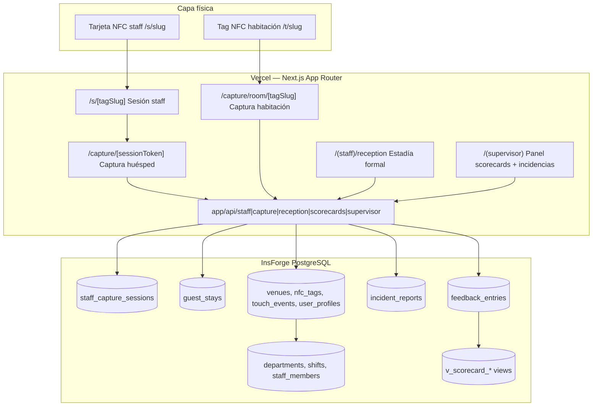
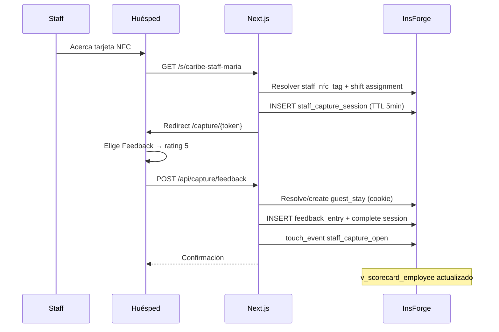

# Plan de Implementación: TagMe — Staff & Feedback Operativo

**Branch**: `003-tagme-staff` | **Fecha**: 2026-06-10 | **Spec**: [spec.md](./spec.md)

**Input**: Especificación clarificada en `specs/003-staff/spec.md` + Constitution Fase 3 + stack heredado Next.js/InsForge

---

## Summary

Fase 3 extiende TagMe con una **capa operativa de captura contextual** iniciada por el staff vía tarjetas NFC personales. El huésped — identificado anónimamente por cookie de estadía — completa flujos separados de **Feedback** (calificación → scorecards) o **Incidencia** (workflow con estados). Todo registro exige **origen trazable** (`staff_nfc` o `room_nfc`), sesiones staff con **TTL 5 minutos**, y agregación jerárquica **Empleado → Turno → Departamento → Hotel** con **NPS interno** (n≥6).

Enfoque pragmático: extender el monolito Next.js existente y tablas Fase 1 (`venues`, `nfc_tags`, `user_profiles`, `touch_events`); entregar 6 milestones verificables en piso antes de enriquecer dashboards Fase 2.

---

## Arquitectura General



### Capas y responsabilidades

| Capa | Responsabilidad | Tecnología |
|------|-----------------|------------|
| **NFC Staff** | Toque → sesión efímera 5 min | URL `/s/{staffTagSlug}` |
| **Captura huésped** | UI Feedback/Incidencia mobile-first | `app/(guest)/capture/*` |
| **Identidad estadía** | Cookie `tagme_stay` + `guest_stays` | API Recepción + auto-efímero |
| **Origen habitación** | Captura sin staff presente | Extensión `/t/` + `/capture/room/` |
| **Scorecards** | NPS jerárquico, n≥6 | Vistas SQL + API |
| **Supervisor** | Bandeja incidencias, config org | `app/(supervisor)/` + RLS |
| **Datos** | Trazabilidad, snapshots históricos | InsForge PostgreSQL |

### Flujo central — NFC staff → feedback



---

## Technical Context

| Campo | Valor |
|-------|-------|
| **Language/Version** | TypeScript 5.x, Node 20 LTS |
| **Frontend** | Next.js 15 App Router, React 19, Tailwind CSS 3.4 |
| **Backend** | InsForge (`@insforge/sdk`) — PostgreSQL, Auth, RLS |
| **Primary Dependencies** | `@insforge/sdk`, `zod`, `date-fns`, `date-fns-tz`, `recharts` |
| **Storage** | InsForge PostgreSQL; migraciones `004_*`, `005_*`, `006_*` |
| **Testing** | Vitest (NPS, TTL, consolidación), Playwright (NFC staff E2E), `tests/contract/003-staff/` |
| **Target Platform** | Vercel; Safari iOS + Chrome Android (huésped toca tarjeta staff) |
| **Performance Goals** | Sesión staff ≤3s; envío feedback ≤2s; scorecard depto ≤3s (NFR-001–003) |
| **Constraints** | Sin PMS; sin login huésped; sesión 5 min; Feedback ≠ Incidencia; n≥6 para NPS |
| **Scale/Scope** | Hotel Caribe piloto: ~200 empleados, 150 sesiones staff/día, 4 departamentos |

---

## Constitution Check

*GATE: Pre-Phase 0 ✅ | Post-Phase 1 ✅*

| Principio (Constitution Fase 3 v1.0.0) | Gate | Estado |
|----------------------------------------|------|--------|
| I. Spec-Driven Development | Plan deriva de `spec.md` clarificado; sin scope §5.2 | ✅ |
| II. Staff como Actor Central | NFC staff inicia sesión; staff no llena formularios | ✅ |
| III. Trazabilidad por Origen | `origin_type`, `origin_id` obligatorios en todo registro | ✅ |
| IV. Feedback ≠ Incidencia | Tablas, APIs y UI separadas | ✅ |
| V. Sesiones Efímeras 5 min | TTL server-side; token invalidado | ✅ |
| VI. Identidad Persistente Estadía | Cookie formal + efímera 48h + consolidación | ✅ |
| VII. Scorecards Jerárquicos | Vistas Empleado→Turno→Depto→Hotel; NPS n≥6 | ✅ |
| VIII. Estructura Configurable | CRUD depto/turnos/NFC sin deploy código | ✅ |
| IX. Captura Interna | Flujos ≤5 min; no empujar a externos | ✅ |
| X. Entrega Incremental | 6 milestones slices verificables | ✅ |

**Post-Phase 1**: Sin violaciones. Monolito extendido justificado; vistas SQL en lugar de snapshots justificado por volumen piloto (ver [research.md](./research.md#6-scorecards--vistas-sql-en-tiempo-real-vs-snapshots)).

---

## Decisiones Técnicas Clave

| Decisión | Elegido | Alternativa rechazada | Razón |
|----------|---------|----------------------|-------|
| **URL NFC staff** | `/s/{staffTagSlug}` | Mismo `/t/` que habitación | Namespace separado; programación tags sin colisión |
| **Sesión efímera** | `staff_capture_sessions` + token en path | JWT stateless | Revocación, auditoría, TTL DB-enforced |
| **Dedup sesiones** | Reutilizar sesión activa <45s mismo tag+fingerprint | Siempre nueva sesión | Edge case toques accidentales duplicados |
| **Cookie estadía** | `tagme_stay` HttpOnly con `stay_token` opaco | localStorage | Seguridad; cross-tab consistente |
| **Estadía walk-in** | Auto `guest_stay` ephemeral 48h (Q3=B) | Bloquear hasta Recepción | No perder capturas pre-check-in |
| **Consolidación** | UPDATE registros + `consolidated_into` FK | Copiar registros | Trazabilidad única `stay_id` definitivo |
| **Feedback vs Incidencia** | Tablas `feedback_entries` / `incident_reports` | Tabla unificada `type` | Principio IV constitucional |
| **Turno al capturar** | Solo `staff_shift_assignments` vigente | Inferencia por hora | Q1=B; evita distorsión métricas |
| **Scorecards compute** | Vistas SQL tiempo real | Snapshots cada minuto | ≤60s con read-after-write; YAGNI |
| **NPS gate** | UI + API retornan `insufficientData` si n<6 | Mostrar NPS siempre | Anti-patrón "1 feedback = estrella" |
| **Captura huésped auth** | Service role + validación session/cookie | RLS anónimo directo | Control fino TTL; sin exponer escritura abierta |
| **Roles nuevos** | `supervisor`, `manager` en `user_profiles` | Solo flags app | RLS auditable; matriz Q2=B |
| **touch_events** | Extender `event_type` | Pipeline paralelo | FR-034; TagMétricas unificada |
| **Room NFC captura** | CTA en hub + `/capture/room/[tagSlug]` | Reemplazar hub | Complementa Fase 1; no sustituye AVEX |
| **Notificaciones incidencia** | Panel supervisor (badge) | WhatsApp/push | Zona gris; MVP panel ≤60s |
| **Prioridad incidencia** | Default por categoría + override huésped | Solo manual supervisor | Pragmatismo piso |

---

## Estructura de Carpetas y Componentes

```text
app/
├── (guest)/
│   ├── s/[tagSlug]/page.tsx           # Entry NFC staff → redirect sesión
│   ├── capture/
│   │   ├── [sessionToken]/page.tsx    # UI captura post-staff
│   │   └── room/[tagSlug]/page.tsx    # Captura origen habitación
│   └── t/[tagSlug]/page.tsx           # EXTENDER: CTA Feedback/Incidencia
├── (staff)/
│   ├── reception/page.tsx             # Generar estadía formal
│   ├── reception/consolidate/page.tsx # Fusionar efímera → formal
│   ├── my-scorecard/page.tsx          # Scorecard personal (S5)
│   └── layout.tsx                     # Auth staff/recepción
├── (supervisor)/
│   ├── dashboard/page.tsx             # Pulso depto
│   ├── scorecards/page.tsx            # Drill-down empleado/turno
│   ├── incidents/page.tsx             # Bandeja incidencias
│   ├── organization/
│   │   ├── departments/page.tsx
│   │   ├── shifts/page.tsx
│   │   ├── job-roles/page.tsx         # CRUD cargos por departamento
│   │   ├── staff/page.tsx             # Asignación NFC
│   │   └── page.tsx
│   └── layout.tsx                     # Auth supervisor/manager
├── api/
│   ├── staff/sessions/
│   │   ├── open/route.ts
│   │   └── [sessionToken]/route.ts
│   ├── capture/
│   │   ├── feedback/route.ts
│   │   └── incident/route.ts
│   ├── reception/stays/
│   │   ├── route.ts
│   │   ├── consolidate/route.ts
│   │   └── [stayId]/close/route.ts
│   ├── scorecards/
│   │   ├── employee/[staffMemberId]/route.ts
│   │   ├── department/[departmentId]/route.ts
│   │   └── hotel/route.ts
│   ├── supervisor/
│   │   ├── incidents/route.ts
│   │   ├── incidents/[id]/route.ts
│   │   ├── departments/route.ts
│   │   ├── shifts/route.ts
│   │   ├── job-roles/route.ts
│   │   └── staff-members/route.ts
│   └── metrics/feedback-summary/route.ts  # Fase 2 enrichment
components/
├── capture/
│   ├── CaptureChoice.tsx              # Feedback | Incidencia
│   ├── FeedbackForm.tsx               # Escala 1-5 + comentario
│   ├── IncidentForm.tsx               # Categoría + descripción
│   ├── SessionCountdown.tsx           # TTL 5 min visible
│   └── CaptureConfirmation.tsx
├── staff/
│   ├── StayGenerator.tsx              # Recepción check-in
│   └── StayConsolidation.tsx
├── supervisor/
│   ├── ScorecardCard.tsx
│   ├── ScorecardDrillDown.tsx
│   ├── IncidentInbox.tsx
│   ├── IncidentStatusBadge.tsx
│   ├── StaffNfcAssignForm.tsx
│   └── OrganizationTree.tsx
lib/
├── staff/
│   ├── resolve-staff-tag.ts
│   ├── open-capture-session.ts
│   ├── validate-session.ts
│   ├── resolve-shift.ts
│   └── build-context-snapshot.ts
├── stays/
│   ├── cookie.ts                      # tagme_stay read/write
│   ├── create-formal-stay.ts
│   ├── create-ephemeral-stay.ts
│   └── consolidate-stays.ts
├── capture/
│   ├── submit-feedback.ts
│   └── submit-incident.ts
├── scorecards/
│   ├── calc-nps.ts
│   ├── query-employee.ts
│   ├── query-department.ts
│   └── query-hotel.ts
├── supervisor/
│   ├── department-scope.ts            # RLS helper supervisor
│   └── incident-routing.ts
└── validators/
    ├── staff-session.ts
    ├── feedback.ts
    ├── incident.ts
    └── guest-stay.ts
supabase/migrations/
├── 004_staff_schema.sql
├── 005_staff_rls.sql
└── 006_staff_scorecard_views.sql
tests/
├── contract/003-staff/
├── unit/scorecards-nps.test.ts
├── unit/session-ttl.test.ts
├── unit/stay-consolidation.test.ts
└── e2e/staff-nfc-feedback.spec.ts
types/
└── staff.ts                           # Tipos Fase 3
```

**Structure Decision**: Extensión del monorepo Next.js existente. Sin carpeta `backend/` separada. Módulos bajo `lib/staff`, `lib/stays`, `lib/capture`, `lib/scorecards` mantienen separación NFR-010.

---

## Modelo de Datos — Resumen

Detalle completo en [data-model.md](./data-model.md).

### Tablas nuevas

| Tabla | Propósito |
|-------|-----------|
| `venue_staff_settings` | TTL estadía, n mínimo NPS, flags venue |
| `departments` | Áreas operativas configurables |
| `job_roles` | Cargos por departamento |
| `shifts` | Franjas por departamento |
| `supervisor_department_assignments` | Scope RLS supervisor |
| `staff_members` | Empleados operativos |
| `staff_nfc_tags` | Tarjetas NFC personales |
| `staff_shift_assignments` | Asignación explícita turno |
| `guest_stays` | Identidad anónima estadía |
| `staff_capture_sessions` | Sesión efímera 5 min |
| `feedback_entries` | Opiniones → scorecards |
| `incident_reports` | Problemas → workflow |
| `incident_status_history` | Auditoría estados |
| `venue_incident_categories` | Categorías configurables |

### Extensiones Fase 1

| Entidad | Cambio |
|---------|--------|
| `user_profiles.role` | +`supervisor`, +`manager` |
| `touch_events` | +`event_type`, +`metadata` jsonb |

### Vistas SQL

| Vista | Nivel scorecard |
|-------|-----------------|
| `v_feedback_base` | Base atómica con timezone |
| `v_scorecard_employee` | Empleado |
| `v_scorecard_shift` | Turno (excluye shift_id null) |
| `v_scorecard_department` | Departamento + incidencias |
| `v_scorecard_hotel` | Hotel |

---

## Matriz de Permisos → Implementación RLS

| Recurso | Staff | Supervisor | Manager | Admin |
|---------|-------|------------|---------|-------|
| Scorecard propio | `staff_member_id = self` | self | hotel | all |
| Scorecard equipo | — | `department_id IN assigned` | venue | all |
| Comentarios textuales | — | depto asignado | venue | all |
| Incidencias gestión | — | depto asignado | venue | all |
| Config org / NFC | — | depto asignado | venue | all |
| Estadía formal | `can_manage_guest_stays()` | `can_manage_guest_stays()` | ✓ | all |
| Consolidar estadía | — | `can_manage_guest_stays()` | ✓ | all |

**Capacidad recepción** (`can_manage_guest_stays()`): `admin` OR `manager` OR `staff_member` activo en depto `code = 'RECEPCION'`. Ver spec §Capacidad recepción.

Implementación: helpers SQL `supervisor_department_ids()`, `is_manager()`, `staff_member_id_for_user()`, `is_reception_staff()`, `can_manage_guest_stays()` en `005_staff_rls.sql`; `staff_capture_sessions` deny-by-default para `authenticated` (solo `admin` ALL; escritura vía service role en APIs captura).

---

## Reutilización Fase 1–2 vs Trabajo Nuevo

### Reutilizar directamente

| Artefacto Fase 1–2 | Uso Fase 3 |
|--------------------|------------|
| `venues` | Scope, timezone agregaciones |
| `nfc_tags` | Origen `room_nfc`; CTA captura en hub |
| `user_profiles` + auth InsForge | Extender roles; sesiones staff/supervisor |
| `touch_events` | Extender `event_type` para capturas |
| `lib/insforge.ts`, `lib/insforge-server.ts` | Clientes DB |
| `lib/auth/session.ts` | Extender `StaffRole` + guards |
| `app/(admin)/` layout/patterns | Base visual supervisor |
| `app/(guest)/layout.tsx` | Mobile-first captura |
| TagMétricas dashboard | Distinguir proxy vs señal directa |
| Middleware auth existente | Rutas `(staff)`, `(supervisor)` |

### Trabajo nuevo requerido

| Área | Esfuerzo |
|------|----------|
| Schema 12 tablas + 3 migraciones | Alto |
| RLS supervisor por departamento | Alto |
| Flujo `/s/` + sesiones TTL | Medio |
| UI captura Feedback/Incidencia | Medio |
| Cookie estadía + consolidación | Medio |
| Vistas scorecard + API | Medio |
| Panel supervisor completo | Alto |
| Seed Hotel Caribe org + NFC staff | Medio |
| E2E Playwright staff NFC | Medio |
| Enriquecimiento Fase 2 (`feedback-summary`) | Bajo |

---

## Orden de Implementación (Milestones)

| Fase | Milestone | User Stories | Entregable verificable |
|------|-----------|--------------|------------------------|
| **M0** | Fundación schema | — | Migraciones 004–006; seed depto/turnos/categorías Caribe; roles supervisor/manager |
| **M1** | NFC staff → sesión | S1, G1 (parcial) | `/s/{slug}` abre captura ≤3s; sesión expira 5 min; feedback persiste con origen |
| **M2** | Estadía + cookie | S4, G1 | Recepción genera formal; walk-in auto-efímero 48h; mismo `stay_id` en feedbacks |
| **M3** | Incidencias + bandeja | S3, V2 | Flujo incidencia separado; estados auditados; bandeja supervisor ≤60s |
| **M4** | Room NFC + consolidación | G2, S4 (consolidate) | Captura desde habitación; Recepción fusiona efímera→formal |
| **M5** | Scorecards jerárquicos | S5, V1, M1 | NPS n≥6; drill-down depto→turno→empleado; vista staff personal |
| **M6** | Config org + piloto | V3, M2 | CRUD empleados/NFC/turnos; semana piloto Caribe; `feedback-summary` Fase 2 |

**Dependencias**: M0 → M1 → M2 → M3 → (M4 ∥ M5) → M6

### Criterio de done por milestone

- **M1**: SC-001, SC-002, SC-003 parcial
- **M2**: SC-010 (stay_id en 100% registros)
- **M3**: SC-007, SC-008
- **M5**: SC-004, SC-009
- **M6**: SC-005, SC-011, SC-012

---

## Riesgos Técnicos y Mitigaciones

| ID | Riesgo | Impacto | Mitigación |
|----|--------|---------|------------|
| **TR-01** | Sesión expira mid-form por red lenta | Medio | Countdown visible; mensaje claro; reintento = nuevo toque staff |
| **TR-02** | RLS supervisor demasiado amplio/restrictivo | Alto | Matriz Q2=B en policies; tests contract por rol |
| **TR-03** | Scorecard lento con 200 empleados × 30 días | Medio | Índices `(venue_id, created_at)`; vistas optimizadas; cache diario si >3s |
| **TR-04** | Estadías efímeras duplicadas | Medio | Reutilizar cookie activa; consolidación Recepción; TTL 48h |
| **TR-05** | Confusión slug staff vs room | Medio | Prefijos URL `/s/` vs `/t/`; validación UNIQUE separada |
| **TR-06** | Fase 2 no lista para enrichment | Bajo | Panel supervisor autónomo; endpoint `feedback-summary` desacoplado |
| **TR-07** | Staff sin `shift_assignment` → huecos en métricas turno | Medio | Documentar en capacitación; UI muestra "sin turno asignado"; válido por spec |
| **TR-08** | Safari iOS NFC staff card | Medio | Pruebas dispositivos reales; URL corta impresa en tarjeta |
| **TR-09** | Registros sin origen por bug | Alto | CHECK constraints; validación Zod; auditoría SC-010 |
| **TR-10** | Comentarios ofensivos | Bajo | Endpoint moderación supervisor; filtro palabras básico |

---

## Contratos API

| Contrato | Descripción |
|----------|-------------|
| [staff-nfc-session.md](./contracts/staff-nfc-session.md) | Apertura y validación sesión staff |
| [guest-capture.md](./contracts/guest-capture.md) | Envío feedback e incidencia |
| [guest-stay.md](./contracts/guest-stay.md) | Cookie estadía y consolidación |
| [scorecards.md](./contracts/scorecards.md) | Agregados jerárquicos NPS |
| [supervisor-api.md](./contracts/supervisor-api.md) | Bandeja, config org, moderación |

---

## Project Structure

### Documentation (this feature)

```text
specs/003-staff/
├── plan.md              # Este archivo
├── research.md          # Decisiones Phase 0
├── data-model.md        # Modelo de datos InsForge
├── quickstart.md        # Guía validación E2E piloto
├── contracts/           # Contratos API
│   ├── staff-nfc-session.md
│   ├── guest-capture.md
│   ├── guest-stay.md
│   ├── scorecards.md
│   └── supervisor-api.md
├── constitution.md      # Gobernanza Fase 3
├── spec.md              # Requisitos funcionales
└── tasks.md             # (/speckit.tasks — pendiente)
```

---

## Complexity Tracking

*Vacío — sin violaciones de Constitution Fase 3 que requieran justificación.*

---

## Referencias

- [spec.md](./spec.md) — FR-001–FR-037, user stories S1–M2
- [constitution.md](./constitution.md) — Principios II–IX
- [research.md](./research.md) — Decisiones Phase 0
- [data-model.md](./data-model.md) — Esquema PostgreSQL
- [quickstart.md](./quickstart.md) — Validación piloto
- [contracts/](./contracts/) — Contratos API
- Fase 1: [specs/001-tagme-platform/](../001-tagme-platform/)
- Constitución global: `.specify/memory/constitution.md` v1.1.0