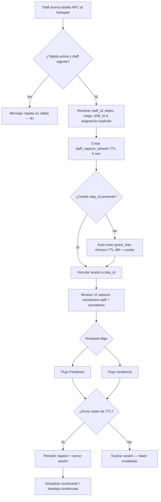
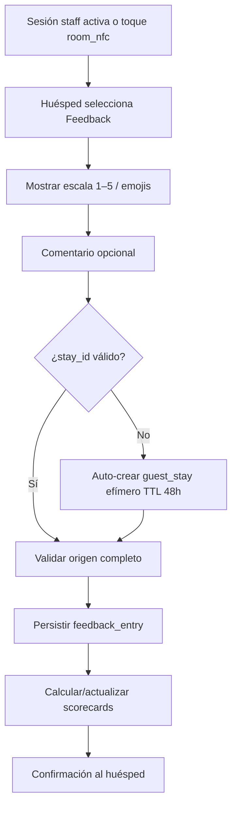
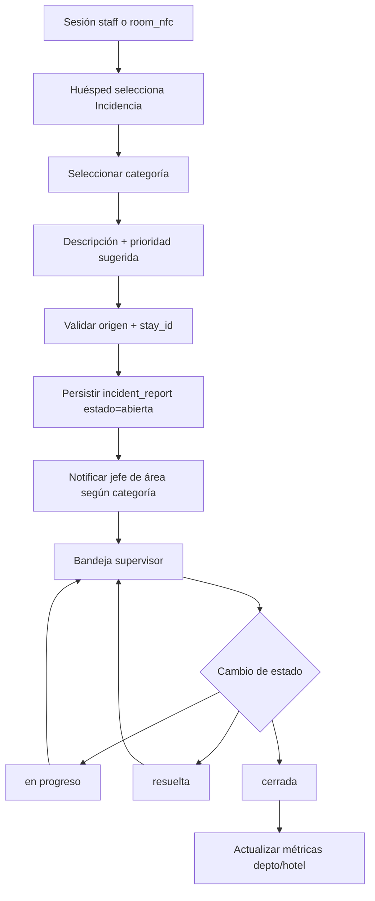
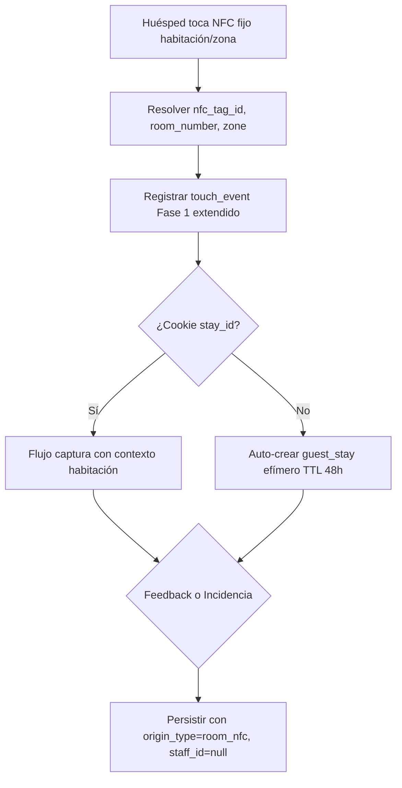
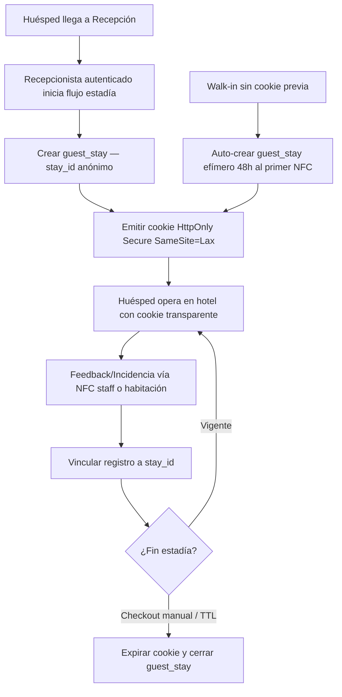
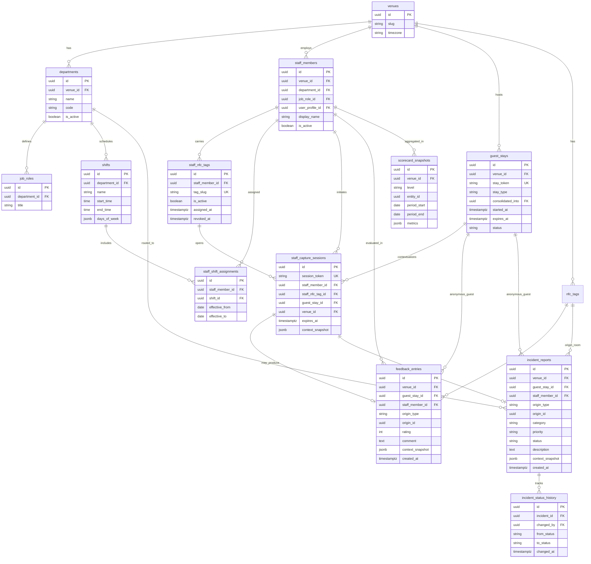
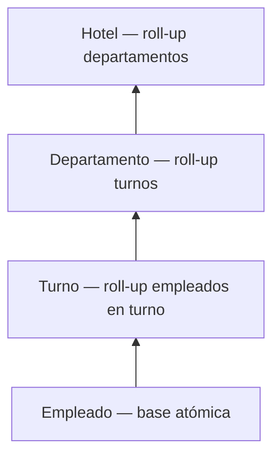

# Especificación de Funcionalidad: TagMe — Staff & Feedback Operativo

**Rama de funcionalidad**: `003-tagme-staff`

**Directorio de spec**: `specs/003-staff/`

**Creado**: 2026-06-10

**Estado**: Clarificado (listo para planificación)

**Clarificaciones resueltas** (2026-06-10): Q1=B (NPS interno, n≥6, turno por asignación explícita), Q2=B (supervisor gestiona depto(s) asignado(s), gerente hotel+comentarios, staff ve score propio), Q3=B (guest_stay efímero TTL 48h, consolidación en recepción)

**Input del usuario**: Fase 3 centrada en el staff operativo como actor principal; captura contextual de feedback e incidencias con trazabilidad NFC, scorecards jerárquicos y cookie de estadía persistente.

**Constitución aplicable**: `specs/003-staff/constitution.md` v1.0.0 (prevalece sobre constitución global para esta fase)

**Fuentes de verdad complementarias**: `specs/001-tagme-platform/`, `specs/002-clevel/` (cuando exista), `TagMe.pdf`, `.specify/memory/constitution.md` v1.1.0

---

## Resumen Ejecutivo

### Problema

En hospitalidad, la experiencia del huésped se evalúa **demasiado tarde y fuera del hotel**: reseñas en TripAdvisor, Google y redes sociales llegan días después, sin contexto operativo, sin vínculo con el empleado que atendió y sin oportunidad de corrección inmediata. El personal de piso — meseros, camaristas, recepcionistas, mantenimiento — no tiene un canal rápido para **invitar** al huésped a opinar o reportar un problema en el momento exacto de la interacción. La gerencia, por su parte, consume proxies inferidos (toques NFC, sesiones AVEX) en lugar de señales directas de satisfacción o fallo de servicio.

Las consecuencias son concretas:

| Actor | Dolor actual |
|-------|--------------|
| **Staff operativo** | No puede convertir una buena (o mala) interacción en dato accionable sin interrumpir el servicio ni pedir al huésped que busque un formulario |
| **Huésped** | Para opinar o reportar un problema debe recordar detalles, buscar canales externos o esperar encuestas post-checkout |
| **Supervisor** | Carece de scorecards por empleado/turno con origen trazable; las incidencias se dispersan en WhatsApp, papel o sistemas ajenos |
| **Gerencia** | Decisiones basadas en agregados de uso (Fase 1–2), no en feedback e incidencias de primera clase vinculados a departamentos y turnos |

### Solución

TagMe Fase 3 invierte el punto de partida: **el staff operativo inicia la interacción** acercando su tarjeta NFC personal al huésped. En segundos se abre una sesión efímera (máx. 5 minutos) donde el huésped — identificado de forma anónima por cookie de estadía — puede dejar **Feedback** (opinión/calificación) o reportar una **Incidencia** (problema que requiere acción). Cada registro queda vinculado a su **origen trazable** (NFC staff o NFC fijo de habitación/zona), al contexto operativo (empleado, departamento, turno, zona) y al `stay_id` del huésped.

Las métricas se consolidan en **Scorecards Jerárquicos**: Empleado → Turno → Departamento → Hotel, alimentando la capa gerencial de Fase 2 con señales reales sin integrar PMS ni exigir login al huésped.

### Propuesta de valor

| Actor | Valor Fase 3 |
|-------|--------------|
| **Staff operativo** | Un toque NFC propio inicia captura en ≤ 3 s; carga principal en el huésped, no en el empleado |
| **Huésped** | Opinar o reportar en contexto, sin apps, sin datos personales obligatorios, en menos de 5 minutos |
| **Supervisor** | Scorecards de equipo, bandeja de incidencias abiertas, tendencias por turno con drill-down |
| **Gerente / C-Level** | Agregados hoteleros enriquecidos con feedback e incidencias reales (complementa Fase 2) |
| **Establecimiento** | Intercepta experiencia **antes** de canales públicos; trazabilidad por empleado sin depender de reseñas externas |

---

## Objetivos de la Fase 3

| ID | Objetivo | Alineación Constitution |
|----|----------|-------------------------|
| **OBJ-01** | Posicionar al staff operativo como iniciador de interacciones de opinión y reporte vía tarjeta NFC propia | Principio II — Staff como Actor Central |
| **OBJ-02** | Capturar Feedback e Incidencias como tipos semánticos distintos con flujos, estados y métricas separadas | Principio IV — Feedback ≠ Incidencia |
| **OBJ-03** | Garantizar trazabilidad completa por origen (NFC staff vs NFC habitación/zona) en todo registro válido | Principio III — Trazabilidad por Origen |
| **OBJ-04** | Implementar sesiones efímeras del staff con TTL de 5 minutos enforced server-side | Principio V — Sesiones Efímeras |
| **OBJ-05** | Establecer identidad persistente de estadía (`stay_id`) vía cookie generada principalmente en Recepción | Principio VI — Identidad Persistente |
| **OBJ-06** | Entregar scorecards jerárquicos Empleado → Turno → Departamento → Hotel con reglas de agregación documentadas | Principio VII — Scorecards Jerárquicos |
| **OBJ-07** | Permitir configuración de departamentos, cargos, turnos y asignación staff/NFC sin cambios de código | Principio VIII — Estructura Organizacional Configurable |
| **OBJ-08** | Interceptar feedback e incidencias dentro del hotel antes de escalamiento a canales externos | Principio IX — Captura Interna |
| **OBJ-09** | Enriquecer dashboards gerenciales (Fase 2) con señales de feedback/incidencia sin rediseñar la capa ejecutiva | §4.5 Integración con capas anteriores |
| **OBJ-10** | Validar operación real en piloto Hotel Caribe by Faranda Grand durante al menos una semana | §8 Criterio de done de la fase |

---

## Alcance de la Fase 3

### Dentro del alcance

| Área | Incluido | Detalle |
|------|----------|---------|
| **Tarjetas NFC de staff** | Sí | Asignación, activación, revocación; toque → sesión efímera |
| **Sesiones efímeras staff↔huésped** | Sí | TTL 5 min; token no reutilizable tras expiración |
| **Flujo huésped post-toque staff** | Sí | UI mobile-first; elección Feedback o Incidencia |
| **Cookie / identidad de estadía** | Sí | Generación en Recepción; persistencia durante estadía; vinculación de registros |
| **Modelo Feedback** | Sí | Calificación + comentario opcional; pipeline hacia scorecards |
| **Modelo Incidencia** | Sí | Categoría, prioridad, estados, asignación, notificación a responsable |
| **Origen NFC habitación/zona** | Sí | Captura alternativa sin staff presente; origen `room_nfc` |
| **Scorecards jerárquicos** | Sí | Empleado, Turno, Departamento, Hotel con drill-down |
| **Configuración organizacional** | Sí | CRUD departamentos, cargos, turnos, asignaciones staff |
| **Panel supervisor** | Sí | Incidencias abiertas, scorecards de equipo, historial por empleado |
| **Enriquecimiento gerencial** | Sí | Nuevas señales en capa Fase 2 (alertas, tendencias) |
| **Múltiples feedbacks por huésped** | Sí | Mismo empleado, distintos momentos/contextos — registros independientes |
| **Trazabilidad histórica** | Sí | Contexto al momento del registro se conserva aunque staff cambie de turno/depto |
| **Piloto Hotel Caribe** | Sí | Configuración de equipos reales, tarjetas staff, validación en piso |

### Explícitamente fuera del alcance

| Área | Excluido | Razón (Constitution §5.2) |
|------|----------|---------------------------|
| **Integración PMS** | Fuera | Cookie de estadía es mecanismo propio; sin sync check-in/checkout automático |
| **Publicación en TripAdvisor / Google** | Fuera | Objetivo = captura interna previa |
| **Sistema completo de RRHH** | Fuera | No nómina, contratos ni evaluaciones formales de desempeño |
| **Gamificación / rankings públicos** | Fuera | Scorecards son herramienta operativa/gerencial, no competencia visible al huésped |
| **Sesiones staff > 5 minutos** | Fuera | Principio V; requiere enmienda de constitution |
| **Login obligatorio del huésped** | Fuera | Cookie de estadía suficiente |
| **Reemplazo de AVEX / hub Fase 1** | Fuera | Complementa, no sustituye |
| **Rediseño completo dashboards C-Level** | Fuera | Fase 2; Fase 3 aporta señales |
| **App nativa staff** | Fuera | Web mobile-first suficiente |
| **IA para clasificar sentimiento** | Fuera | Categorización manual/simple en MVP |
| **Sistema de tickets externo (ServiceNow, etc.)** | Fuera | Zona gris; post-MVP salvo decisión explícita |

### Zona gris — resolver en `/speckit.clarify` o spec futura

| Tema | Estado |
|------|--------|
| Lectura PMS solo para auto-expirar cookie en checkout | Pendiente decisión |
| Notificaciones push/WhatsApp/email en incidencia crítica | Pendiente decisión |
| Feedback anónimo sin cookie (walk-in sin check-in) | Pendiente decisión |
| Exportación scorecards a RRHH / BI externo | Pendiente decisión |
| Fórmula NPS interno vs. promedio simple | **Resuelto (Q1=B)** — NPS interno como métrica principal |
| Resolución automática de turno activo al momento del toque | **Resuelto (Q1=B)** — solo por `staff_shift_assignments` explícita |
| Matriz de permisos supervisor vs. gerente vs. staff | **Resuelto (Q2=B)** — ver §Matriz de Permisos |
| Consolidación de estadías efímeras en Recepción | Pendiente detalle UX en plan — flujo base acordado (Q3=B) |

---

## User Scenarios & Testing

Las historias están priorizadas por valor operativo y capacidad de entrega incremental. Cada historia es **independientemente testeable**.

---

### Perspectiva: Staff Operativo

#### User Story S1 — Iniciar captura con tarjeta NFC propia (Prioridad: P1) 🎯 MVP

Como **mesero, camarista, recepcionista o técnico de mantenimiento**, quiero **acercar mi tarjeta NFC TagMe al huésped para abrir de inmediato un flujo de opinión o reporte**, para **convertir la interacción recién terminada en dato trazable sin interrumpir mi operación más de unos segundos**.

**Por qué esta prioridad**: Es el cambio de paradigma central de Fase 3 (Principio II). Sin esto no existe la fase.

**Prueba independiente**: Staff con tarjeta asignada toca NFC con teléfono del huésped; en ≤ 3 s aparece pantalla de captura con nombre/rol del empleado y opciones Feedback/Incidencia.

**Escenarios de aceptación**:

1. **Dado** un empleado activo con tarjeta NFC asignada, **Cuando** el huésped toca la tarjeta, **Entonces** el sistema identifica automáticamente `staff_id`, departamento, cargo y abre sesión efímera con countdown visible de 5 minutos.
2. **Dado** una sesión activa, **Cuando** transcurren 5 minutos sin envío, **Entonces** la sesión expira, el token queda invalidado y el huésped debe solicitar nuevo toque al staff.
3. **Dado** un empleado sin tarjeta asignada o con tarjeta revocada, **Cuando** alguien toca la tarjeta, **Entonces** el sistema muestra mensaje de tarjeta no válida sin crear sesión ni registro huérfano.
4. **Dado** un staff en servicio activo, **Cuando** inicia captura, **Entonces** no debe completar formularios propios; la carga de entrada recae en el huésped.

---

#### User Story S2 — Múltiples capturas en distintos contextos del mismo día (Prioridad: P2)

Como **camarista**, quiero **que el huésped pueda calificarme en la entrega de toallas y más tarde en el turn-down**, para **reflejar interacciones distintas sin que el sistema las colapse en una sola evaluación**.

**Por qué esta prioridad**: Regla constitucional explícita; evita pérdida de granularidad operativa.

**Prueba independiente**: Mismo `stay_id` + mismo `staff_id` en dos sesiones NFC separadas genera dos `feedback_entries` independientes con timestamps y contextos distintos.

**Escenarios de aceptación**:

1. **Dado** un huésped con cookie de estadía válida, **Cuando** completa feedback al mismo empleado en dos sesiones distintas, **Entonces** existen dos registros independientes, cada uno con su `origin`, timestamp y contexto.
2. **Dado** registros múltiples del mismo par huésped-empleado, **Cuando** el supervisor consulta scorecard del empleado, **Entonces** todos los feedbacks contribuyen al promedio según reglas de agregación vigentes.

---

#### User Story S3 — Reportar incidencia detectada en piso (Prioridad: P2)

Como **empleado de mantenimiento**, quiero **que el huésped reporte una falla (ej. aire acondicionado) vía mi tarjeta NFC**, para **abrir un caso trazable asignado al área correcta sin que yo llene un parte en papel**.

**Por qué esta prioridad**: Incidencias son el segundo pilar semántico (Principio IV); cierra el loop operativo.

**Prueba independiente**: Staff inicia sesión → huésped elige Incidencia → categoría Mantenimiento → registro aparece en bandeja del jefe de área con estado `abierta`.

**Escenarios de aceptación**:

1. **Dado** una sesión staff activa, **Cuando** el huésped selecciona Incidencia, **Entonces** ve formulario con categorías (mantenimiento, limpieza, ruido, F&B, otro) sin campos de calificación de feedback.
2. **Dado** una incidencia enviada, **Cuando** se persiste, **Entonces** incluye origen completo (`staff_nfc`, `staff_id`, `stay_id`, zona) y estado inicial `abierta`.
3. **Dado** una incidencia categorizada como Mantenimiento, **Cuando** se crea, **Entonces** el jefe de departamento o área responsable recibe notificación en panel (canal exacto: ver zona gris).

---

#### User Story S4 — Generar cookie de estadía en Recepción (Prioridad: P1) 🎯 MVP

Como **recepcionista**, quiero **generar o renovar la identidad de estadía del huésped al check-in o primer contacto**, para **que sus feedbacks e incidencias posteriores queden vinculados sin pedir datos personales**.

**Por qué esta prioridad**: Sin `stay_id` persistente, la trazabilidad huésped-multifeedback se pierde (Principio VI).

**Prueba independiente**: Recepcionista ejecuta flujo de generación → huésped recibe cookie HttpOnly → feedback posterior incluye mismo `stay_id`.

**Escenarios de aceptación**:

1. **Dado** un huésped en check-in, **Cuando** recepción inicia flujo de estadía, **Entonces** se crea `guest_stay` con `stay_id` y cookie con TTL alineado a estadía del venue.
2. **Dado** un huésped con cookie vigente, **Cuando** deja feedback horas después vía NFC staff, **Entonces** el registro se asocia al mismo `stay_id` sin re-identificación.
3. **Dado** checkout o expiración TTL, **Cuando** la estadía termina, **Entonces** la cookie expira y nuevos registros requieren nueva estadía (salvo auto-creación efímera Q3).
4. **Dado** un huésped con estadía efímera auto-creada (walk-in), **Cuando** pasa por Recepción, **Entonces** el recepcionista puede consolidar la estadía efímera en una formal vinculando todos los feedbacks/incidencias previos.

---

#### User Story S5 — Consultar mi desempeño personal (Prioridad: P3)

Como **empleado operativo**, quiero **ver mi NPS interno, volumen de feedbacks y tendencia reciente**, para **entender cómo me perciben los huéspedes y mejorar mi servicio**.

**Por qué esta prioridad**: Transparencia acordada (Q2=B) favorece adopción; no bloquea MVP de captura.

**Prueba independiente**: Staff autenticado abre vista personal → ve NPS (si n ≥ 6), volumen y tendencia; no ve comentarios textuales ni datos de compañeros.

**Escenarios de aceptación**:

1. **Dado** un empleado con ≥ 6 feedbacks en el periodo, **Cuando** abre su scorecard personal, **Entonces** ve NPS interno, volumen n y promedio 1–5 auxiliar.
2. **Dado** un empleado con < 6 feedbacks, **Cuando** abre su scorecard, **Entonces** ve "datos insuficientes" con n actual, sin NPS destacado.
3. **Dado** un empleado operativo, **Cuando** accede a su vista, **Entonces** no puede ver scorecards ni comentarios de otros empleados.

---

### Perspectiva: Huésped

#### User Story G1 — Dejar feedback rápido post-servicio (Prioridad: P1) 🎯 MVP

Como **huésped**, quiero **calificar la atención recibida en pocos toques tras el NFC del empleado**, para **expresar mi satisfacción sin buscar formularios externos ni instalar apps**.

**Por qué esta prioridad**: Cierra el loop de captura interna (Principio IX).

**Prueba independiente**: Tras toque NFC staff, huésped selecciona Feedback, califica 1–5, envía en < 60 s; confirmación visible; scorecard del empleado se actualiza en ≤ 60 s.

**Escenarios de aceptación**:

1. **Dado** una sesión staff activa, **Cuando** el huésped elige Feedback, **Entonces** ve escala simple (1–5 o emojis) y campo de comentario opcional, sin campos de incidencia.
2. **Dado** un envío exitoso, **Cuando** confirma, **Entonces** ve mensaje de agradecimiento y la sesión se cierra; no puede reenviar en la misma sesión expirada.
3. **Dado** un huésped sin cookie previa en primera interacción NFC staff, **Cuando** intenta enviar feedback, **Entonces** el sistema crea automáticamente un `guest_stay` efímero (TTL 48 h), emite cookie y permite el envío sin redirigir a Recepción.

---

#### User Story G2 — Reportar problema desde habitación sin staff presente (Prioridad: P2)

Como **huésped en mi habitación**, quiero **tocar el NFC fijo de la habitación para reportar un problema o dejar opinión**, para **resolver inconvenientes sin bajar a recepción ni buscar al empleado**.

**Por qué esta prioridad**: Segundo canal de origen obligatorio (Principio III); complementa captura staff-led.

**Prueba independiente**: Toque tag habitación → flujo captura con origen `room_nfc`, `room_number`, sin `staff_id` obligatorio.

**Escenarios de aceptación**:

1. **Dado** un tag NFC fijo de habitación activo (reutiliza `nfc_tags` Fase 1 con `zone = room`), **Cuando** el huésped toca, **Entonces** abre flujo de Feedback o Incidencia con contexto de habitación visible.
2. **Dado** captura vía habitación, **Cuando** se persiste, **Entonces** `origin_type = room_nfc`, `staff_id` es null y `nfc_tag_id` + `room_number` están poblados.
3. **Dado** incidencia desde habitación, **Cuando** se categoriza, **Entonces** sigue el mismo workflow de estados que incidencia vía staff NFC.

---

#### User Story G3 — Dar feedback a distintos empleados durante la estadía (Prioridad: P2)

Como **huésped**, quiero **calificar al mesero del desayuno y por separado al del servicio de habitación**, para **que mi opinión refleje cada interacción con precisión**.

**Por qué esta prioridad**: Múltiples contextos = múltiples registros; evita promedios engañosos.

**Prueba independiente**: Tres sesiones staff con tres empleados distintos en la misma estadía → tres registros con mismo `stay_id`, distintos `staff_id`.

**Escenarios de aceptación**:

1. **Dado** cookie de estadía válida, **Cuando** el huésped interactúa con NFC de empleados de distintos departamentos, **Entonces** cada registro conserva departamento y cargo del empleado al momento del toque.
2. **Dado** múltiples feedbacks del mismo huésped, **Cuando** gerencia consulta agregados, **Entonces** no se expone qué huésped específico escribió qué comentario (solo agregados y moderación).

---

### Perspectiva: Jefe de Departamento / Supervisor

#### User Story V1 — Ver scorecard de mi equipo (Prioridad: P2)

Como **jefe de housekeeping**, quiero **ver el desempeño agregado de mi departamento y de cada empleado con desglose por turno**, para **detectar caídas de calidad y reconocer buen desempeño con datos, no intuición**.

**Por qué esta prioridad**: Scorecards jerárquicos son entregable central (Principio VII).

**Prueba independiente**: Supervisor accede a panel → ve score departamento, lista empleados con promedio y volumen, filtra por turno y rango de fechas.

**Escenarios de aceptación**:

1. **Dado** un supervisor con uno o más departamentos asignados, **Cuando** abre scorecard, **Entonces** ve y gestiona métricas e incidencias solo de esos departamentos, sin acceso a departamentos no asignados.
2. **Dado** scorecard de empleado, **Cuando** hace drill-down, **Entonces** ve volumen de feedbacks, NPS interno, tendencia y conteo de incidencias vinculadas (sin PII del huésped).
3. **Dado** un empleado con menos de 6 feedbacks en el periodo, **Cuando** se muestra score consolidado, **Entonces** el sistema muestra estado "datos insuficientes" con volumen actual (n) en lugar de NPS destacado o ranking.

---

#### User Story V2 — Gestionar bandeja de incidencias (Prioridad: P2)

Como **supervisor de mantenimiento**, quiero **ver incidencias abiertas de mi área, cambiar estado y asignar responsable**, para **cerrar problemas con trazabilidad y tiempos de respuesta medibles**.

**Por qué esta prioridad**: Incidencias requieren workflow operativo, no solo captura.

**Prueba independiente**: Incidencia creada → aparece en bandeja → supervisor cambia a `en progreso` → `resuelta` → `cerrada` con historial de cambios.

**Escenarios de aceptación**:

1. **Dado** una incidencia abierta de categoría Mantenimiento, **Cuando** el supervisor accede, **Entonces** la ve en su bandeja con origen (staff NFC o habitación), categoría, prioridad y timestamp.
2. **Dado** un cambio de estado, **Cuando** el supervisor actualiza, **Entonces** queda registro de auditoría (quién, cuándo, estado anterior/nuevo).
3. **Dado** una incidencia resuelta, **Cuando** se cierra, **Entonces** deja de contar como abierta en métricas de departamento y hotel.

---

#### User Story V3 — Configurar estructura de mi área (Prioridad: P3)

Como **jefe de departamento autorizado**, quiero **gestionar cargos, asignación de empleados a turnos y vincular tarjetas NFC**, para **mantener la estructura operativa actualizada sin depender de TI**.

**Por qué esta prioridad**: Configuración es prerequisito de scorecards correctos; puede seguir a captura básica.

**Prueba independiente**: Supervisor crea turno "Mañana 6–14", asigna empleados, vincula NFC → próximo toque refleja turno en contexto del registro.

**Escenarios de aceptación**:

1. **Dado** un supervisor con permiso de configuración, **Cuando** edita asignación staff↔turno, **Entonces** los nuevos registros usan la asignación vigente; históricos conservan snapshot al momento del evento.
2. **Dado** un cambio de departamento de un empleado, **Cuando** se guarda, **Entonces** registros futuros usan nuevo departamento; registros pasados conservan departamento original.

---

### Perspectiva: Gerente General

#### User Story M1 — Pulso hotelero con señales reales de experiencia (Prioridad: P2)

Como **gerente general**, quiero **ver un consolidado del hotel con score por departamento, tasa de incidencias y tendencia**, para **tomar decisiones con señales de feedback real, no solo proxies de toques NFC o AVEX**.

**Por qué esta prioridad**: Enriquece Fase 2 sin rediseñarla (OBJ-09).

**Prueba independiente**: Dashboard gerencial muestra score hotel, ranking departamentos, incidencias abiertas vs. cerradas, comparativo semanal.

**Escenarios de aceptación**:

1. **Dado** un gerente con rol autorizado, **Cuando** accede a vista hotel, **Entonces** ve roll-up Departamento → Hotel con NPS interno y puede consultar comentarios textuales de feedback por departamento.
2. **Dado** un pico de incidencias en un departamento, **Cuando** supera umbral configurable, **Entonces** puede generarse alerta gerencial (integración Fase 2).
3. **Dado** datos de feedback e incidencia, **Cuando** se muestran junto a TagMétricas Fase 1, **Entonces** queda claro qué métrica es proxy vs. señal directa.

---

#### User Story M2 — Comparar turnos y detectar brechas operativas (Prioridad: P3)

Como **gerente general**, quiero **comparar desempeño entre turnos del mismo departamento**, para **ajustar dotación, capacitación o procesos según franja horaria**.

**Por qué esta prioridad**: Valor analítico alto; depende de scorecards de turno funcionando.

**Prueba independiente**: Vista comparativa turno Mañana vs. Noche en Restaurante con diferencia de promedio y volumen.

**Escenarios de aceptación**:

1. **Dado** feedbacks distribuidos en múltiples turnos, **Cuando** el gerente filtra por departamento, **Entonces** ve scorecard por turno con volumen y promedio.
2. **Dado** empleados con asignación explícita a turnos, **Cuando** se agregan métricas por turno, **Entonces** cada registro usa el `shift_id` de `staff_shift_assignments` vigente al momento del toque; sin asignación explícita, el registro queda sin turno (no se infiere por hora).

---

### Edge Cases

- **Sesión expirada mid-formulario**: Huésped pierde progreso; mensaje claro pidiendo nuevo toque al staff; no se persiste borrador.
- **Huésped sin cookie y sin paso por recepción**: Auto-crear `guest_stay` efímero (TTL 48 h) y cookie al primer intento de captura; Recepción puede consolidar después con estadía formal.
- **Tarjeta NFC staff perdida o robada**: Revocación inmediata en panel; tarjeta revocada no abre sesiones; histórico conservado.
- **Empleado sin asignación de turno explícita**: Registro válido con `shift_id` null en `context_snapshot`; no se infiere turno por hora del venue.
- **Empleado con múltiples asignaciones de turno solapadas**: Usar asignación vigente única; si hay conflicto, priorizar la asignación con `effective_from` más reciente — detalle en plan.
- **Estadía efímera + check-in formal mismo huésped**: Recepción consolida vinculando registros previos al `stay_id` definitivo.
- **Toques duplicados accidentales (< 30 s)**: Política de deduplicación de sesiones, no de feedbacks enviados — definir en plan.
- **Incidencia duplicada mismo problema**: Huésped reporta dos veces; registros independientes; supervisor puede marcar como duplicado manualmente (post-MVP) o convivir.
- **Feedback extremo (1★) con comentario ofensivo**: Moderación en vista supervisor; no exposición pública; reglas de filtro según spec de privacidad.
- **Tag habitación reasignado a otra habitación**: `nfc_tags` actualiza `room_number`; histórico conserva valor al momento del evento.
- **Venue multi-idioma**: UI de captura en español por defecto; soporte idioma huésped deseable post-MVP.
- **Conectividad intermitente del huésped**: Reintento de envío; mensaje claro; sesión puede expirar antes de éxito.
- **Staff nocturno en turno que cruza medianoche**: Agregación por turno debe usar timezone del venue (`America/Bogota`).

---

## Flujos Principales

### Flujo 1 — Sesión efímera iniciada por NFC del staff



**Criterios del flujo**:

- Tiempo desde toque NFC hasta formulario visible: **≤ 3 segundos**.
- Duración máxima de sesión: **5 minutos** (enforced server-side).
- Staff no completa formularios; solo inicia con toque físico.

---

### Flujo 2 — Captura de Feedback



**Criterios del flujo**:

- Sin campos de incidencia (prioridad, categoría de fallo).
- Origen obligatorio: `origin_type`, `origin_id`, `venue_id`, `stay_id`, timestamp.
- Si origen staff: `staff_id` y `staff_nfc_tag_id` obligatorios.
- Actualización de scorecards: objetivo **≤ 60 segundos** tras envío.

---

### Flujo 3 — Captura y gestión de Incidencia



**Estados válidos**: `abierta` → `en progreso` → `resuelta` → `cerrada` (transiciones auditadas).

**Criterios del flujo**:

- Pipeline separado de feedback; una incidencia **no** decrementa automáticamente score de empleado salvo regla explícita futura.
- Conserva origen para investigación (staff presente vs. reporte desde habitación).

---

### Flujo 4 — Interacción desde NFC fijo de habitación



**Criterios del flujo**:

- Reutiliza entidad `nfc_tags` (Fase 1) con `zone = room` u otras zonas fijas.
- No requiere presencia del staff; `staff_id` nullable.
- Misma bifurcación Feedback/Incidencia que flujo staff-led.

---

### Flujo 5 — Generación y uso de cookie de estadía persistente



**Criterios del flujo**:

- Generación **principalmente** en Recepción (Principio VI).
- Sin PII obligatoria (nombre, documento, email).
- TTL configurable por venue; expiración al checkout operativo manual en MVP.

---

## Diferenciación: Feedback vs. Incidencia

| Dimensión | **Feedback** | **Incidencia** |
|-----------|--------------|----------------|
| **Definición** | Opinión o calificación sobre interacción/servicio recibido | Problema que requiere acción correctiva del hotel |
| **Ejemplos** | "Excelente atención en check-in", 5/5 al mesero | AC dañado, ruido excesivo, demora room service |
| **Campos principales** | `rating` (1–5), `comment` (opcional), origen, `stay_id`, contexto staff/depto | `category`, `description`, `priority`, `status`, origen, `stay_id` |
| **Estados** | Enviado (terminal); no workflow | `abierta` → `en progreso` → `resuelta` → `cerrada` |
| **Destino operativo** | Scorecards jerárquicos | Bandeja supervisor + métricas incidencias abiertas/cerradas |
| **Métricas** | Promedio calificación, volumen, tendencia, NPS proxy | Tasa incidencias, tiempo resolución, distribución por categoría |
| **UI** | Escala + comentario opcional; sin categorías de fallo | Categoría + descripción; sin escala de satisfacción |
| **Relación con empleado** | Típicamente vinculado a `staff_id` cuando origen staff | Puede vincularse a staff si origen staff; nullable si origen habitación |
| **Regla constitucional** | Nunca mezclar campos de incidencia en formulario feedback | Nunca tratar incidencia como feedback negativo implícito |

---

## Modelo de Datos Propuesto

> Detalle de implementación (tipos SQL, RLS, índices) en `data-model.md` (pendiente `/speckit.plan`). Aquí se definen entidades, atributos clave y relaciones.

### Diagrama ER (alto nivel)



### Entidades principales y reglas

| Entidad | Representa | Reglas clave |
|---------|------------|--------------|
| **`departments`** | Área operativa (Housekeeping, F&B, Mantenimiento, Recepción) | Configurable por venue; no hardcodear Hotel Caribe |
| **`job_roles`** | Cargo dentro de departamento (mesero, camarista, recepcionista) | Vinculado a un departamento |
| **`shifts`** | Franja operativa (Mañana, Tarde, Noche) | Por departamento; horarios y días configurables |
| **`staff_members`** | Empleado operativo | Extiende `user_profiles` Fase 1; histórico conserva snapshot en cada registro |
| **`staff_nfc_tags`** | Tarjeta NFC personal del empleado | Una activa por empleado en MVP; revocable |
| **`staff_shift_assignments`** | Asignación empleado↔turno con vigencia | Cambios no alteran registros históricos |
| **`guest_stays`** | Estadía anónima del huésped | `stay_token` en cookie; `stay_type`: `formal` (Recepción) \| `ephemeral` (auto 48 h); `consolidated_into` al fusionar efímera → formal |
| **`staff_capture_sessions`** | Sesión efímera staff↔huésped | TTL 5 min; `context_snapshot` con depto/cargo/turno al crear |
| **`feedback_entries`** | Registro atómico de opinión | Requiere origen + `stay_id`; alimenta scorecards |
| **`incident_reports`** | Registro de problema | Workflow de estados; categoría obligatoria |
| **`incident_status_history`** | Auditoría de cambios de estado | Quién, cuándo, transición |
| **`scorecard_snapshots`** | Agregados precalculados (opcional) | Niveles: employee, shift, department, hotel |

### Trazabilidad por origen (campos obligatorios en todo registro)

| Campo | Feedback | Incidencia | Descripción |
|-------|----------|------------|-------------|
| `origin_type` | ✓ | ✓ | `staff_nfc` \| `room_nfc` |
| `origin_id` | ✓ | ✓ | ID del `staff_nfc_tag` o `nfc_tag` |
| `venue_id` | ✓ | ✓ | Venue del evento |
| `guest_stay_id` / `stay_id` | ✓ | ✓ | Huésped anónimo |
| `staff_member_id` | Si origen staff | Nullable | Empleado que inició o atendió |
| `context_snapshot` | ✓ | ✓ | JSON: departamento, cargo, turno, zona, room_number al momento del evento |
| `created_at` | ✓ | ✓ | Timestamp UTC; agregaciones usan timezone venue |

### Reutilización de Fases 1–2

| Entidad Fase 1–2 | Uso en Fase 3 |
|------------------|---------------|
| `venues` | Scope de todo staff, stays, scorecards |
| `nfc_tags` | Tags fijos habitación/zona (`origin_type = room_nfc`) |
| `user_profiles` | Base auth para staff, supervisores, gerentes |
| `touch_events` | Extender con `event_type` captura staff/habitación (no duplicar pipeline) |
| Dashboards Fase 2 | Consumir agregados de `feedback_entries` e `incident_reports` |

---

## Sistema de Scorecards Jerárquicos

### Cascada de agregación



### Métricas por nivel

| Nivel | Métricas típicas | Fuentes |
|-------|------------------|---------|
| **Empleado** | NPS interno, volumen feedbacks, tendencia 7/30 días, incidencias vinculadas (conteo) | `feedback_entries` WHERE `staff_member_id` |
| **Turno** | NPS interno del turno, volumen, comparativo vs. otros turnos del mismo depto | Roll-up empleados con `context_snapshot.shift_id` (solo asignación explícita) |
| **Departamento** | NPS interno consolidado, incidencias abiertas/cerradas, ranking interno empleados | Roll-up turnos + bandeja incidencias |
| **Hotel** | NPS interno hotelero, tasa incidencias por 100 estadías, cobertura captura | Roll-up departamentos |

### Reglas de agregación (Q1=B — ratificadas 2026-06-10)

| Regla | Definición acordada | Estado |
|-------|---------------------|--------|
| **Métrica principal** | **NPS interno** = % calificaciones 5★ − % calificaciones 1★ y 2★ (escala 1–5) | ✅ Resuelto |
| **Métrica auxiliar** | Promedio aritmético 1–5 visible junto a NPS para contexto operativo | ✅ Resuelto |
| **Volumen mínimo** | NPS consolidado y ranking destacado solo si **n ≥ 6** feedbacks en el periodo; si n < 6 → estado "datos insuficientes" mostrando n actual | ✅ Resuelto |
| **Múltiples feedbacks mismo huésped-empleado** | Todos cuentan; no deduplicar | Confirmado (Constitution) |
| **Incidencias en score empleado** | Conteo separado; no afectan NPS automáticamente | Confirmado (Constitution) |
| **Turno al capturar** | Solo por **asignación explícita** en `staff_shift_assignments` vigente al timestamp del registro; **no** inferir por hora del venue | ✅ Resuelto |
| **Sin asignación de turno** | `shift_id = null` en `context_snapshot`; registro válido, excluido de roll-up por turno | ✅ Resuelto |
| **Periodo de agregación** | Diario, semanal, mensual seleccionable | Confirmado |
| **Drill-down** | Hotel → Depto → Turno → Empleado → lista agregada (sin PII huésped) | Confirmado |
| **Tiempo actualización** | ≤ 60 s tras envío feedback | Confirmado (Constitution §4.2) |

**Fórmula NPS interno (ejemplo)**:

```
NPS_interno = (count(rating=5) / n × 100) − (count(rating∈{1,2}) / n × 100)
```

Donde `n` = total de `feedback_entries` del sujeto en el periodo seleccionado.

### Anti-patrón explícito

Un solo feedback 5★ **no** debe mostrar al empleado como "empleado del mes". Con n < 6 el sistema muestra "datos insuficientes", nunca un NPS destacado.

---

## Matriz de Permisos (Q2=B — ratificada 2026-06-10)

| Recurso / Acción | Staff operativo | Supervisor (depto(s) asignado(s)) | Gerente general | Admin venue |
|------------------|-----------------|-----------------------------------|-----------------|-------------|
| Iniciar sesión NFC (toque físico) | ✓ | ✓ | — | — |
| Ver scorecard propio (NPS, volumen, tendencia) | ✓ | ✓ (el suyo) | ✓ (roll-up hotel) | ✓ |
| Ver scorecards de equipo | — | ✓ (solo depto(s) asignado(s)) | ✓ (todo el hotel) | ✓ |
| Ver comentarios textuales de feedback | — | ✓ (solo depto(s) asignado(s)) | ✓ | ✓ |
| Gestionar incidencias (estados, asignación) | — | ✓ (solo depto(s) asignado(s)) | ✓ (todo el hotel) | ✓ |
| Configurar departamentos, cargos, turnos | — | ✓ (solo depto(s) asignado(s)) | ✓ | ✓ |
| Asignar / revocar tarjetas NFC staff | — | ✓ (solo depto(s) asignado(s)) | ✓ | ✓ |
| Generar cookie estadía formal (Recepción) | ✓ (si rol recepción) | ✓ (si rol recepción) | ✓ | ✓ |
| Consolidar estadía efímera → formal | — | ✓ (si rol recepción) | ✓ | ✓ |
| Exportar / alertas gerenciales Fase 2 | — | — | ✓ | ✓ |

> Un supervisor puede tener **uno o más departamentos asignados**; RLS filtra por esa lista. No accede a departamentos fuera de su asignación.

### Capacidad recepción (definición MVP)

Usuario autenticado con **capacidad recepción** si cumple **cualquiera** de:

1. `user_profiles.role` ∈ `{ manager, admin }`, o
2. Existe `staff_members` activo vinculado a su `user_profile_id` en un departamento con `departments.code = 'RECEPCION'` del mismo `venue_id`.

Aplica a: generar estadía formal (FR-006), lookup, cierre y consolidación (FR-010b). No requiere rol adicional en `user_profiles`.

Implementación: `canManageGuestStays()` en app; helpers SQL `is_reception_staff()` y `can_manage_guest_stays()` en RLS.

---

## Estructura Organizacional Configurable

| Elemento | Operaciones permitidas | Quién puede |
|----------|------------------------|-------------|
| **Departamentos** | Crear, editar nombre/código, activar/desactivar | Admin venue, gerente; supervisor solo en depto(s) asignado(s) |
| **Cargos (job_roles)** | CRUD por departamento | Admin venue, gerente, supervisor de depto asignado |
| **Turnos** | Definir horarios, días, nombre | Admin venue, gerente, supervisor de depto asignado |
| **Staff ↔ Departamento/Cargo** | Asignar, transferir | Admin venue, gerente, supervisor de depto asignado |
| **Staff ↔ Turno** | Asignación explícita con vigencia (`staff_shift_assignments`) | Supervisor de depto asignado, admin venue |
| **Staff ↔ Tarjeta NFC** | Asignar, revocar, reemplazar | Supervisor de depto asignado, admin venue, gerente |
| **Categorías incidencia** | Lista configurable por venue | Admin venue, gerente |

**Regla histórica**: Todo cambio organizacional aplica **hacia adelante**. `context_snapshot` en cada `feedback_entry` / `incident_report` conserva departamento, cargo y turno al momento del hecho.

---

## Requirements

### Functional Requirements

**Sesiones NFC staff**

- **FR-001**: El sistema DEBE abrir flujo de captura en ≤ 3 segundos tras toque del huésped a tarjeta NFC activa del staff.
- **FR-002**: El sistema DEBE crear `staff_capture_session` con TTL máximo de 5 minutos enforced server-side.
- **FR-003**: El sistema DEBE invalidar el token de sesión tras expiración o envío exitoso; no reutilizable.
- **FR-004**: El sistema DEBE identificar automáticamente empleado, departamento y cargo desde la tarjeta NFC sin entrada manual del staff.
- **FR-005**: El sistema DEBE registrar `shift_id` en `context_snapshot` **solo** si existe asignación explícita vigente en `staff_shift_assignments` al momento del registro; si no hay asignación, `shift_id` es null (sin inferencia por hora).

**Cookie e identidad de estadía**

- **FR-006**: El sistema DEBE permitir a recepción autenticada generar `guest_stay` y emitir cookie de estadía HttpOnly, Secure, SameSite=Lax.
- **FR-007**: El sistema DEBE asociar feedbacks e incidencias al `stay_id` de la cookie vigente.
- **FR-008**: El sistema DEBE expirar cookie al fin de estadía (checkout manual o TTL configurable por venue).
- **FR-009**: El sistema NO DEBE almacenar PII obligatoria del huésped (nombre, documento, email) en MVP.
- **FR-010**: Si el huésped no tiene cookie de estadía al iniciar captura (NFC staff o habitación), el sistema DEBE auto-crear `guest_stay` efímero con TTL de **48 horas**, emitir cookie y permitir envío de feedback/incidencia.
- **FR-010a**: El sistema DEBE marcar estadías auto-creadas con `stay_type = ephemeral` para distinguirlas de estadías formales de Recepción.
- **FR-010b**: Recepción DEBE poder consolidar una estadía efímera vinculando sus registros a una estadía formal sin pérdida de trazabilidad.

**Feedback**

- **FR-011**: El sistema DEBE ofrecer escala de calificación 1–5 (o equivalente emoji) y comentario opcional.
- **FR-012**: El sistema DEBE persistir `feedback_entry` con origen completo (`origin_type`, `origin_id`, `venue_id`, `stay_id`, `staff_member_id` si aplica).
- **FR-013**: El sistema DEBE actualizar scorecards del empleado y departamento en ≤ 60 segundos tras envío.
- **FR-014**: El sistema NO DEBE incluir campos de incidencia en el flujo de feedback.
- **FR-015**: El sistema DEBE permitir múltiples `feedback_entries` del mismo `stay_id` hacia el mismo `staff_member_id` en sesiones distintas.

**Incidencias**

- **FR-016**: El sistema DEBE ofrecer flujo separado con categorías: mantenimiento, limpieza, ruido, F&B, otro (configurable).
- **FR-017**: El sistema DEBE asignar estado inicial `abierta` y soportar transiciones a `en progreso`, `resuelta`, `cerrada`.
- **FR-018**: El sistema DEBE registrar historial de cambios de estado con actor y timestamp.
- **FR-019**: El sistema DEBE notificar al responsable del área según categoría (mínimo: visibilidad en panel supervisor).
- **FR-020**: El sistema NO DEBE convertir incidencias en feedback negativo implícito ni unificar pipelines.

**Origen NFC habitación/zona**

- **FR-021**: El sistema DEBE permitir captura Feedback/Incidencia desde `nfc_tags` fijos sin presencia del staff.
- **FR-022**: El sistema DEBE persistir `origin_type = room_nfc` y `staff_member_id` null salvo contexto explícito futuro.
- **FR-023**: El sistema DEBE reutilizar entidad `nfc_tags` de Fase 1 sin duplicar infraestructura de puntos físicos.

**Scorecards**

- **FR-024**: El sistema DEBE calcular agregados en cascada Empleado → Turno → Departamento → Hotel.
- **FR-025**: El sistema DEBE permitir drill-down desde hotel hasta empleado sin exponer PII del huésped.
- **FR-026**: El sistema DEBE calcular **NPS interno** (% 5★ − % 1★–2★) como métrica principal de scorecard; mostrar NPS consolidado solo si **n ≥ 6** feedbacks en el periodo; si n < 6, mostrar "datos insuficientes" con conteo actual.
- **FR-027**: El sistema DEBE mostrar volumen de feedbacks junto a promedios en toda vista de scorecard.

**Configuración organizacional**

- **FR-028**: El sistema DEBE permitir CRUD de departamentos, cargos, turnos y asignaciones staff sin despliegue de código.
- **FR-029**: El sistema DEBE permitir asignación y revocación de tarjetas NFC a empleados activos.
- **FR-030**: El sistema DEBE conservar `context_snapshot` histórico indepeniente de cambios organizacionales posteriores.

**Paneles y permisos**

- **FR-031**: El sistema DEBE proveer panel supervisor con bandeja de incidencias y scorecards de equipo.
- **FR-032**: El sistema DEBE aplicar la matriz de permisos §Matriz de Permisos: supervisor gestiona solo depto(s) asignado(s); gerente ve hotel completo incluyendo comentarios textuales; staff operativo accede únicamente a su scorecard personal (sin comentarios de otros huéspedes ni datos de compañeros).
- **FR-033**: El sistema DEBE enriquecer vistas gerenciales Fase 2 con métricas de feedback e incidencia sin rediseño completo.
- **FR-037**: El sistema DEBE exponer vista de scorecard personal al staff operativo autenticado (NPS propio, volumen, tendencia) sin exponer comentarios textuales individuales de huéspedes en MVP.

**Integración Fases 1–2**

- **FR-034**: El sistema DEBE extender `touch_events` o modelo de eventos existente para registrar capturas staff/habitación.
- **FR-035**: El sistema DEBE reutilizar `venues`, `nfc_tags`, `user_profiles` y roles existentes.
- **FR-036**: El sistema PUEDE emitir alertas gerenciales ante picos de incidencias o caída de score por departamento.

### Non-Functional Requirements

- **NFR-001 (Rendimiento captura)**: Formulario de captura visible en ≤ 3 s tras toque NFC staff; envío de feedback en ≤ 2 s.
- **NFR-002 (Scorecards)**: Vista scorecard departamento carga en ≤ 3 s con datos de piloto (hasta 200 empleados, 30 días).
- **NFR-003 (Disponibilidad)**: Flujos de captura huésped y panel supervisor ≥ 99% en horario operativo del venue piloto.
- **NFR-004 (Usabilidad staff)**: Iniciar sesión NFC requiere 1 acción física del staff (entregar tarjeta al huésped); cero campos de texto para el staff.
- **NFR-005 (Usabilidad huésped)**: Completar feedback con calificación solamente en ≤ 2 toques; incidencia mínima en ≤ 5 toques.
- **NFR-006 (Privacidad)**: Comentarios textuales visibles solo a roles autorizados con moderación; agregados sin identificación de huésped.
- **NFR-007 (Seguridad)**: Auth obligatoria para staff, supervisor, recepción; captura huésped vía token de sesión efímera o cookie `stay_id`; RLS por venue.
- **NFR-008 (Trazabilidad)**: 100% de registros persistidos tienen origen identificable; cero registros huérfanos en producción.
- **NFR-009 (Idioma)**: UI operativa y documentación de producto en español.
- **NFR-010 (Mantenibilidad)**: Separación clara de módulos: sesiones NFC, captura huésped, feedback, incidencias, scorecards, configuración.
- **NFR-011 (Escalabilidad piloto)**: Soportar ≥ 150 sesiones staff/día y ≥ 500 feedbacks/incidencias/mes en Hotel Caribe sin degradación perceptible.

---

## Success Criteria

### Measurable Outcomes

- **SC-001**: ≥ 90% de toques NFC staff abren formulario de captura en ≤ 3 segundos, medido con ≥ 30 pruebas en dispositivos iPhone y Android.
- **SC-002**: 100% de sesiones staff expiran automáticamente a los 5 minutos sin envío en pruebas de aceptación.
- **SC-003**: ≥ 95% de envíos de feedback registran `feedback_entry` completo (origen + `stay_id`) en ≤ 2 segundos.
- **SC-004**: Scorecard de empleado refleja nuevo feedback en ≤ 60 segundos en ≥ 95% de pruebas.
- **SC-005**: Durante semana piloto en Hotel Caribe, ≥ 3 departamentos operan captura staff-led con ≥ 50 feedbacks reales registrados.
- **SC-006**: ≥ 80% de huéspedes que inician flujo de captura completan feedback (solo calificación) en ≤ 2 minutos.
- **SC-007**: 100% de incidencias creadas aparecen en bandeja del supervisor responsable en ≤ 60 segundos.
- **SC-008**: ≥ 70% de incidencias abiertas durante piloto transicionan a `resuelta` o `cerrada` en ≤ 48 horas.
- **SC-009**: Gerente general puede ver score consolidado hotel + desglose por ≥ 4 departamentos en una sola vista.
- **SC-010**: Cero registros huérfanos (sin `origin_type` o sin `stay_id`) en auditoría de piloto; estadías efímeras auto-creadas cuentan como `stay_id` válido.
- **SC-011**: Configuración de nuevo empleado + tarjeta NFC + turno aplicable en ≤ 15 minutos sin intervención de desarrollo.
- **SC-012**: ≥ 75% del staff piloto (muestra ≥ 12) califica el flujo NFC como "rápido" o "muy rápido" en encuesta post-piloto.

---

## Riesgos

| ID | Riesgo | Impacto | Mitigación propuesta |
|----|--------|---------|----------------------|
| **R-01** | Baja adopción staff — perciben fricción o miedo a evaluación | Alto | Capacitación; NFC toma < 3 s; scorecards no públicos al huésped; enfoque en mejora, no castigo |
| **R-02** | Huésped sin cookie de estadía | Medio | **Resuelto (Q3=B)** — auto-crear efímera 48 h; Recepción consolida |
| **R-03** | Scorecards engañosos con volumen bajo (n=1) | Medio | **Resuelto (Q1=B)** — NPS solo si n ≥ 6; estado "datos insuficientes" |
| **R-04** | Confusión Feedback vs. Incidencia en UI | Medio | Flujos separados desde primer pantallazo; copy claro en español |
| **R-05** | Turnos mal resueltos distorsionan métricas por franja | Medio | **Resuelto (Q1=B)** — solo asignación explícita; sin inferencia horaria |
| **R-06** | Permisos supervisor demasiado amplios o restrictivos | Medio | **Resuelto (Q2=B)** — matriz de permisos + RLS por depto asignado |
| **R-12** | Estadías efímeras duplicadas antes de consolidación | Medio | Consolidación en Recepción; TTL 48 h; detección de estadía activa en plan |
| **R-07** | Dependencia de Fase 2 no implementada aún | Medio | Panel supervisor Fase 3 autónomo; enriquecimiento Fase 2 como slice incremental |
| **R-08** | Expectativa de integración PMS | Medio | Constitution §5.2; comunicar cookie como mecanismo MVP |
| **R-09** | Comentarios ofensivos en feedback | Bajo | Moderación supervisor; no exposición a todo el staff |
| **R-10** | Sesión expira antes de envío por conectividad | Medio | UX de reintento; mensaje claro para nuevo toque staff |
| **R-11** | Privacidad Ley 1581 Colombia | Medio | `stay_id` anónimo; sin PII; agregados por defecto |

---

## Suposiciones

- Hotel Caribe by Faranda Grand participa como venue piloto con equipos operativos reales y tarjetas NFC staff físicas disponibles o en producción.
- Fases 1 (`001-tagme-platform`) están desplegadas con `venues`, `nfc_tags`, `user_profiles` y TagMétricas operativos.
- Fase 2 (`002-clevel`) puede estar parcial; Fase 3 incluye panel supervisor propio aunque enriquecimiento gerencial sea incremental.
- La mayoría de huéspedes del piloto pasan por Recepción donde se genera cookie de estadía formal; walk-ins se cubren con estadía efímera auto-creada (TTL 48 h).
- Staff piloto tiene smartphones con NFC para que el huésped toque la tarjeta del empleado (el staff no necesita app; el huésped usa su teléfono).
- Recepción tiene al menos una estación con acceso autenticado al flujo de generación de estadía.
- Departamentos piloto iniciales: Recepción, Housekeeping, F&B (restaurante), Mantenimiento — configurables, no hardcodeados.
- Timezone del venue: `America/Bogota` para agregaciones de turno y reportes.
- Tags NFC de habitación de Fase 1 se reutilizan para origen `room_nfc` sin reprogramación masiva.
- Categorías de incidencia listadas son suficientes para MVP; extensibles por venue.
- Un empleado tiene máximo una tarjeta NFC staff activa en MVP.
- Comentarios técnicos en código pueden estar en inglés; UI y specs en español.

---

## Dependencias con Fases 1 y 2

### Fase 1 (`001-tagme-platform`) — Dependencias duras

| Artefacto Fase 1 | Dependencia en Fase 3 |
|------------------|----------------------|
| `venues` | Scope de staff, stays, scorecards, configuración organizacional |
| `nfc_tags` | Tags fijos habitación/zona para `origin_type = room_nfc` |
| `touch_events` | Extender para eventos de captura; evitar pipeline paralelo |
| `user_profiles` + roles | Auth de staff, supervisores, recepción, gerentes |
| `experience_configs` | Coexistencia con hub huésped; no reemplazar |
| TagMétricas | Complementar con feedback/incidencia; distinguir métricas proxy vs. directas |
| AVEX | Coexistencia; AVEX no participa en flujo feedback/incidencia MVP |

### Fase 2 (`002-clevel`) — Dependencias blandas

| Artefacto Fase 2 | Dependencia en Fase 3 |
|------------------|----------------------|
| Dashboards ejecutivos | Consumir agregados hotel/depto de scorecards Fase 3 |
| Alertas gerenciales | Opcional: picos incidencias, caída score departamento |
| ROI / pulso gerencial | Enriquecer con tasa captura interna vs. reseñas externas |
| Roles C-Level | Gerente general accede a roll-up hotel |

### Orden de entrega sugerido (Principio X — entrega incremental)

1. **Slice 1**: NFC staff → sesión efímera → feedback → scorecard empleado
2. **Slice 2**: Cookie estadía recepción + vinculación `stay_id`
3. **Slice 3**: Incidencias + bandeja supervisor
4. **Slice 4**: Origen room_nfc + captura sin staff
5. **Slice 5**: Scorecards turno/depto/hotel + panel supervisor completo
6. **Slice 6**: Enriquecimiento dashboards Fase 2

---

## Clarificaciones Resueltas (2026-06-10)

### Q1 — Agregación de scorecards y resolución de turno → **B**

| Decisión | Valor acordado |
|----------|----------------|
| Métrica principal | **NPS interno** = % calificaciones 5★ − % calificaciones 1★ y 2★ |
| Volumen mínimo | **n ≥ 6** para mostrar NPS consolidado; si n < 6 → "datos insuficientes" + conteo |
| Turno al capturar | **Solo asignación explícita** en `staff_shift_assignments`; sin inferencia por hora |
| Sin asignación | `shift_id = null`; registro válido, excluido de roll-up por turno |

---

### Q2 — Permisos de supervisor vs. gerente vs. staff → **B** (con ajustes del usuario)

| Rol | Alcance acordado |
|-----|------------------|
| **Supervisor** | Ve y **gestiona** su(s) departamento(s) asignado(s): scorecards, incidencias, configuración de turnos/NFC |
| **Gerente general** | Ve **todo el hotel** + **comentarios textuales** de feedback |
| **Staff operativo** | Inicia captura NFC + ve **scorecard personal** (NPS, volumen, tendencia; sin comentarios textuales en MVP) |

---

### Q3 — Huésped sin cookie de estadía → **B**

| Decisión | Valor acordado |
|----------|----------------|
| Sin cookie al capturar | Auto-crear `guest_stay` efímero + cookie (TTL **48 horas**) |
| Orígenes aplicables | NFC staff y NFC habitación/zona |
| Consolidación | Recepción puede fusionar estadía efímera en formal (`consolidated_into`) |

---

### Otros puntos ambiguos (documentados; resolver en plan)

| Tema | Notas |
|------|-------|
| Notificaciones incidencia crítica | Panel mínimo en MVP; push/WhatsApp post-MVP |
| Deduplicación sesiones NFC | Ventana 30–60 s — definir en plan técnico |
| Moderación de comentarios | Filtro básico de palabras + revisión supervisor |
| Prioridad incidencia | Auto-sugerida por categoría vs. selección huésped |
| Exportación BI | Fuera MVP; API de agregados en plan si aplica |

---

## Restricciones de Flujo de Trabajo (Spec Kit)

- Ninguna implementación sin especificación aprobada (Constitution Principio I).
- Q1–Q3 resueltos (2026-06-10). Siguiente paso: `/speckit.plan`.
- Cambios de alcance requieren enmienda de esta especificación o de `constitution.md`.
- Modelo de datos detallado y contratos API se generan en `/speckit.plan` → `data-model.md`, `contracts/`.

---

*Esta especificación es la base fundacional para todo el desarrollo de TagMe Fase 3 — Staff & Feedback Operativo. Debe leerse junto con `specs/003-staff/constitution.md`.*