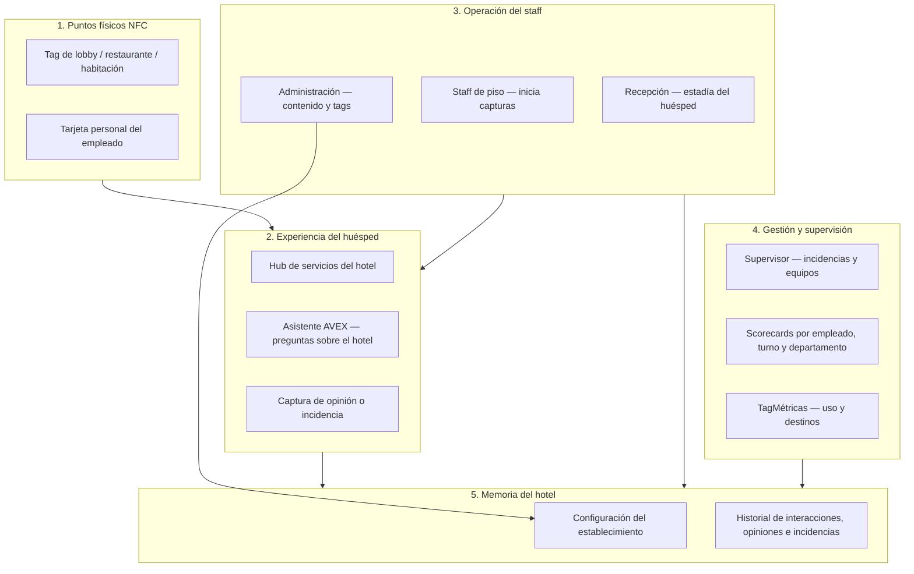
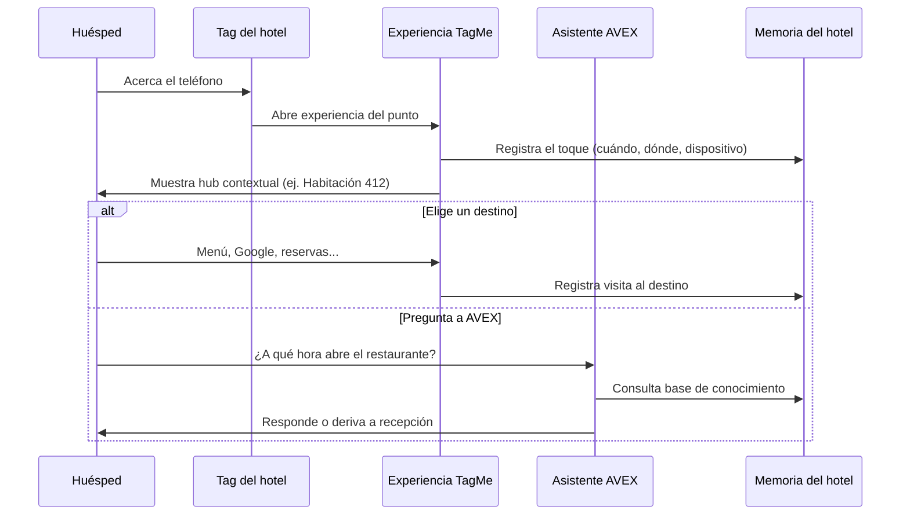
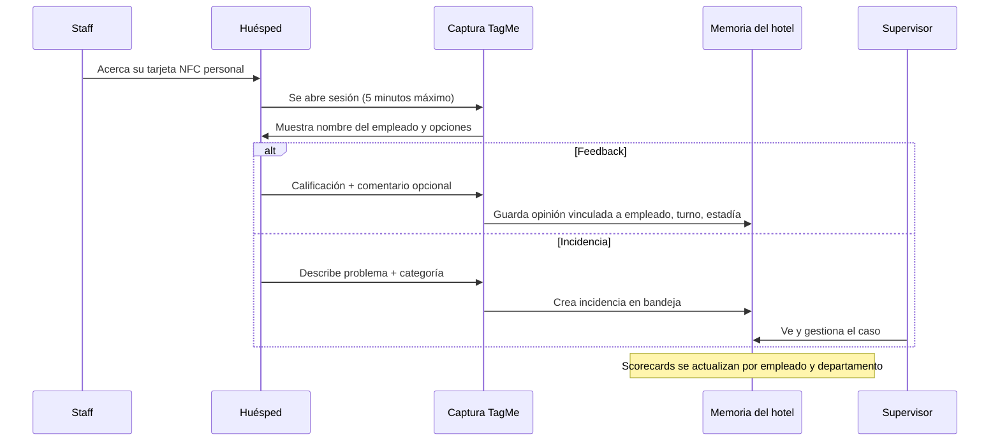
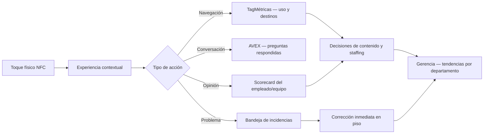

# TagMe — Arquitectura del negocio y flujos de experiencia

**Documento para stakeholders** · Hotel Caribe piloto · Sin lenguaje técnico

**Versión:** 1.0  
**Fecha:** 2026-06-12  
**Audiencia:** Gerencia, supervisores, recepción, jefes de área y operaciones del hotel

---

## 1. ¿Qué es TagMe?

TagMe es una **plataforma de experiencia para huéspedes en hospitalidad** (hoteles, restaurantes, bares) que conecta el mundo físico del establecimiento con una experiencia digital **sin apps ni códigos QR**.

El huésped **acerca su teléfono** a una tarjeta o punto físico TagMe (NFC) y accede de inmediato a información y servicios del hotel. El establecimiento, a su vez, **ve qué pasa en tiempo real**: quién interactúa, cuándo, desde dónde y hacia qué destinos va.

**Piloto actual:** Hotel Caribe by Faranda Grand.

---

## 2. El problema que resuelve

| Actor | Dolor hoy |
|-------|-----------|
| **Huésped** | QR incómodos, menús desactualizados, buscar enlaces por su cuenta, esperar al personal para preguntas simples |
| **Staff** | Repetir la misma información, no tener forma rápida de capturar opinión o problemas en el momento |
| **Supervisores** | Incidencias dispersas (WhatsApp, papel), sin scorecards por empleado ni turno |
| **Gerencia** | Decisiones basadas en reseñas tardías (TripAdvisor, Google) o en proxies de uso, no en señales directas |

**Promesa central:** *un toque, una experiencia, dato accionable.*

---

## 3. Las partes del sistema (vista de negocio)

TagMe no es “una sola pantalla”. Se organiza en **cinco bloques** que trabajan juntos:

### Qué hace cada bloque

| Bloque | Para quién | Qué logra |
|--------|------------|-----------|
| **Puntos físicos NFC** | Todos | Identifica *dónde* y *quién* inició la interacción (habitación 412, lobby, empleado María) |
| **Experiencia huésped** | Huésped | Acceso instantáneo a menú, enlaces, asistente AVEX, opinión o reporte de problemas |
| **Operación staff** | Recepción y piso | Vincula al huésped a su estadía, inicia capturas, actualiza lo que muestra cada tag |
| **Gestión** | Supervisores y gerencia | Ve incidencias abiertas, rendimiento por equipo, patrones de uso |
| **Memoria del hotel** | Plataforma | Guarda configuración, eventos y trazabilidad sin depender de sistemas externos (PMS) |

---

## 4. Los actores y su experiencia

### Huésped

- **Toque NFC** → ve un hub personalizado según el punto (lobby, habitación, restaurante).
- Puede ir a **menú digital**, reservas, Google, TripAdvisor u otros destinos configurados.
- Puede **hablar con AVEX** para preguntas sobre horarios, servicios, políticas (sin reservas automáticas en esta fase).
- Puede **opinar o reportar un problema** cuando el staff le acerca su tarjeta, o desde el tag de la habitación.

### Staff operativo (mesero, camarista, recepción, mantenimiento)

- Lleva una **tarjeta NFC personal**.
- Tras atender al huésped, **acerca la tarjeta al móvil del huésped** (unos segundos).
- El huésped completa el flujo; el empleado **no llena formularios**.

### Recepción

- Al check-in, **vincula la estadía del huésped** (identidad anónima por cookie, sin login).
- Si alguien opinó antes de pasar por recepción, **consolida** esa estadía temporal con la formal.

### Supervisor

- Configura **departamentos, cargos, turnos y asignación de tarjetas**.
- Gestiona **bandeja de incidencias** (abierta → en curso → cerrada).
- Consulta **scorecards** de su equipo (satisfacción agregada con reglas de confianza estadística).

### Gerencia / operaciones

- Ve **TagMétricas**: toques por día, horas pico, destinos más visitados.
- Complementa con **feedback e incidencias reales** vinculados a departamentos y turnos.

### Administrador de plataforma

- Registra **venues y puntos NFC**, actualiza contenido y destinos sin reimprimir tarjetas.

---

## 5. Dos grandes momentos del producto

TagMe se construyó en **dos fases de negocio** que se complementan:

### Fase 1 — Experiencia huésped y analítica (TagMétricas + AVEX)

**Objetivo:** que el huésped conecte con un toque y el hotel entienda el uso.

**Regla clave:** cada tag sabe su contexto (lobby, habitación, restaurante) **sin integrar el PMS del hotel**. La habitación se define en la configuración del tag, no por check-in automático.

---

### Fase 3 — Staff, feedback e incidencias operativas

**Objetivo:** capturar opinión y problemas **en el momento**, con trazabilidad por empleado, turno y departamento.

**Reglas de negocio importantes:**

| Regla | Significado para el negocio |
|-------|----------------------------|
| Sesión de 5 minutos | El huésped debe responder en ese tiempo; si no, debe pedir otro toque al staff |
| Feedback ≠ Incidencia | Son flujos distintos: uno mide satisfacción, el otro activa operación |
| Origen trazable | Cada registro sabe si vino de tarjeta de empleado o de tag de habitación/zona |
| Estadía del huésped | Vincula varias opiniones del mismo huésped sin pedir datos personales |
| Scorecards jerárquicos | Empleado → Turno → Departamento → Hotel |
| NPS interno (n≥6) | Los indicadores de equipo solo se muestran con volumen mínimo para ser confiables |

---

## 6. Flujos alternativos que completan la operación

### Captura sin staff presente (tag de habitación)

El huésped toca el **tag fijo de la habitación** y puede opinar o reportar sin que un empleado esté al lado. El origen queda como “habitación/zona”, no como empleado específico.

### Acceso asistido (sin NFC en el teléfono)

Si el dispositivo no tiene NFC, el staff puede compartir una **URL alternativa** con el mismo contenido. El sistema distingue acceso directo vs. asistido en las métricas.

### Consolidación en recepción

Huésped que ya opinó → llega después a recepción → recepción **une** la estadía temporal con la formal **sin perder** registros previos.

---

## 7. Cómo fluye el valor (de la interacción al dato)

**Idea central para stakeholders:** TagMe intercepta la experiencia **antes** de que llegue a TripAdvisor o Google. El hotel actúa con información fresca y contextualizada.

---

## 8. Qué está dentro y fuera del alcance actual

### Dentro (lo que el piloto demuestra)

- Experiencia huésped por NFC, sin app
- Múltiples puntos por hotel (lobby, restaurante, habitaciones)
- Contenido actualizable sin cambiar el hardware
- AVEX como asistente informativo (no hace reservas automáticas)
- TagMétricas básicas
- Tarjetas NFC personales del staff
- Feedback e incidencias con trazabilidad
- Scorecards y panel supervisor
- Recepción y consolidación de estadías
- Piloto Hotel Caribe

### Fuera (explícitamente no es el producto hoy)

- App nativa para huésped o staff
- Integración con PMS (check-in automático del hotel)
- Pagos, e-commerce o reservas automáticas por AVEX
- Publicación automática en TripAdvisor/Google
- Sistema completo de RRHH o nómina
- Sensores IoT avanzados (temperatura, ocupación, etc.)

---

## 9. Mapa mental: “¿Dónde vive cada cosa?”

Para una reunión con el hotel, esta tabla resume **quién ve qué**:

| Pregunta del stakeholder | Dónde ocurre en TagMe |
|--------------------------|----------------------|
| “¿Qué ve el huésped al tocar el lobby?” | Hub de experiencia del punto NFC |
| “¿Cómo sabe AVEX que estoy en la 412?” | Contexto configurado en el tag de esa habitación |
| “¿Cómo pide el huésped toallas extra?” | AVEX responde con info del hotel; incidencia si hay problema |
| “¿Cómo capturo opinión tras servir la mesa?” | Staff acerca su tarjeta → huésped califica |
| “¿Dónde veo problemas abiertos?” | Panel supervisor — bandeja de incidencias |
| “¿Cómo sé si mi equipo va bien?” | Scorecards por departamento y turno |
| “¿Cuánta gente usa el menú digital?” | TagMétricas — destinos y horarios |
| “¿Cómo vinculo al huésped del check-in?” | Recepción — creación/consolidación de estadía |

---

## 10. Mensaje para la demo con el hotel

> **TagMe convierte cada interacción del staff con el huésped en dato accionable: el empleado solo acerca su tarjeta NFC, el huésped opina o reporta en segundos, y supervisores y gerencia ven el resultado al instante — antes de que el problema llegue a TripAdvisor.**

### Mensajes de apoyo por actor

| Actor | Mensaje clave |
|-------|---------------|
| **Staff operativo** | “Un toque NFC, sin formularios ni interrumpir el servicio” |
| **Huésped** | “Opinar o reportar un problema en contexto, sin apps ni registro” |
| **Supervisor** | “Incidencias en bandeja y scorecards de mi equipo en tiempo real” |
| **Gerencia** | “Visibilidad por departamento sin depender de reseñas tardías ni proxies de uso” |
| **Recepción** | “La estadía del huésped se vincula desde el check-in; los walk-ins se consolidan sin perder datos” |

### Flujos obligatorios en demo (45–60 min)

1. Staff NFC → Feedback (estrella del show)
2. Staff NFC → Incidencia → aparece en bandeja supervisor
3. Tag de habitación → captura sin staff
4. Recepción → estadía y consolidación
5. Panel supervisor → incidencias y scorecards

---

## 11. Resumen en una frase por capa

| Capa de negocio | Una frase |
|-----------------|-----------|
| **Físico** | Las tarjetas y tags son la “puerta de entrada” al servicio digital |
| **Huésped** | Un toque abre todo: información, asistente, opinión o reporte |
| **Staff** | Inicia la captura en segundos; el huésped hace el trabajo |
| **Supervisión** | Ve problemas y rendimiento por equipo en tiempo real |
| **Gerencia** | Combina uso (TagMétricas) con satisfacción e incidencias reales |
| **Memoria** | Todo queda trazado por origen, sin depender del PMS |

---

## Referencias internas

- Especificación Fase 1: `specs/001-tagme-platform/spec.md`
- Especificación Fase 3 (staff): `specs/003-staff/spec.md`
- Preparación demo hotel: `specs/demo-hotel-prep/spec.md`
- Capacitación piso: `specs/003-staff/guides/capacitacion-piso-caribe.md`